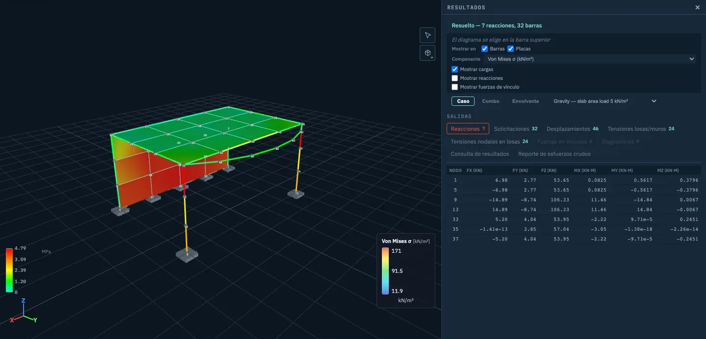

<p align="center">
  
</p>

<h1 align="center">Stabileo</h1>

<p align="center">
  <strong>Cálculo estructural, en una pestaña del navegador.</strong><br>
  Una plataforma abierta de análisis estructural. El solver corre en tu máquina:
  sin instalar nada, sin licencias y sin cuenta.
</p>

<p align="center">
  <a href="https://stabileo.com"><strong>Abrir el editor</strong></a> ·
  <a href="docs/guide/es/README.md"><strong>Leer la guía</strong></a> ·
  <a href="https://stabileo.com/es/blog">Blog</a> ·
  <a href="README.md">Read in English</a>
</p>

<p align="center">
  <a href="LICENSE"></a>
  <a href="https://github.com/lambdaclass/stabileo/actions/workflows/ci.yml"></a>
</p>

<p align="center">
  
</p>

---

## Qué es

Stabileo es un programa de cálculo estructural que funciona en cualquier navegador actual. Modelás,
cargás, resolvés y leés resultados en 2D y en 3D. El motor de cálculo está escrito en Rust y
compilado a WebAssembly, así que corre en tu propia computadora: tus modelos no salen de ella.

Nació en los cursos de estructuras de la [FIUBA](http://www.fi.uba.ar/) (Universidad de Buenos
Aires) y conserva ese origen: además de dar el resultado, **muestra el desarrollo** —el grado de
hiperestaticidad, la matriz de rigidez paso a paso, qué teoría de torsión corresponde a una
sección y por qué—.

La interfaz está en **español, inglés y portugués**.

## Los modos

| Modo | Estado | Qué hace |
|------|--------|----------|
| **Básico** | Gratis, siempre | Estructuras de barras en 2D y en 3D. Diagramas de axial, corte y momento, tensiones y funciones avanzadas: análisis cinemático, análisis de sección, segundo orden, pandeo, análisis modal, colapso plástico, líneas de influencia y el método de las rigideces paso a paso. Los modelos se cargan desde plantillas de Excel, se guardan en un archivo o viajan en un link. |
| **PRO** | En desarrollo · acceso libre | Elementos finitos y modelos complejos: losas y tabiques como placas y cáscaras, vínculos, generación de cargas según norma, importación desde AutoCAD (DXF), Excel o BIM (IFC), y análisis dinámico, por etapas y no lineal. |
| **Educativo** | En desarrollo | El docente arma el ejercicio dentro de la app y lo reparte como un link. El alumno lo resuelve sin el resultado a la vista, y las respuestas vuelven al docente. |
| **Stabileo IA** | En desarrollo | Un agente que arma, revisa y explica modelos, sobre el mismo modelo estructurado y el mismo solver que usás vos. La IA propone; el solver decide. |

<table>
  <tr>
    <td width="50%"></td>
    <td width="50%"></td>
  </tr>
  <tr>
    <td><sub>Básico 2D: el diagrama de momentos de un pórtico, con la tabla de resultados.</sub></td>
    <td><sub>Análisis cinemático: la fórmula del grado da cero y la matriz de rigidez encuentra el mecanismo.</sub></td>
  </tr>
</table>

## Documentación

**La [guía de Stabileo](docs/guide/es/README.md)** explica cómo usar cada modo y la teoría que hay
detrás. Está escrita para leerse como un apunte, y no hace falta saber de GitHub ni de programación
para recorrerla: se abre un capítulo y se sigue con los enlaces del final de cada página.

| | Español | English |
|---|---|---|
| Índice | [Guía](docs/guide/es/README.md) | [Guide](docs/guide/en/README.md) |
| 1 | [Primeros pasos](docs/guide/es/01-primeros-pasos.md) | [Getting started](docs/guide/en/01-getting-started.md) |
| 2 | [Modo Básico en 2D](docs/guide/es/02-basico-2d.md) | [Basic mode in 2D](docs/guide/en/02-basic-2d.md) |
| 3 | [Modo Básico en 3D](docs/guide/es/03-basico-3d.md) | [Basic mode in 3D](docs/guide/en/03-basic-3d.md) |
| 4 | [Funciones avanzadas](docs/guide/es/04-funciones-avanzadas.md) | [Advanced tools](docs/guide/en/04-advanced-tools.md) |
| 5 | [Modo PRO](docs/guide/es/05-pro.md) | [PRO mode](docs/guide/en/05-pro.md) |
| 6 | [Fundamentos teóricos](docs/guide/es/06-fundamentos-teoricos.md) | [Theory](docs/guide/en/06-theory.md) |

La documentación técnica y para colaboradores —referencia del solver, verificación, benchmarks,
hojas de ruta— está en inglés y se indexa en [docs/README.md](docs/README.md).

## Por qué existe

Los paquetes de cálculo estructural establecidos cuestan miles de dólares por año, funcionan en un
solo sistema operativo, necesitan instalación y servidores de licencias, y son cerrados. Los
solvers de código abierto como [OpenSees](https://opensees.berkeley.edu/) son potentes, pero se
manejan con scripts y no tienen interfaz visual.

- **Nativo del navegador.** Abrís [stabileo.com](https://stabileo.com) y empezás.
- **Un solver de verdad, en tu máquina.** Tus modelos no se suben a ningún lado.
- **En tiempo real.** Movés un nodo, cambiás una carga o una sección, y los resultados acompañan.
- **Explica.** El análisis cinemático, el análisis de sección y el método de las rigideces paso a
  paso muestran *por qué* un resultado es el que es, incluso cuando la fórmula que te enseñaron no
  aplica.
- **Código abierto.** Leé el solver, seguí las cuentas, mandá mejoras.

## El blog

[stabileo.com/blog](https://stabileo.com/es/blog) — notas largas sobre cómo funciona el solver y las
decisiones detrás, en español, inglés y portugués. Cada número se calcula con el motor antes de
escribir el texto, y varias notas tienen el editor embebido sobre el modelo del que hablan.

- [¿Barras o elementos finitos?](https://stabileo.com/es/blog/bars-or-finite-elements) — no son dos métodos, son dos modelos, y dónde dan distinto
- [Bredt o Saint-Venant](https://stabileo.com/es/blog/torsion-bredt-saint-venant) — qué teoría de torsión aplica, y qué cuesta elegir mal
- [Verificación a flexión según CIRSOC 201](https://stabileo.com/es/blog/verificacion-flexion-cirsoc-201) — los pasos que deciden el resultado
- [Lo que el software gratuito calcula, y lo que no te explica](https://stabileo.com/es/blog/conceptual-side-advanced-tools) — dónde se detienen las herramientas gratuitas
- [La frontera de determinismo](https://stabileo.com/es/blog/the-determinism-boundary) — por qué un agente de IA no debe calcular

## Cómo está hecho

- **Motor:** Rust, compilado a WebAssembly. Método de las rigideces para barras, elementos MITC4 y
  DKT para placas y cáscaras, factorización de Cholesky dispersa para modelos grandes.
- **Interfaz:** Svelte 5 y TypeScript, Three.js para el 3D, KaTeX para las ecuaciones del paso a
  paso.
- **Verificación:** contrastado con soluciones analíticas, benchmarks de NAFEMS, el ANSYS
  Verification Manual, Code_Aster y problemas de libro. Ver [BENCHMARKS.md](docs/BENCHMARKS.md).

## Correrlo localmente

```bash
git clone https://github.com/lambdaclass/stabileo.git
cd stabileo/web
npm install
npm run wasm      # compila el motor Rust en web/src/lib/wasm (requiere Rust y wasm-pack)
npm run dev       # http://localhost:4000
```

Requiere Node.js 18 o superior. Los detalles del build y de los tests están en el
[README en inglés](README.md#run-it-locally).

## Colaborar

Los pull requests son bienvenidos. Para cambios grandes, abrí primero un *issue* para discutir el
enfoque. La [documentación técnica](docs/README.md) es el punto de partida.

## Licencia

[AGPL-3.0](LICENSE)

## Hecho por

- **Bautista Chesta** — Ingeniero civil (FIUBA), UX/UI y gestión del proyecto
- **Diego Kingston** — Doctor en Ingeniería (UBA), integración producto–solver
- **Federico Carrone** — Fundador de [Lambda Class](https://lambdaclass.com), líder del solver

Con aportes de matemáticos, físicos, ingenieros en computación y científicos de la computación de
[Lambda Class](https://lambdaclass.com).
