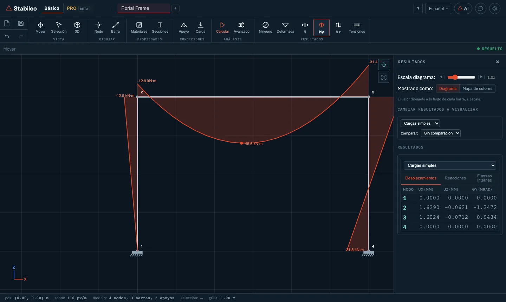
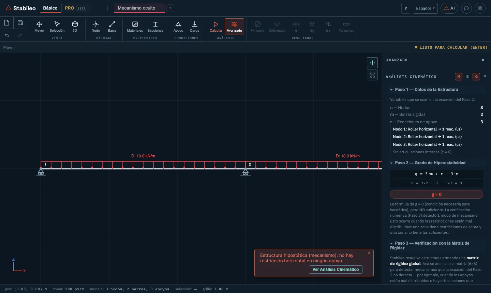

<p align="center">
  <picture>
    <source media="(prefers-color-scheme: dark)" srcset="docs/brand/stabileo-horizontal-color-fondo-oscuro.svg">
    
  </picture>
</p>

<p align="center">
  <strong>El motor de cálculo estructural detrás de Stabileo.</strong><br>
  Un solver de código abierto escrito en Rust y compilado a WebAssembly,
  que corre en la máquina del usuario, en el navegador.
</p>

<p align="center">
  <a href="https://stabileo.com"><strong>Usarlo en Stabileo</strong></a> ·
  <a href="docs/README.md"><strong>Documentación</strong></a> ·
  <a href="https://stabileo.com/es/blog/">Blog</a> ·
  <a href="README.md">Read in English</a>
</p>

<p align="center">
  <a href="LICENSE"></a>
  <a href="https://github.com/lambdaclass/stabileo/actions/workflows/ci.yml"></a>
</p>

---

## Qué es

Este repositorio es el motor de [Stabileo](https://stabileo.com), una plataforma de cálculo
estructural que funciona en el navegador. El motor toma un modelo estructural (nodos, barras,
placas y cáscaras, apoyos, materiales, secciones y cargas) y lo resuelve: desplazamientos,
reacciones, esfuerzos, tensiones, modos y los diagnósticos que dicen cuánto confiar en ellos. No
tiene interfaz propia.

Está escrito en Rust y compilado a WebAssembly, así que la aplicación lo corre en la propia
computadora del usuario: el modelo no se manda a un servidor para calcularlo. El mismo crate
compila de forma nativa para tests, benchmarks y uso del lado del servidor.

Nació en los cursos de estructuras de la [FIUBA](http://www.fi.uba.ar/) (Universidad de Buenos
Aires) y conserva ese origen en lo que informa: el grado de hiperestaticidad, los mecanismos que
una fórmula de conteo no ve y diagnósticos estructurados en lugar de un resultado silencioso.

<table>
  <tr>
    <td width="50%"></td>
    <td width="50%"></td>
  </tr>
  <tr>
    <td><sub>El motor trabajando en Stabileo: el diagrama de momentos de un pórtico.</sub></td>
    <td><sub>Análisis cinemático: la fórmula del grado da cero, la matriz de rigidez encuentra el mecanismo.</sub></td>
  </tr>
</table>

## Qué resuelve

- Estática lineal 2D y 3D, segundo orden (P-Δ), pandeo lineal, modal, espectral, historia en el
  tiempo, respuesta armónica y cargas móviles
- Análisis no lineal corrotacional y de material, análisis plástico, elementos viga-columna de
  fibras
- Construcción por etapas, pretensado y postesado, cables, contacto y gap, interacción
  suelo-estructura no lineal
- Imperfecciones iniciales, tensiones residuales, fluencia y retracción
- Cáscaras: MITC4 (ANS + EAS-7), MITC9, cáscara sólida SHB8-ANS y cáscaras curvas; placas DKT
- Reducción de modelos de Guyan y de Craig-Bampton
- Combinaciones de carga, envolventes, líneas de influencia, análisis de sección, recuperación de
  tensiones y diagnóstico cinemático

Por dentro: el método de las rigideces, factorización de Cholesky dispersa con reordenamiento
para modelos grandes y autovalores por Lanczos. Ver [engine/README.md](engine/README.md) para las
familias de análisis y [SOLVER_REFERENCE.md](docs/SOLVER_REFERENCE.md) para el contrato del modelo.

## Cómo se verifica

Cada familia de resultados se contrasta con soluciones analíticas, benchmarks de NAFEMS, el ANSYS
Verification Manual, Code_Aster y problemas de libro, además de tests de invariantes y de fuzzing
diferencial. Ver [BENCHMARKS.md](docs/BENCHMARKS.md) y [VERIFICATION.md](docs/VERIFICATION.md).

## Cómo usarlo

**Desde Rust**, fijá un commit de este repositorio (el crate todavía no está en crates.io):

```toml
[dependencies]
dedaliano-engine = { git = "https://github.com/lambdaclass/stabileo", rev = "<commit>" }
```

**En el navegador**, compilá el paquete WebAssembly (requiere Rust y
[wasm-pack](https://rustwasm.github.io/wasm-pack/); el toolchain está fijado en
`engine/rust-toolchain.toml`):

```bash
git clone https://github.com/lambdaclass/stabileo.git
cd stabileo
make wasm          # engine/pkg: un módulo ES con declaraciones de TypeScript
```

**Tests**:

```bash
make test             # la suite de tests del motor
make test-inventory   # los números publicados en docs/BENCHMARKS.md
make check            # clippy
```

[engine/README.md](engine/README.md) tiene un ejemplo y la lista de puntos de entrada.

## La aplicación Stabileo

[Stabileo](https://stabileo.com) es la aplicación construida sobre este motor: modelado y resultados
en 2D y 3D, modelos de elementos finitos en el modo PRO, un modo educativo y un asistente de IA que
trabaja sobre el mismo modelo estructurado y el mismo solver, en español, inglés y portugués. La
aplicación no forma parte de este repositorio. Su [guía de usuario](docs/guide/es/README.md) explica
cada modo y la teoría que hay detrás, y el [blog](https://stabileo.com/es/blog/) tiene notas largas
sobre cómo funciona el solver, con cada número calculado por este motor.

## Colaborar

Stabileo se construye a la vista, con quienes lo usan. Los reportes, las ideas, las discusiones y
el código son bienvenidos.

**El mejor lugar para empezar es nuestro [Discord](https://discord.gg/Q53rp7FKXA)**: ahí charlamos
sobre el proyecto, respondemos dudas y discutimos lo que viene, en español y en inglés. Sumate y
saludá.

Todos los canales están reunidos en **[linktr.ee/stabileo](https://linktr.ee/stabileo)**:

| Canal | Idioma | Para qué |
|---|---|---|
| [Discord](https://discord.gg/Q53rp7FKXA) | Español · inglés | Charlar y participar del proyecto |
| [WhatsApp](https://wa.me/5491138563881) | Español · inglés | Contacto directo con el equipo |
| [X](https://x.com/Stabileoapp) | Inglés | Novedades y actualizaciones |
| [Instagram](https://www.instagram.com/stabileoapp/) | Español | Novedades de funciones |
| [LinkedIn](https://www.linkedin.com/company/stabileo) | Español | Novedades del proyecto |

**Código.** Los pull requests al motor son bienvenidos. Para cambios grandes, abrí primero un
*issue* para discutir el enfoque. La [documentación](docs/README.md) es el punto de partida. Los
problemas con la aplicación de stabileo.com conviene reportarlos en Discord.

## Seguridad

Para reportar una vulnerabilidad, escribí a security@lambdaclass.com.

## Licencia

[AGPL-3.0](LICENSE)

## Hecho por

- **Bautista Chesta**: Ingeniero civil (FIUBA), UX/UI y gestión del proyecto
- **Diego Kingston**: Doctor en Ingeniería (UBA), integración producto–solver
- **Federico Carrone**: Fundador de [Lambda Class](https://lambdaclass.com), líder del solver

Con aportes de matemáticos, físicos, ingenieros en computación y científicos de la computación de
[Lambda Class](https://lambdaclass.com).
