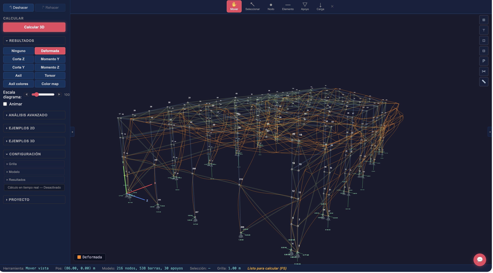

<p align="center">
  
</p>

<h1 align="center">Stabileo</h1>

<p align="center">
  <strong>Open-source structural solver and browser workspace.</strong><br>
  Model, solve, inspect, and share 2D and 3D structures in the browser. The same structured model and solver can be used directly by engineers or driven through AI build/review workflows. Rust solver compiled to WASM. No installation required.
</p>

<p align="center">
  <a href="https://stabileo.com">Try it now</a> ·
  <a href="#why-stabileo">Why it exists</a> ·
  <a href="#features">Features</a> ·
  <a href="#getting-started">Getting started</a> ·
  <a href="docs/README.md">Docs</a>
</p>

<p align="center">
  <a href="LICENSE"></a>
  <a href="https://github.com/lambdaclass/stabileo/actions/workflows/ci.yml"></a>
</p>

<p align="center">
  
</p>
<p align="center"><sub>3D industrial warehouse with Pratt roof trusses and crane bridge. Orange overlay shows the deformed shape under load. 216 nodes, 538 elements, 30 supports.</sub></p>

<p align="center">
  
</p>
<p align="center"><sub>Same structure with stress utilization color map (σ/fy). Blue = lightly loaded, yellow = moderate, red = approaching yield.</sub></p>

---

## Why Stabileo

The dominant structural analysis tools — [SAP2000](https://www.csiamerica.com/products/sap2000), [ETABS](https://www.csiamerica.com/products/etabs), [Robot](https://www.autodesk.com/products/robot-structural-analysis), [RFEM](https://www.dlubal.com/en/products/rfem-fea-software/what-is-rfem) — cost thousands of dollars per year, run on Windows, require installation and license servers, and are closed source. Open-source solvers like [OpenSees](https://opensees.berkeley.edu/) are powerful but require scripting and have no visual interface.

Stabileo is different:

- **Browser-native.** Open [stabileo.com](https://stabileo.com) and start. No download, no license key, no account.
- **Real solver.** Rust engine compiled to WebAssembly — linear, nonlinear, dynamic, shells, staged construction, contact, fiber beams, and more.
- **Real-time.** The solver runs on every edit. Move a node, change a load, resize a section — results update instantly.
- **Structured model surface.** The browser UI, backend APIs, and AI workflows all target the same model/snapshot contract instead of hidden prompt magic.
- **AI-ready, but deterministic.** AI can help generate, edit, review, and explain models; the solver remains the source of truth for mechanics.
- **Open source.** Read the solver, trace the math, submit improvements.
- **Transparent.** Interactive step-by-step wizard shows every stage of the Direct Stiffness Method with [KaTeX](https://katex.org)-rendered matrices.

**Tech stack:** Svelte 5 frontend, Rust solver engine via WASM, Three.js 3D visualization.

Originally built for structural engineering courses at [FIUBA](http://www.fi.uba.ar/) (University of Buenos Aires). Named after [Daedalus](https://en.wikipedia.org/wiki/Daedalus), the architect who built wings to escape the labyrinth.

---

## Humans and AI use the same solver

Stabileo's strongest technical wedge is not "AI chat" by itself. It is a `structured structural model` and a `deterministic solver` that humans and AI can both operate.

- Engineers can model directly in the browser and inspect diagrams, stresses, reactions, and diagnostics.
- AI workflows can build or edit the same structured model snapshot, then hand it to the same solver for real analysis.
- Review and explanation tools sit on top of solver artifacts and diagnostics instead of inventing mechanics.

Start here:

- [Docs hub](docs/README.md)
- [Quick start](docs/QUICKSTART.md)
- [AI modeling workflow](docs/AI_MODELING_WORKFLOW.md)
- [Solver reference](docs/SOLVER_REFERENCE.md)

---

## Features

### Solver capabilities

- 2D and 3D linear static, second-order, buckling, modal, response spectrum, time history, harmonic response, and moving loads
- Corotational and material nonlinear analysis, plastic analysis, fiber beam-column elements
- Staged construction, prestress/post-tension, cable analysis, contact/gap behavior, nonlinear SSI
- Initial imperfections, residual stress, creep/shrinkage
- Multi-family shell stack: MITC4 (ANS + EAS-7), MITC9, SHB8-ANS solid-shell, curved shells
- Guyan and Craig-Bampton model reduction
- Sparse-first assembly and solve with AMD ordering, 22-234× speedups on shell models
- Load combinations, envelopes, section analysis, stress recovery, kinematic diagnostics

### Design codes

| Code | Scope |
|------|-------|
| AISC 360 | Steel |
| ACI 318 | Concrete |
| EN 1993-1-1 (EC3) | Steel |
| EN 1992-1-1 (EC2) | Concrete |
| CIRSOC 201 | Concrete |
| AISI S100 | Cold-formed steel |
| NDS | Timber |
| TMS 402 | Masonry |
| ASCE 7 / EN 1990 | Loads and combinations |

### Validation

Benchmarked against NAFEMS, ANSYS Verification Manual, Code_Aster, SAP2000, OpenSees, Robot, STAAD.Pro, and textbook solutions. See [BENCHMARKS.md](docs/BENCHMARKS.md) for full coverage.

---

## Getting started

**Use it now.** Open [stabileo.com](https://stabileo.com). Works on any modern browser.

**Run locally:**

```bash
git clone https://github.com/lambdaclass/stabileo.git
cd stabileo/web
npm install
npm run dev       # http://localhost:4000
```

```bash
npm test          # run the web test suite
npm run build     # production build -> web/dist/
```

Requires Node.js >= 18.

---

## Documentation

| Document | Contents |
|----------|----------|
| [docs/README.md](docs/README.md) | Docs hub: quick start, AI workflow, solver reference, and roadmap entry points |
| [QUICKSTART.md](docs/QUICKSTART.md) | First model tutorial: build, solve, inspect, and share a 2D beam |
| [AI_MODELING_WORKFLOW.md](docs/AI_MODELING_WORKFLOW.md) | How AI build/review flows use the structured model + solver loop |
| [SOLVER_REFERENCE.md](docs/SOLVER_REFERENCE.md) | Coordinate conventions, model objects, outputs, and execution surfaces |
| [SOLVER_ROADMAP.md](docs/roadmap/SOLVER_ROADMAP.md) | Solver status, sequencing, performance, and validation |
| [PRODUCT_ROADMAP.md](docs/roadmap/PRODUCT_ROADMAP.md) | App, workflow, and market sequencing |
| [INFRASTRUCTURE_ROADMAP.md](docs/roadmap/INFRASTRUCTURE_ROADMAP.md) | Backend, deployment, auth, persistence, and operational sequencing |
| [AI_ROADMAP.md](docs/roadmap/AI_ROADMAP.md) | AI capability sequencing, safety rules, and prerequisites |
| [BENCHMARKS.md](docs/BENCHMARKS.md) | Validation coverage and benchmark status |
| [VERIFICATION.md](docs/VERIFICATION.md) | Testing philosophy, fuzzing, invariants |
| [POSITIONING.md](docs/POSITIONING.md) | Market framing and competitive strategy |
| [engine/README.md](engine/README.md) | Rust solver engine API and analysis types |
| [CHANGELOG.md](CHANGELOG.md) | Milestone updates |
| [docs/research/](docs/research/) | Shell-family research, competitor comparisons, numerical methods |

---

## Contributing

Pull requests are welcome. For major changes, open an issue first to discuss the approach.

## Security

To report a vulnerability, email security@lambdaclass.com.

## License

[AGPL-3.0](LICENSE)

---

## Built by

- **Bautista Chesta** — Civil Engineer (FIUBA), UX/UI and project management
- **Diego Kingston** — Ph.D. in Engineering (UBA), product–solver integration
- **Federico Carrone** — Founder of [Lambda Class](https://lambdaclass.com), solver lead

With contributions from mathematicians, physicists, computer engineers, and computer scientists at [Lambda Class](https://lambdaclass.com).

<p align="center">
  <em>In honor of Daedalus, who built the labyrinth and dared to fly.</em>
</p>
