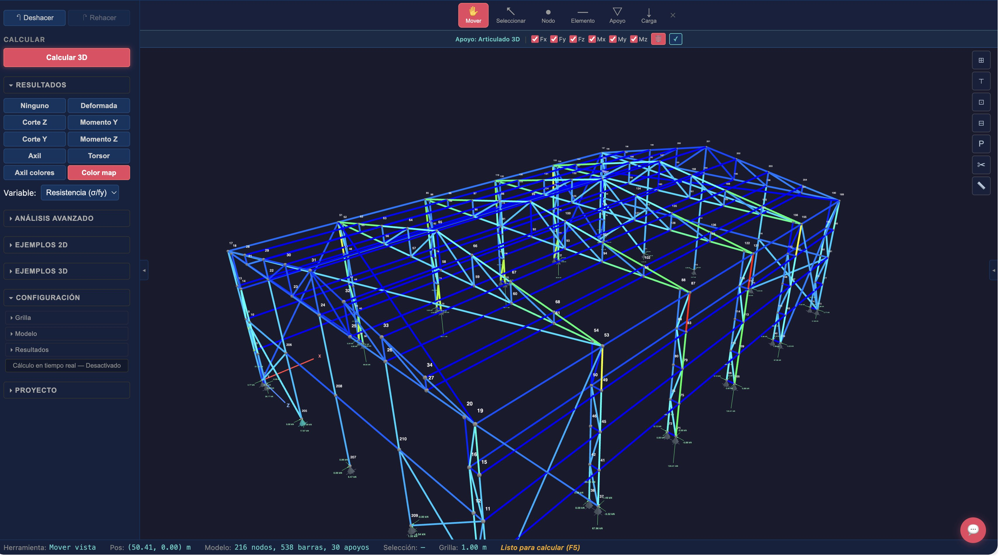

<p align="center">
  
</p>

<h1 align="center">Dedaliano</h1>

<p align="center">
  <strong>Open-source structural analysis for the browser.</strong><br>
  Model, solve, and visualize frame structures in 2D and 3D. No installation required.
</p>

<p align="center">
  <a href="https://dedaliano.com">Try it now</a> ·
  <a href="#what-is-structural-analysis">What is this</a> ·
  <a href="#how-it-works">How it works</a> ·
  <a href="#solver-engine">Solver engine</a> ·
  <a href="#features">Features</a> ·
  <a href="#getting-started">Getting started</a>
</p>

<p align="center">
  <a href="LICENSE"></a>
</p>

<p align="center">
  
</p>
<p align="center"><sub>3D model of an industrial warehouse with Pratt roof trusses and a crane bridge. The orange overlay shows the deformed shape under applied loads, exaggerated for visibility. 216 nodes, 538 elements, 30 supports.</sub></p>

<p align="center">
  
</p>
<p align="center"><sub>Same structure with a stress utilization color map (sigma/fy). Blue elements are lightly loaded. Green and yellow elements are at moderate utilization. Red elements are approaching their yield strength.</sub></p>

---

## What is structural analysis

When engineers design a building, a bridge, or a tower, they need to know whether it will carry the loads it is subjected to without failing.

Structural analysis computes the internal forces, stresses, and deformations in a structure under load. Every structure is subject to forces: its own weight, the weight of what it carries (people, furniture, vehicles, equipment), wind pressure, snow, seismic ground motion, thermal expansion. The engineer must verify that no element exceeds its capacity under any plausible combination of these loads.

This requires solving a mathematical model of the structure. The model represents the geometry (where are the columns, beams, and braces), the material properties (how stiff is the steel, how strong is the concrete), the connections (is this joint rigid or does it allow rotation), and the boundary conditions (where is the structure attached to the ground). Given the loads, the analysis produces the displacements at every point, the forces in every element, and the stresses at every cross-section.

For simple cases (a single beam with a point load), there are closed-form solutions known for centuries. For real structures with hundreds of elements, multiple load cases, and complex geometry, the problem is solved numerically. The standard method used worldwide is the **[Direct Stiffness Method](https://en.wikipedia.org/wiki/Direct_stiffness_method)**, a matrix-based approach that assembles the behavior of individual elements into a global system of linear equations and solves it.

Dedaliano implements this method from scratch.

---

## Why Dedaliano

The dominant structural analysis tools today are commercial desktop applications: [SAP2000](https://www.csiamerica.com/products/sap2000) and [ETABS](https://www.csiamerica.com/products/etabs) from CSI, [Robot Structural Analysis](https://www.autodesk.com/products/robot-structural-analysis) from Autodesk, [RSTAB](https://www.dlubal.com/en/products/rstab-beam-structures/what-is-rstab) and [RFEM](https://www.dlubal.com/en/products/rfem-fea-software/what-is-rfem) from Dlubal. A professional license costs thousands of dollars per year. They run on Windows. They require installation, license servers, and IT support. Their source code is closed.

For students, this creates a gap. You learn the theory in class (equilibrium, compatibility, constitutive relations, the stiffness method), but you never see the inside of the machine. The commercial tools are black boxes: you input a model, press solve, and get results. You cannot inspect the stiffness matrix, see how it was assembled, verify a single entry, or understand why a particular element is failing. If the results look wrong, you have no way to trace the computation.

Dedaliano is an attempt to provide an alternative.

- **Browser-native.** Open [dedaliano.com](https://dedaliano.com) and start. No download, no license key, no account. Works offline after the first load.
- **Open source.** The entire codebase is here. Read the solver, trace the math, submit improvements.
- **Transparent computation.** A 9-step interactive wizard shows every intermediate result of the Direct Stiffness Method: the local stiffness matrix of each element, the coordinate transformation, the assembled global matrix, the partitioning, the solution, the back-substitution for reactions and internal forces. Every matrix is rendered with [KaTeX](https://katex.org).
- **Self-contained solver.** The analysis engine uses no external linear algebra library. Gaussian elimination, Cholesky factorization, QR eigenvalue extraction, static condensation: all implemented in TypeScript, all tested against analytical solutions.
- **Real-time.** The solver runs on every edit. Move a node, change a load, resize a section, and the results update.

Originally built for structural engineering courses at [FIUBA](http://www.fi.uba.ar/) (University of Buenos Aires, School of Engineering).

Named after [Daedalus](https://en.wikipedia.org/wiki/Daedalus) (Daidalos), the architect of the labyrinth, who built wings to escape Crete.

---

## How it works

The Direct Stiffness Method models a structure as a set of **nodes** (points in 2D or 3D space) connected by **elements** (straight bars that can resist axial force, shear, bending, and torsion). Each node has **degrees of freedom** (DOF): the possible displacements and rotations at that point. In 2D, each node has 3 DOF (horizontal displacement, vertical displacement, rotation). In 3D, each node has 6 DOF (three translations, three rotations).

The method proceeds in well-defined steps:

**1. Element stiffness.** For each element, a local stiffness matrix **k** is computed from its length L, cross-sectional properties (area A, moment of inertia I), and material (Young's modulus E). For a 2D frame element, **k** is 6x6 and relates the forces at the element's ends to the displacements at those ends, in the element's local coordinate system. The key terms are:

- Axial stiffness: EA/L
- Transverse stiffness: 12EI/L^3
- Bending-translation coupling: 6EI/L^2
- Rotational stiffness: 4EI/L

For a 3D frame element, **k** is 12x12 and includes bending in two planes (about the local Y and Z axes, using I_y and I_z), torsion about the longitudinal axis (using the torsional constant J and shear modulus G = E/2.6), and all the corresponding couplings.

For truss elements, which only carry axial force, **k** reduces to a 4x4 matrix (2D) or 6x6 matrix (3D) with only the EA/L term.

**2. Transformation.** Each local matrix is rotated into the global coordinate system using a transformation matrix **T** derived from the element's orientation. In 2D, **T** is built from the angle between the element and the horizontal axis (cos and sin). In 3D, **T** is a block-diagonal matrix of 3x3 rotation matrices constructed from the direction cosines of the element's local axes (computed via Gram-Schmidt orthonormalization from the element direction and an optional user-specified orientation vector or roll angle). The transformation is: **K** = **T**^T **k** **T**.

**3. Assembly.** All element matrices are assembled into a single global stiffness matrix **K** by adding each element's contribution at the rows and columns corresponding to its nodes' DOFs. This is the key operation of the method: the global matrix encodes the entire structure's resistance to deformation.

**4. Load vector.** External loads are assembled into a global load vector **F**:

- Nodal forces map directly to their DOF positions in **F**.
- Distributed loads (uniform, trapezoidal, partial) are converted to equivalent nodal forces using work-equivalence integrals. For a uniform load q on a beam of length L: the equivalent end shears are qL/2 and the equivalent end moments are qL^2/12.
- Point loads on elements at distance a from the start node produce fixed-end forces via the beam on elastic foundation formulae.
- Thermal loads produce equivalent axial force F = E A alpha DeltaT and equivalent end moments M = E I alpha DeltaT_gradient / h.

**5. Boundary conditions.** The system **KU** = **F** is partitioned into free and supported DOFs. Free DOFs (indices 0 to n_free-1) are the unknowns. Restrained DOFs (indices n_free to n_total-1) have known displacements (typically zero, but prescribed displacements are supported). The submatrices are:

- **K_ff**: free-free block (the system to solve)
- **K_fs**: free-supported coupling
- **F_f**: loads on free DOFs

Spring supports add their stiffness directly to the corresponding diagonal of **K**. Inclined supports apply a rotation to the relevant DOFs before assembly.

**6. Solution.** The reduced system **K_ff** **U_f** = **F_f** - **K_fs** **U_s** is solved for the unknown displacements **U_f**. The solver first attempts Cholesky factorization (LL^T decomposition), which is faster and exploits the fact that stiffness matrices are symmetric positive-definite. If the matrix is not positive-definite (indicating a mechanism or near-singular system), it falls back to LU decomposition with partial pivoting. Singularity is detected at a pivot tolerance of 1e-15.

**7. Post-processing.** From the displacements, the reactions at supports are recovered: **R** = **K_sf** **U_f** + **K_ss** **U_s** - **F_s**. The internal forces in each element (axial N, shear V, moment M in 2D; additionally V_y, V_z, M_y, M_z, torsion T in 3D) are computed by extracting the element's nodal displacements, transforming them to local coordinates, and multiplying by the local stiffness matrix: **f** = **k** **T** **u_e**.

For advanced analysis types, additional matrices and iterations are involved:

- **P-Delta.** The geometric stiffness matrix **K_G** (Przemieniecki formulation) captures the destabilizing effect of axial loads on lateral stiffness. The system (**K** + **K_G**)**U** = **F** is solved iteratively: solve for displacements, recompute axial forces, rebuild **K_G**, repeat until the relative displacement change is below 1e-4 (typically 3 to 6 iterations, maximum 20).
- **Buckling.** The generalized eigenvalue problem **K** phi = lambda (-**K_G**) phi finds the critical load factor lambda at which the structure buckles. Solved via Cholesky transformation of **K** followed by the Jacobi cyclic eigenvalue algorithm on the transformed symmetric matrix. The smallest positive eigenvalue is the critical buckling mode.
- **Modal.** The generalized eigenvalue problem **K** phi = omega^2 **M** phi finds natural frequencies and mode shapes. **M** is the consistent mass matrix assembled from element mass matrices using cubic shape functions (coefficient rho A L / 420). Solved via the same Cholesky-plus-Jacobi approach. Returns frequencies, periods, participation factors, and effective mass ratios.
- **Spectral.** Earthquake analysis using a response spectrum (predefined CIRSOC 103 spectra for Argentine seismic zones, or user-defined). For each mode, peak response is computed from the spectral acceleration at that mode's period. Responses are combined using either SRSS (square root of sum of squares) or CQC (complete quadratic combination, using the Der Kiureghian correlation coefficient with 5% damping).
- **Plastic.** Incremental event-to-event strategy that tracks hinge formation. At each step: solve the current structure, find the load increment that causes the next section to reach its plastic moment M_p = f_y Z_p, insert a hinge, repeat until a mechanism forms (collapse).

---

## Solver engine

The analysis engine is in [`web/src/lib/engine/`](web/src/lib/engine/). It is written entirely in TypeScript with zero external linear algebra dependencies. No NumPy, no LAPACK, no nalgebra, no math.js. Every matrix operation is implemented, tested, and readable. All matrices are stored as `Float64Array` in row-major order for cache efficiency and minimal allocation overhead.

### Source files

| File | LOC | Purpose |
|---|---|---|
| `solver-js.ts` | ~1400 | 2D DSM solver. DOF numbering, 6x6 frame and 4x4 truss local stiffness, coordinate transformation, global assembly, Cholesky/LU solution, reaction and internal force recovery. 3 DOF per node (u_x, u_y, theta_z). |
| `solver-3d.ts` | ~1200 | 3D DSM solver. 12x12 frame and 6x6 truss local stiffness, 3D rotation via direction cosines, Gram-Schmidt local axis computation, roll angle support, 6 DOF per node (u_x, u_y, u_z, theta_x, theta_y, theta_z). |
| `solver-detailed.ts` | ~800 | Pedagogical 2D solver variant. Captures and returns every intermediate matrix (local k, transformation T, assembled K, partitioned K_ff, load vector F, solution U, reactions R) for the 9-step DSM wizard. |
| `solver-detailed-3d.ts` | ~900 | Pedagogical 3D solver variant. Same step-by-step capture for 3D models. |
| `pdelta.ts` | ~350 | P-Delta second-order analysis. Newton-Raphson iteration on (K + K_G)U = F with convergence tolerance 1e-4, maximum 20 iterations. Returns amplification factor B_2 = max(u_pdelta / u_linear). |
| `buckling.ts` | ~280 | Linear buckling eigenvalue analysis. Computes critical load factor, effective length, slenderness ratio for each element. Uses Cholesky transform plus Jacobi eigensolver. |
| `modal.ts` | ~420 | Modal analysis. Computes natural frequencies, periods, mode shapes, modal participation factors (Gamma_n = phi^T M r / phi^T M phi), effective mass ratios, and Rayleigh damping coefficients. |
| `plastic.ts` | ~400 | Plastic collapse analysis. Event-to-event incremental strategy with hinge insertion. Computes plastic moment M_p = f_y Z_p (shape factor ~1.15 for I-beams). Returns collapse load factor, hinge sequence, and redundancy count. |
| `spectral.ts` | ~450 | Response spectrum analysis. CIRSOC 103 predefined spectra (zones 1-4, soil types I-III) or user-defined. Modal superposition with SRSS or CQC combination. CQC correlation: rho_ij = 8 xi^2 (1+r) r^(3/2) / ((1-r^2)^2 + 4 xi^2 r (1+r)^2), xi = 0.05 default. |
| `moving-loads.ts` | ~380 | Moving load envelope analysis. A train of concentrated loads traverses the structure. Returns max/min internal forces at every section. |
| `influence-service.ts` | ~200 | Influence line computation. Response at a fixed location as a unit load moves along the structure. |
| `geometric-stiffness.ts` | ~180 | Geometric stiffness matrices (Przemieniecki formulation). 6x6 frame K_G with transverse terms proportional to axial force N: K_G[v,v] = 36N/(30L), K_G[v,theta] = 3NL/(30L), K_G[theta,theta] = 4NL^2/(30L). 4x4 truss K_G with K_G[v,v] = N/L. |
| `mass-matrix.ts` | ~320 | Consistent mass matrix assembly. Element mass matrices using cubic shape functions with coefficient rho A L / 420. Handles hinge condensation for released rotational DOFs. |
| `matrix-utils.ts` | ~420 | Core linear algebra. Cholesky decomposition (LL^T for SPD matrices), LU with partial pivoting (fallback for non-SPD), Jacobi cyclic eigenvalue solver (threshold strategy: 0.2 sqrt(offNorm)/n^2 for first 4 sweeps, then 0; termination at off-diagonal norm < 1e-24), generalized eigenvalue solver (Cholesky transform of B, then Jacobi on L^{-1} A L^{-T}), dense matrix multiplication. |
| `diagrams.ts` | ~800 | 2D internal force diagrams. M(x), V(x), N(x) computation with 21 sample points per element plus positions around point load discontinuities. Deformed shape using Hermite cubic interpolation: v(x) = N1 v_I + N2 theta_I L + N3 v_J + N4 theta_J L, where N1 = 1 - 3 xi^2 + 2 xi^3, N2 = xi - 2 xi^2 + xi^3, N3 = 3 xi^2 - 2 xi^3, N4 = -xi^2 + xi^3, xi = x/L. Particular solution for intra-element loads (fixed-fixed beam deflection). Hinge correction to enforce zero moment. |
| `diagrams-3d.ts` | ~550 | 3D internal force diagrams. M_y(x), M_z(x), V_y(x), V_z(x), N(x), T(x) in both bending planes. Note the sign convention: theta_y = -dw/dx inverts the M_y relation. |
| `section-stress.ts` | ~700 | 2D cross-section stress analysis. Normal stress via Navier: sigma = N/A + M y / I_z. Shear stress via Jourawski: tau = V Q(y) / (I_z b(y)), where Q(y) is the first moment of area above fiber y and b(y) is the width at that height. Shear flow paths computed per section type (I/H: 5 paths, U: 3 paths, RHS: 6 paths with closed-section q_0 correction, CHS: 2 semicircles). Mohr's circle for principal stresses. Failure criteria: Von Mises sigma_vm = sqrt(sigma^2 + 3 tau^2) and Tresca. |
| `section-stress-3d.ts` | ~900 | 3D cross-section stress analysis. Biaxial Navier: sigma(y,z) = N/A + M_z y / I_z - M_y z / I_y (note sign from theta_y = -dw/dx convention). Separate Jourawski for V_y and V_z. Torsional shear: Bredt formula tau_T = M_x / (2 A_m t) for closed sections, Saint-Venant tau_T = M_x t_max / J for open sections. Combined Von Mises: sigma_vm = sqrt(sigma^2 + 3(tau_Vy^2 + tau_Vz^2 + tau_T^2)). Neutral axis computation for biaxial bending. |
| `kinematic-2d.ts` | ~300 | 2D mechanism detection. Checks rank of stiffness matrix, identifies collinear all-hinged configurations, reports why the structure is unstable. |
| `kinematic-3d.ts` | ~350 | 3D mechanism detection. Same analysis extended to 6 DOF per node. |
| `combinations-service.ts` | ~250 | Load combination engine. Solves each load case independently, applies LRFD factors (1.2D + 1.6L, 1.4D, etc.), computes envelopes (max/min of every response across all combinations). |
| `solver-service.ts` | ~150 | High-level dispatch. Routes solve calls to 2D or 3D solver based on analysis mode. |
| `live-calc.ts` | | Real-time solver. Triggers a full solve on every model edit when live calculation is enabled, so results update as the user moves nodes or changes loads. |
| `types.ts` | | 2D type definitions. SolverNode (x, y), SolverElement (type, nodeI, nodeJ, hingeStart, hingeEnd), SolverSection (a, iz), SolverMaterial (e, nu), SolverSupport (type, stiffness, prescribed displacements), SolverLoad (nodal, distributed, pointOnElement, thermal), Displacement (ux, uy, rz), ElementForces (nStart, nEnd, vStart, vEnd, mStart, mEnd). |
| `types-3d.ts` | | 3D type definitions. SolverNode3D (x, y, z), SolverSection3D (a, iy, iz, j), SolverElement3D (localYx/Yy/Yz orientation vector, rollAngle), SolverSupport3D (6 translation + 6 rotation restraints, inclined normal), ElementForces3D (N, Vy, Vz, Mx, My, Mz at both ends, distributed and point loads in Y and Z planes). |

### Linear algebra

All routines are in `matrix-utils.ts`. Matrices are stored as `Float64Array` in row-major layout: element (i, j) of an n x n matrix is at index i*n + j. This layout provides cache-efficient row access and avoids object allocation overhead.

| Operation | Algorithm | Complexity | Details |
|---|---|---|---|
| Cholesky decomposition | LL^T for symmetric positive-definite matrices | O(n^3/3) | In-place. L[j,j] = sqrt(A[j,j] - sum L[j,k]^2). Threshold 1e-15 for positive-definiteness check. Used as primary solver for KU = F. |
| LU decomposition | Gaussian elimination with row partial pivoting | O(2n^3/3) | Fallback when Cholesky fails (non-SPD matrix). Pivot tolerance 1e-15. Forward and back substitution. |
| Jacobi eigenvalue | Cyclic Jacobi with threshold strategy | O(n^2) per sweep | Threshold = 0.2 sqrt(offNorm)/n^2 for first 4 sweeps, then 0 (rotate all pairs). Givens rotations. Terminates when off-diagonal norm < 1e-24. Max 300 sweeps. Returns eigenvalues in ascending order with eigenvectors as columns. |
| Generalized eigenvalue | Cholesky transform + Jacobi | O(n^4) | Solves Ax = lambda Bx. Cholesky of B: B = LL^T. Transform: C = L^{-1} A L^{-T}. Jacobi on C. Back-transform: x = L^{-T} y. Max 200 sweeps. |

### Element formulations

**2D frame element (6 DOF).** Local DOF order: [u_1, v_1, theta_1, u_2, v_2, theta_2]. The local stiffness matrix encodes:

- Axial: EA/L coupling between u_1 and u_2
- Bending (fixed-fixed): 12EI/L^3 transverse, 6EI/L^2 coupling, 4EI/L and 2EI/L rotational
- Combined: symmetric 6x6 with axial and bending blocks decoupled in local coordinates

Internal hinges are handled via static condensation. When a moment release is present at an element end, the corresponding rotational DOF is condensed out: K_condensed = K_uu - K_u_theta K_theta_theta^{-1} K_theta_u. This reduces the effective stiffness and modifies the shape functions to reflect the hinged boundary.

**3D frame element (12 DOF).** Local DOF order: [u_1, v_1, w_1, theta_x1, theta_y1, theta_z1, u_2, v_2, w_2, theta_x2, theta_y2, theta_z2]. The 12x12 matrix includes:

- Axial (uu): EA/L
- Torsion (theta_x, theta_x): GJ/L, where G = E/2.6 for isotropic materials
- Y-bending (v, theta_z): 12EI_z/L^3, 6EI_z/L^2, 4EI_z/L (strong axis)
- Z-bending (w, theta_y): 12EI_y/L^3, 6EI_y/L^2, 4EI_y/L (weak axis)

The bending planes are uncoupled in local coordinates. The local coordinate system is: X along the element (I to J), Y perpendicular (from user-specified orientation vector or automatic default), Z completing the right-hand system. For vertical elements, the global Z axis is used as the reference direction. Roll angle (0, 90, 180, or 270 degrees) rotates the section about the element axis.

**Truss elements** carry only axial force. 2D: 4x4 with EA/L. 3D: 6x6 with EA/L in the axial direction, zero transverse stiffness.

### Numerical parameters

| Parameter | Value | Context |
|---|---|---|
| Matrix singularity tolerance | 1e-15 | LU pivot test and Cholesky diagonal check. Near IEEE 754 double-precision machine epsilon. |
| P-Delta convergence | 1e-4 | Relative displacement change norm(Delta_u)/norm(u). Typically converges in 3 to 6 iterations. |
| P-Delta max iterations | 20 | Safety limit to prevent infinite loops on divergent problems. |
| Jacobi eigenvalue termination | 1e-24 | Off-diagonal Frobenius norm threshold. |
| Jacobi max sweeps | 300 (standard) / 200 (generalized) | Upper limit on iteration count. |
| Element length singularity | 1e-12 m | Zero-length elements are skipped. |
| Zero load threshold | 1e-10 kN | Negligible loads are ignored. |
| Damping ratio (spectral) | 0.05 | 5% critical damping, tunable per analysis. |
| Diagram sampling | 21 points per element | Plus positions at eps = 1e-6 around point load discontinuities. |

### Testing

The solver is verified against known analytical solutions across 31 test suites with over 1,050 test cases. Every test checks equilibrium (sum of forces = 0, sum of moments = 0) in addition to comparing against the expected solution.

**Canonical benchmarks:**

| Structure | Analytical solution | Tolerance |
|---|---|---|
| Cantilever beam, point load P at tip | delta = PL^3 / 3EI, M_max = PL | 0.1% |
| Simply supported beam, uniform load q | delta_max = 5qL^4 / 384EI, M_max = qL^2 / 8 | 0.1% |
| Continuous beams | Moment distribution verified against three-moment equation | 0.1% |
| Portal frames | Verified against published frame solutions | 0.5% |
| Trusses | Method of joints / method of sections | Exact |
| Euler buckling | P_cr = pi^2 EI / L^2 for various end conditions | 0.5% |
| Modal frequencies | Exact frequencies for uniform beams (Chopra textbook) | 0.5% |
| Gerber beams | Hinge moment = 0, equilibrium on each span | Exact |
| Three-hinge arches | Equilibrium and hinge conditions | Exact |
| P-Delta sway | Amplified displacements vs manual iteration | 1% |
| Plastic collapse | Collapse multiplier vs upper/lower bound theorems | 1% |

Additional test categories: 3D orientation vectors and roll angles, 2D/3D consistency (a planar structure in the 3D solver must produce the same results as the 2D solver), thermal loads (axial expansion and gradient-induced curvature), prescribed displacements, spring supports, mechanism detection (singular stiffness matrix, collinear all-hinged configurations), and load combination envelopes. The `chopra-review.test.ts` suite validates spectral and modal results against worked examples from Chopra's *Dynamics of Structures*.

### Rust / WebAssembly

There is an experimental [Rust implementation](engine/) of the solver core in the `engine/` directory. The intent is to compile it to WebAssembly via [wasm-pack](https://rustwasm.github.io/wasm-pack/) for near-native performance in the browser, particularly for large models and eigenvalue computations where the O(n^4) Jacobi solver becomes the bottleneck.

---

## Features

### Modeling

Place nodes in 2D or 3D space. Connect them with frame elements (transmit axial force, shear, and bending moment) or truss elements (axial force only). Assign materials with preset or custom elastic properties. Assign cross-sections from a built-in catalog:

- **Steel profiles:** over 100 European sections (IPE, HEB, HEA, IPN, UPN, L, RHS, CHS)
- **Concrete sections:** rectangular, circular, T-beam, inverted L
- **Custom sections:** parametric builder for T, U, C, and compound shapes

Define supports: fixed (all DOF restrained), pinned (translations restrained, rotation free), roller (one translation restrained), spring (with custom stiffness in any DOF), inclined at any angle, or with prescribed displacements.

Internal hinges (moment releases) at element ends for modeling Gerber beams and other articulated structures. Hinges are implemented via static condensation: the released rotational DOF is eliminated from the element stiffness matrix before assembly.

In 3D mode, elements have configurable local axes. You can specify an orientation vector for the local Y axis or a roll angle (0, 90, 180, 270 degrees) to control the section rotation about the element axis.

### Loading

- **Nodal forces:** F_x, F_y, F_z, M_x, M_y, M_z at any node
- **Distributed loads:** uniform, trapezoidal, or partial along any element, in local or global directions
- **Point loads on elements:** concentrated force at any distance from the start node
- **Thermal loads:** uniform temperature change DeltaT (axial expansion: F = E A alpha DeltaT) and through-depth gradient DeltaT_g (curvature: M = E I alpha DeltaT_g / h)
- **Self-weight:** automatic calculation from material density, cross-section area, and gravity

Loads are organized into **load cases** following standard categories (dead D, live L, wind W, earthquake E, snow S, thermal T, roof live Lr, rain R, lateral earth H). Cases are combined into **load combinations** using LRFD factors per design codes (CIRSOC/ASCE 7). Default combinations include 1.2D + 1.6L, 1.4D, 1.2D + L + 1.6W, and 1.2D + L + E.

### Analysis

| Type | Description | 2D | 3D |
|---|---|:---:|:---:|
| **Linear static** | Solves **KU** = **F** for displacements and internal forces under applied loads | Yes | Yes |
| **P-Delta** | Iterative second-order analysis. Assembles geometric stiffness **K_G** from axial forces, solves (**K** + **K_G**)**U** = **F**, repeats until convergence (tolerance 1e-4, max 20 iterations). Returns amplification factor B_2. | Yes | |
| **Linear buckling** | Generalized eigenvalue problem **K** phi = lambda (-**K_G**) phi. Returns critical load factor, effective length, and slenderness for each element. | Yes | |
| **Modal** | Generalized eigenvalue problem **K** phi = omega^2 **M** phi. Returns natural frequencies, periods, mode shapes, participation factors, effective mass ratios. Consistent mass matrix from cubic shape functions. | Yes | |
| **Plastic** | Event-to-event incremental analysis. Detects when a section reaches M_p = f_y Z_p, inserts a hinge, redistributes forces. Continues until mechanism (collapse). Returns collapse load multiplier and hinge sequence. | Yes | |
| **Spectral** | Earthquake analysis using a response spectrum. Modal superposition with SRSS or CQC combination. Predefined CIRSOC 103 spectra (zones 1-4, soil types I-III) or user-defined. 5% default damping. | Yes | |
| **Moving loads** | Envelope of maximum/minimum effects from a train of loads traversing the structure | Yes | |
| **Influence lines** | Response at a specific location as a unit load moves across the structure | Yes | |

All analyses run in real time as the model is edited. The 2D solver operates at 3 DOF per node (u_x, u_y, theta_z). The 3D solver operates at 6 DOF per node (u_x, u_y, u_z, theta_x, theta_y, theta_z).

### Results and visualization

- **Deformed shape** with cubic Hermite interpolation between nodes (not just linear), giving smooth curvature even with coarse meshes. In 3D, deformation is interpolated independently in both bending planes (Y-plane for M_z/V_y and Z-plane for M_y/V_z) with particular solutions for intra-element loads computed via Simpson's rule integration (20 segments).
- **Support reactions** (forces and moments at every restrained DOF)
- **Internal force diagrams** plotted along every element: axial force N(x), shear force V(x), bending moment M(x) in 2D; additionally V_y, V_z, M_y, M_z, and torsion T in 3D. Each diagram is sampled at 21 points per element, with additional samples at discontinuity positions around point loads.
- **Envelope curves** showing the maximum and minimum of every response quantity across all load combinations, plotted as dual positive/negative curves
- **Load case overlay** for side-by-side comparison of different cases or combinations
- **Stress utilization color map** on the 3D model, colored by sigma/f_y or any other variable

### Cross-section stress analysis

For any element at any position along its length, Dedaliano computes the full stress state at the cross-section:

| Quantity | Method | Formula |
|---|---|---|
| Normal stress sigma | Navier | sigma = N/A +/- M y/I (2D); sigma = N/A + M_z y/I_z - M_y z/I_y (3D, sign from theta_y = -dw/dx convention) |
| Shear stress tau | Jourawski | tau = V Q(y) / (I b(y)), where Q is the first moment of area above fiber y and b is the width at y |
| Torsional shear tau_T | Saint-Venant (open sections) / Bredt (closed sections) | Open: tau_T = M_x t_max / J. Closed: tau_T = M_x / (2 A_m t), where A_m is the mean enclosed area |
| Principal stresses | Mohr's circle | sigma_1, sigma_3, tau_max from plane stress transformation (sigma_y = 0 for beam theory) |
| Failure check | Von Mises, Tresca, Rankine | sigma_vm = sqrt(sigma^2 + 3 tau^2) for 2D; sigma_vm = sqrt(sigma^2 + 3(tau_Vy^2 + tau_Vz^2 + tau_T^2)) for 3D |

Shear flow paths are computed per section type. For I/H sections: 5 paths (two top flanges converging inward, web downward, two bottom flanges diverging outward). For RHS: 6 paths with a closed-section correction q_0. For CHS: 2 semicircles with q_0 = 0 by symmetry.

Also computes and visualizes the **neutral axis** (the line of zero normal stress under biaxial bending: N/A - M_y y/I_z + M_z z/I_y = 0) and the **central core** (the region within which a compressive force produces no tension anywhere in the section).

### Educational tools

**DSM wizard.** A 9-step interactive walkthrough of the entire Direct Stiffness Method for the current model:

1. **DOF numbering.** Assign a global index to every free and supported degree of freedom.
2. **Local stiffness matrix.** Compute **k** for each element from E, A, I, and L.
3. **Coordinate transformation.** Rotate **k** to global coordinates: **K_e** = **T**^T **k** **T**.
4. **Global stiffness matrix.** Assemble all **K_e** into the global **K** by DOF mapping.
5. **Load vector.** Assemble nodal loads and fixed-end forces into **F**.
6. **Partitioning.** Separate **K** and **F** into free (f) and supported (s) subsets: **K_ff**, **K_fs**, **F_f**.
7. **Solution.** Solve **K_ff** U_f = **F_f** - **K_fs** U_s for the unknown displacements.
8. **Reactions.** Back-substitute: **R** = **K_sf** U_f + **K_ss** U_s - **F_s**.
9. **Internal forces.** For each element, recover local forces from global displacements: **f** = **k** **T** **u_e**.

Every matrix and vector is rendered with KaTeX. Entries are highlighted to show which element or DOF they correspond to.

**Kinematic analysis.** Automatic detection of mechanisms (structures with insufficient restraints or unfortunate hinge arrangements that allow rigid-body motion). The analysis checks the rank of the stiffness matrix, identifies collinear all-hinged configurations, and produces a diagnostic report explaining why the structure is unstable.

### Import and export

| Format | Import | Export | Notes |
|---|:---:|:---:|---|
| JSON | Yes | Yes | Native format. Preserves all model data, results, and UI state. |
| DXF | Yes | Yes | AutoCAD R12 (AC1009). Uses POLYLINE/VERTEX/SEQEND entities. Geometry on separate layers (Nodes, Elements, Supports, Loads). 2D only. |
| IFC | Yes | | BIM import via [web-ifc](https://github.com/ThatOpen/engine_web-ifc) WASM parser. Reads IFCBEAM, IFCCOLUMN, IFCMEMBER entities. Extracts placement matrices and ExtrudedAreaSolid geometry. 3D only. WASM module (3.5 MB) is dynamically imported only when the IFC dialog is opened, to avoid penalizing initial bundle size. |
| Excel | | Yes | Tabulated results in .xlsx format via [SheetJS](https://sheetjs.com). |
| PNG | | Yes | Viewport screenshot at current zoom and orientation. |
| URL | Yes | Yes | The full model state is serialized, compressed with [LZ-string](https://github.com/pieroxy/lz-string), and encoded in the URL hash. Share a link, and the recipient opens the exact model. Auto-solve on load is supported. |

---

## Architecture

### Rendering

Dedaliano has two rendering systems, one for each analysis mode:

**2D: HTML5 Canvas API.** The 2D viewport (`Viewport.svelte`, ~1900 LOC) renders the entire scene in a single `requestAnimationFrame` loop. Draw functions in `src/lib/canvas/` paint the model elements, supports, loads, and results (diagrams, deformed shape, influence lines, mode shapes) as vector graphics using `ctx.beginPath()`, `moveTo()`, `lineTo()`, `fill()`, and `stroke()`. Coordinates are transformed from world space (meters) to screen space (pixels) via zoom and pan parameters. Node picking uses distance-based proximity (10px snap tolerance). Element picking measures distance to line segments.

**3D: Three.js (WebGL).** The 3D viewport (`Viewport3D.svelte`, ~1900 LOC) uses Three.js to render a full WebGL scene. The scene graph is organized into parent groups (nodes, elements, supports, loads, results) for efficient raycasting and selective rendering. Key implementation details:

- **Elements** are rendered as `Line2` objects with `LineMaterial` (screen-space width, 3 pixels regardless of zoom). In solid mode, frames become cylinders. In section mode, frames are extruded section profiles via `ExtrudeGeometry` with `Quaternion.setFromUnitVectors()` orientation.
- **Section profiles** are generated as `THREE.Shape` objects: I/H, RHS, CHS, rectangular, U, L, T, inverted L, C. Centered at origin, extruded along the element length, rotated to align with element direction plus section rotation and roll angle.
- **Picking** uses invisible cylindrical helpers (opacity 0, radius 0.15m) attached to each element group, because `Line2` raycasting is unreliable in wireframe mode. These helpers are tagged with `userData.pickingHelper = true` and must be skipped when traversing element groups to modify materials.
- **Deformed shape** is rendered as line segments interpolated via Hermite cubics in both bending planes with particular solutions for intra-element loads. 20 segments per element.
- **Camera** supports perspective and orthographic modes with OrbitControls. Preset views: top, front, side, isometric. Zoom-to-fit computes the bounding box and sets distance to 1.5x the maximum dimension.

Scene synchronization (`scene-sync.ts`) follows a reconciliation pattern: on each model change, maps of Three.js objects are diffed against the model store, and only changed entities are added or removed.

### State management

The application uses **Svelte 5 runes** exclusively for state management. No external store libraries. Four main stores:

| Store | File | Purpose |
|---|---|---|
| Model | `model.svelte.ts` (~3000 LOC) | All structural data: nodes, elements, materials, sections, supports, loads, load cases, combinations. CRUD operations with `$state` Maps. Every mutation increments `modelVersion` and triggers a callback that clears stale results. Snapshot/restore for undo. |
| UI | `ui.svelte.ts` (~500 LOC) | Tool selection, entity selections, view settings (zoom, pan, analysis mode, render mode, camera mode, working plane), display toggles (grid, labels, loads), mouse tracking, toast notifications. |
| Results | `results.svelte.ts` (~800 LOC) | Parallel result sets for 2D and 3D: single analysis, per-case, per-combination, envelope. Diagram control (type, scale, animation). Advanced analysis results (modal, buckling, P-Delta, plastic, spectral, moving loads, influence lines). Stress query state. |
| History | `history.svelte.ts` (~300 LOC) | Undo/redo via full model snapshots pushed on every mutation. Batch support: multiple mutations grouped as a single undo step. |

**Reactivity with Maps.** Because Svelte 5's `$state` proxy does not reliably trigger re-renders on `Map.set()` or `Map.delete()`, every Map mutation is followed by a full reassignment: `model.nodes = new Map(model.nodes)`. This guarantees that the property assignment triggers downstream `$derived` and `$effect` computations.

**Data flow:** User interaction (viewport click, toolbar action) calls a model store method (addNode, updateElement, etc.). The mutation increments modelVersion and fires the onMutation callback, which clears results. If live calculation is enabled, an `$effect` in the root component detects the model change and dispatches a solve via the solver service. Results flow into the results store, and `$derived` bindings in the viewport components trigger re-rendering of diagrams, deformed shapes, and color maps.

---

## Tech stack

| | |
|---|---|
| **UI framework** | [Svelte 5](https://svelte.dev) with runes (`$state`, `$derived`, `$effect`) |
| **Language** | TypeScript in strict mode |
| **Bundler** | [Vite 6](https://vite.dev) |
| **2D rendering** | HTML5 Canvas API with custom draw routines |
| **3D rendering** | [Three.js 0.182](https://threejs.org) (WebGL, Line2/LineMaterial for screen-space width elements) |
| **Math rendering** | [KaTeX 0.16](https://katex.org) |
| **BIM import** | [web-ifc 0.0.75](https://github.com/ThatOpen/engine_web-ifc) (IFC parser compiled to WASM, dynamically imported) |
| **CAD import/export** | [dxf-parser 1.1](https://github.com/gdsestimating/dxf-parser) + custom DXF R12 writer |
| **Spreadsheets** | [SheetJS 0.18](https://sheetjs.com) for Excel export |
| **URL compression** | [LZ-string 1.5](https://github.com/pieroxy/lz-string) |
| **Testing** | [Vitest 3.2](https://vitest.dev) (1,050+ tests across 31 suites) |
| **Hosting** | [Cloudflare Pages](https://pages.cloudflare.com) + [GitHub Pages](https://lambdaclass.github.io/dedaliano) |

---

## Getting started

**Use it now.** Open [dedaliano.com](https://dedaliano.com). Nothing to install. Works on any modern browser.

**Run locally.**

```bash
git clone https://github.com/lambdaclass/dedaliano.git
cd dedaliano/web
npm install
npm run dev       # http://localhost:4000
```

```bash
npm test          # run all tests (1,050+ cases)
npm run build     # production build -> web/dist/
```

Requires Node.js >= 18.

---

## Walkthrough: solving a cantilever beam

To illustrate the full computation chain, here is what happens when Dedaliano solves a cantilever beam: Node 1 at (0, 0) is fixed, Node 2 at (10, 0) is free, a single frame element connects them (E = 210,000 MPa, A = 0.01 m^2, I_z = 1e-4 m^4), and a 10 kN downward load is applied at Node 2.

**DOF numbering.** Node 2 has 3 free DOFs (indices 0, 1, 2). Node 1 has 3 restrained DOFs (indices 3, 4, 5). n_free = 3, n_total = 6.

**Local stiffness matrix.** E in solver units = 210,000 MPa x 1000 = 2.1e8 kN/m^2. The key stiffness terms are:
- EA/L = 0.01 x 2.1e8 / 10 = 210,000 kN/m
- 12EI/L^3 = 12 x 2.1e8 x 1e-4 / 1000 = 25.2 kN/m
- 6EI/L^2 = 6 x 2.1e8 x 1e-4 / 100 = 1,260 kN
- 4EI/L = 4 x 2.1e8 x 1e-4 / 10 = 8,400 kN m/rad

**Transformation.** The element is horizontal (angle = 0), so T is the identity matrix: K_global = K_local.

**Assembly.** The 6x6 element matrix maps directly into the 6x6 global matrix (single element, two nodes).

**Load vector.** F = [0, -10, 0, 0, 0, 0]^T. The -10 kN acts on DOF 1 (vertical displacement of Node 2).

**Partitioning.** K_ff is the 3x3 upper-left block (free DOFs of Node 2). F_f = [0, -10, 0]^T.

**Solution.** Cholesky decomposition of K_ff, forward and back substitution. Result: u_free = [0, -0.476 m, -0.0238 rad].

**Verification.** The analytical deflection is PL^3 / 3EI = 10 x 1000 / (3 x 2.1e8 x 1e-4) = 0.476 m. The analytical maximum moment is PL = 100 kN m. Both match the solver output.

**Reactions.** R_x = 0 kN, R_y = 10 kN, M_z = 100 kN m. Equilibrium is satisfied.

**Internal force diagrams.** M(x) = 100 - 10x (linear from 100 kN m at the fixed end to 0 at the free end). V(x) = 10 kN (constant). N(x) = 0 (no axial load). The deformed shape is a cubic: v(x) = Px^2(3L - x) / 6EI.

---

## References

The following texts informed the implementation of Dedaliano's solver and analysis capabilities:

- McGuire, Gallagher & Ziemian. [*Matrix Structural Analysis*](https://www.mastan2.com/textbook.html), 2nd ed. Wiley, 2000. The primary reference for the Direct Stiffness Method implementation, including assembly, condensation, and post-processing.
- Kassimali. *Structural Analysis*, 6th ed. Cengage, 2020. Classical and matrix methods with extensive worked examples used to validate solver output.
- Chopra. *Dynamics of Structures*, 5th ed. Pearson, 2017. Theory and algorithms for modal analysis, response spectrum method, and CQC combination.
- Timoshenko & Gere. *Theory of Elastic Stability*, 2nd ed. McGraw-Hill, 1961. Theoretical foundation for the buckling eigenvalue formulation.
- Cook, Malkus, Plesha & Witt. *Concepts and Applications of Finite Element Analysis*, 4th ed. Wiley, 2001. General FEA theory, element formulations, and numerical methods.
- Przemieniecki. *Theory of Matrix Structural Analysis*. McGraw-Hill, 1968. Geometric stiffness matrix formulation used in P-Delta and buckling analysis.
- Golub & Van Loan. *Matrix Computations*, 4th ed. Johns Hopkins, 2013. Reference for Cholesky decomposition, LU factorization, and the Jacobi eigenvalue algorithm.
- [Direct Stiffness Method](https://en.wikipedia.org/wiki/Direct_stiffness_method) on Wikipedia.

---

## Contributing

Pull requests are welcome. For major changes, open an issue first to discuss the approach.

## Security

To report a vulnerability, email security@lambdaclass.com.

## License

[AGPL-3.0](LICENSE)

---

<p align="center">
  <em>In honor of Daedalus, who built the labyrinth and dared to fly.</em>
</p>
