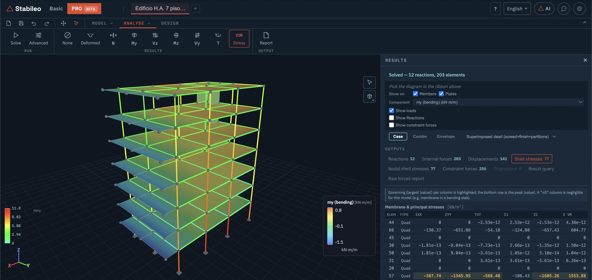
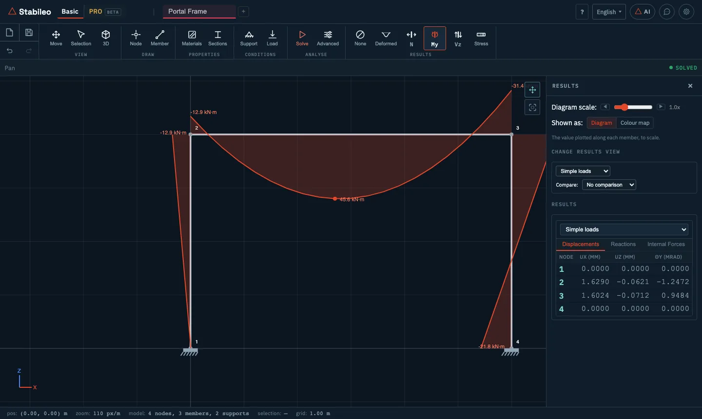

<p align="center">
  
</p>

<h1 align="center">Stabileo</h1>

<p align="center">
  <strong>Structural analysis, in a browser tab.</strong><br>
  An open structural-analysis platform. The solver runs on your machine:
  nothing to install, no licences, no account.
</p>

<p align="center">
  <a href="https://stabileo.com"><strong>Open the editor</strong></a> ·
  <a href="docs/guide/en/README.md"><strong>Read the guide</strong></a> ·
  <a href="https://stabileo.com/en/blog/">Blog</a> ·
  <a href="README.es.md">Leer en español</a>
</p>

<p align="center">
  <a href="LICENSE"></a>
  <a href="https://github.com/lambdaclass/stabileo/actions/workflows/ci.yml"></a>
</p>

<p align="center">
  
</p>

---

## What it is

Stabileo is structural analysis software that runs in any modern browser. You model, load, solve
and read results in 2D and 3D. The analysis engine is written in Rust and compiled to WebAssembly,
so it runs on your own computer: the model is not sent to a server to be solved.

It was born in the structures courses at [FIUBA](http://www.fi.uba.ar/) (University of Buenos
Aires), and it keeps that origin: besides giving the answer, **it shows the working**: the degree
of indeterminacy, the stiffness matrix step by step, which torsion theory applies to a section and
why.

The interface is available in **English, Spanish and Portuguese**.

## The modes

| Mode | Status | What it does |
|------|--------|--------------|
| **Basic** | Available | Frame and truss structures in 2D and 3D. Axial, shear and moment diagrams, stresses, and advanced tools: kinematic analysis, section analysis, second order, buckling, modal analysis, plastic collapse, influence lines and the stiffness method step by step. Models load from Excel templates, save to a file or travel in a link. |
| **PRO** | In development | Finite elements and complex models: slabs and walls as plates and shells, constraints, code-based load generation, import from AutoCAD (DXF) or Excel, and dynamic, staged and non-linear analysis. |
| **Education** | In development | The teacher writes an exercise inside the app and hands it out as a link. The student solves it without the result in view and hands the answers back as a file or a short code. |
| **Stabileo AI** | In development | An agent being built to create, review and explain models, working on the same structured model and the same solver you use. The AI proposes; the solver decides. |

<table>
  <tr>
    <td width="50%"></td>
    <td width="50%"></td>
  </tr>
  <tr>
    <td><sub>Basic 2D: the moment diagram of a portal frame, with the results table.</sub></td>
    <td><sub>Kinematic analysis: the degree formula says zero, the stiffness matrix finds the mechanism.</sub></td>
  </tr>
</table>

## Documentation

**The [Stabileo guide](docs/guide/en/README.md)** explains how to use each mode and the theory
behind it. It is written to be read like course notes, and you do not need to know GitHub or
programming to follow it: open a chapter and use the links at the bottom of each page.

| | English | Español |
|---|---|---|
| Contents | [Guide](docs/guide/en/README.md) | [Guía](docs/guide/es/README.md) |
| 1 | [Getting started](docs/guide/en/01-getting-started.md) | [Primeros pasos](docs/guide/es/01-primeros-pasos.md) |
| 2 | [Basic mode in 2D](docs/guide/en/02-basic-2d.md) | [Modo Básico en 2D](docs/guide/es/02-basico-2d.md) |
| 3 | [Basic mode in 3D](docs/guide/en/03-basic-3d.md) | [Modo Básico en 3D](docs/guide/es/03-basico-3d.md) |
| 4 | [Advanced tools](docs/guide/en/04-advanced-tools.md) | [Funciones avanzadas](docs/guide/es/04-funciones-avanzadas.md) |
| 5 | [PRO mode](docs/guide/en/05-pro.md) | [Modo PRO](docs/guide/es/05-pro.md) |
| 6 | [Theory](docs/guide/en/06-theory.md) | [Fundamentos teóricos](docs/guide/es/06-fundamentos-teoricos.md) |

Technical and contributor documentation (solver reference, verification, benchmarks, roadmaps)
is indexed in [docs/README.md](docs/README.md).

## Why Stabileo exists

Many commercial structural analysis packages cost thousands of dollars a year, run on a single
operating system, need installation and licence servers, and are closed source. Open-source
solvers such as [OpenSees](https://opensees.berkeley.edu/) are powerful, but they are driven by
scripts and have no visual interface of their own.

- **Local computation.** The solver runs in your browser through WebAssembly. You open
  [stabileo.com](https://stabileo.com) and start, with nothing to install and no model sent to a
  server.
- **Live recalculation.** With live calculation turned on, moving a node, changing a load or
  resizing a section solves the model again and updates the results.
- **Explained results.** The advanced tools lay out the formulas, the data and the intermediate
  steps. Kinematic analysis, section analysis and the step-by-step stiffness method show *why* a
  result is what it is, including when the formula you were taught does not apply.
- **Open source.** The engine and the interface are published under AGPL-3.0 and can be audited
  and modified.

## The blog

Long pieces on how the solver works and the decisions behind it, in English, Spanish and
Portuguese. Every figure in them is computed by the engine before the prose is written, and
several posts embed the real editor on the model they describe. Two to start with:

- [What free software computes, and what it does not explain](https://stabileo.com/en/blog/conceptual-side-advanced-tools/): where the free tools stop
- [The determinism boundary](https://stabileo.com/en/blog/the-determinism-boundary/): why an AI agent must not do the arithmetic

**[Read all the posts on the blog →](https://stabileo.com/en/blog/)**

## Under the hood

- **Engine:** Rust, compiled to WebAssembly. Direct stiffness method for frames and trusses, MITC4
  and DKT elements for plates and shells, sparse Cholesky factorisation for large models.
- **Interface:** Svelte 5 and TypeScript, Three.js for 3D, KaTeX for the step-by-step equations.
- **Validation:** checked against analytical solutions, NAFEMS benchmarks, the ANSYS Verification
  Manual, Code_Aster and textbook problems. See [BENCHMARKS.md](docs/BENCHMARKS.md).

<details>
<summary><strong>What the engine can solve</strong></summary>

The engine implements more than any single mode exposes today; the modes above say what is
reachable from the interface.

- 2D and 3D linear static, second order (P-Δ), linear buckling, modal, response spectrum, time
  history, harmonic response and moving loads
- Corotational and material non-linear analysis, plastic analysis, fibre beam-column elements
- Staged construction, prestress and post-tension, cables, contact and gap, non-linear
  soil-structure interaction
- Initial imperfections, residual stress, creep and shrinkage
- Shells: MITC4 (ANS + EAS-7), MITC9, SHB8-ANS solid-shell and curved shells
- Guyan and Craig-Bampton model reduction
- Load combinations, envelopes, section analysis, stress recovery and kinematic diagnostics

</details>

## Run it locally

```bash
git clone https://github.com/lambdaclass/stabileo.git
cd stabileo/web
npm install
npm run wasm      # build the Rust engine into web/src/lib/wasm (needs Rust and wasm-pack)
npm run dev       # http://localhost:4000
```

```bash
npm test           # the web test suite
npm run build:only # production build -> web/dist/
```

Requires Node.js 18 or later. `npm run build` also prerenders every public route by driving the
page in headless Chromium, so it needs `npx playwright install chromium` first; `dev`, `test` and
`build:only` do not.

## Contributing

Stabileo is built in the open, with the people who use it. Reports, ideas, discussions and code
are all welcome.

**The best place to start is our [Discord](https://discord.gg/Q53rp7FKXA)**: it is where we chat
about the project, answer questions and discuss what comes next, in English and Spanish. Come
and say hello.

Every channel is also gathered on **[linktr.ee/stabileo](https://linktr.ee/stabileo)**:

| Channel | Language | What for |
|---|---|---|
| [Discord](https://discord.gg/Q53rp7FKXA) | English · Spanish | Chat and take part in the project |
| [WhatsApp](https://wa.me/5491138563881) | English · Spanish | Direct contact with the team |
| [X](https://x.com/Stabileoapp) | English | News and updates |
| [Instagram](https://www.instagram.com/stabileoapp/) | Spanish | New features as they ship |
| [LinkedIn](https://www.linkedin.com/company/stabileo) | Spanish | Project news |

**Code.** Pull requests are welcome. For larger changes, open an issue first to discuss the
approach. The [technical documentation](docs/README.md) is the place to start.

## Security

To report a vulnerability, email security@lambdaclass.com.

## License

[AGPL-3.0](LICENSE)

## Built by

- **Bautista Chesta**: Civil Engineer (FIUBA), UX/UI and project management
- **Diego Kingston**: Ph.D. in Engineering (UBA), product–solver integration
- **Federico Carrone**: Founder of [Lambda Class](https://lambdaclass.com), solver lead

With contributions from mathematicians, physicists, computer engineers and computer scientists at
[Lambda Class](https://lambdaclass.com).
