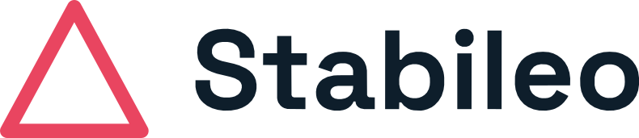
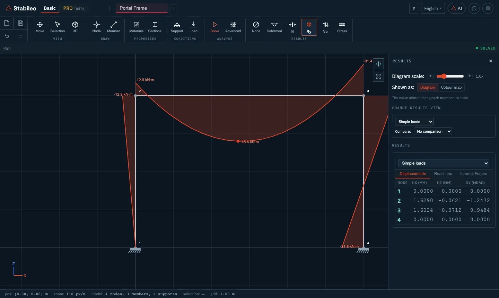
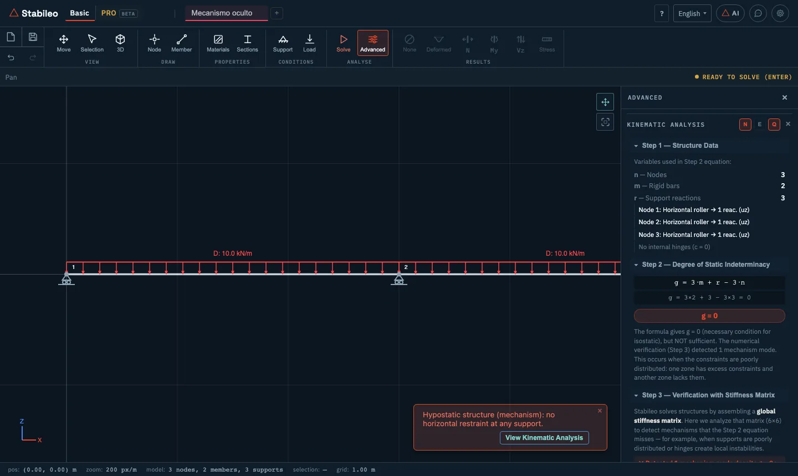

<p align="center">
  <picture>
    <source media="(prefers-color-scheme: dark)" srcset="docs/brand/stabileo-horizontal-color-fondo-oscuro.svg">
    
  </picture>
</p>

<p align="center">
  <strong>The structural analysis engine behind Stabileo.</strong><br>
  An open-source solver written in Rust and compiled to WebAssembly,
  so it runs on the user's machine, in the browser.
</p>

<p align="center">
  <a href="https://stabileo.com"><strong>Use it in Stabileo</strong></a> ·
  <a href="docs/README.md"><strong>Documentation</strong></a> ·
  <a href="https://stabileo.com/en/blog/">Blog</a> ·
  <a href="README.es.md">Leer en español</a>
</p>

<p align="center">
  <a href="LICENSE"></a>
  <a href="https://github.com/lambdaclass/stabileo/actions/workflows/ci.yml"></a>
</p>

---

## What it is

This repository is the engine of [Stabileo](https://stabileo.com), a structural analysis platform
that runs in the browser. The engine takes a structural model (nodes, members, plates and shells,
supports, materials, sections and loads) and solves it: displacements, reactions, internal forces,
stresses, modes and the diagnostics that say how far to trust them. It has no user interface of
its own.

It is written in Rust and compiled to WebAssembly, so the application runs it on the user's own
computer: the model is not sent to a server to be solved. The same crate builds natively for
tests, benchmarks and server-side use.

It was born in the structures courses at [FIUBA](http://www.fi.uba.ar/) (University of Buenos
Aires), and it keeps that origin in what it reports: the degree of indeterminacy, the mechanisms a
counting formula misses, and structured diagnostics instead of a silent result.

<table>
  <tr>
    <td width="50%"></td>
    <td width="50%"></td>
  </tr>
  <tr>
    <td><sub>The engine at work in Stabileo: the moment diagram of a portal frame.</sub></td>
    <td><sub>Kinematic analysis: the degree formula says zero, the stiffness matrix finds the mechanism.</sub></td>
  </tr>
</table>

## What it solves

- 2D and 3D linear static, second order (P-Δ), linear buckling, modal, response spectrum, time
  history, harmonic response and moving loads
- Corotational and material non-linear analysis, plastic analysis, fibre beam-column elements
- Staged construction, prestress and post-tension, cables, contact and gap, non-linear
  soil-structure interaction
- Initial imperfections, residual stress, creep and shrinkage
- Shells: MITC4 (ANS + EAS-7), MITC9, SHB8-ANS solid-shell and curved shells; DKT plates
- Guyan and Craig-Bampton model reduction
- Load combinations, envelopes, influence lines, section analysis, stress recovery and kinematic
  diagnostics

Under the hood: the direct stiffness method, sparse Cholesky factorisation with fill-reducing
ordering for large models, and Lanczos eigensolvers. See [engine/README.md](engine/README.md) for
the analysis families and [SOLVER_REFERENCE.md](docs/SOLVER_REFERENCE.md) for the model contract.

## How it is checked

Every result family is checked against analytical solutions, NAFEMS benchmarks, the ANSYS
Verification Manual, Code_Aster and textbook problems, alongside invariant and differential fuzz
tests. See [BENCHMARKS.md](docs/BENCHMARKS.md) and [VERIFICATION.md](docs/VERIFICATION.md).

## Using it

**From Rust**, pin a commit of this repository (the crate is not on crates.io yet):

```toml
[dependencies]
dedaliano-engine = { git = "https://github.com/lambdaclass/stabileo", rev = "<commit>" }
```

**In the browser**, build the WebAssembly package (needs Rust and
[wasm-pack](https://rustwasm.github.io/wasm-pack/); the toolchain is pinned in
`engine/rust-toolchain.toml`):

```bash
git clone https://github.com/lambdaclass/stabileo.git
cd stabileo
make wasm          # engine/pkg: an ES module with TypeScript declarations
```

**Tests**:

```bash
make test             # the engine test suite
make test-inventory   # the counts published in docs/BENCHMARKS.md
make check            # clippy
```

[engine/README.md](engine/README.md) has an example and the list of entry points.

## The Stabileo application

[Stabileo](https://stabileo.com) is the application built on this engine: modelling and results in
2D and 3D, finite-element models in PRO mode, an education mode and an AI assistant that works on
the same structured model and solver, in English, Spanish and Portuguese. The application is not
part of this repository. Its [user guide](docs/guide/en/README.md) explains each mode and the theory
behind it, and the [blog](https://stabileo.com/en/blog/) has long pieces on how the solver works,
with every figure computed by this engine.

## Contributing

Stabileo is built in the open, with the people who use it. Reports, ideas, discussions and code
are all welcome.

**The best place to start is our [Discord](https://discord.gg/Q53rp7FKXA)**: it is where we chat
about the project, answer questions and discuss what comes next, in English and Spanish. Come
and say hello.

Every channel is also gathered on **[linktr.ee/stabileo](https://linktr.ee/stabileo)**:

| Channel | Language | What for |
|---|---|---|
| [Discord](https://discord.gg/Q53rp7FKXA) | English · Spanish | Chat and take part in the project |
| [WhatsApp](https://wa.me/5491138563881) | English · Spanish | Direct contact with the team |
| [X](https://x.com/Stabileoapp) | English | News and updates |
| [Instagram](https://www.instagram.com/stabileoapp/) | Spanish | New features as they ship |
| [LinkedIn](https://www.linkedin.com/company/stabileo) | Spanish | Project news |

**Code.** Pull requests to the engine are welcome. For larger changes, open an issue first to
discuss the approach. The [documentation](docs/README.md) is the place to start. Problems with the
application at stabileo.com are best reported on Discord.

## Security

To report a vulnerability, email security@lambdaclass.com.

## License

[AGPL-3.0](LICENSE)

## Built by

- **Bautista Chesta**: Civil Engineer (FIUBA), UX/UI and project management
- **Diego Kingston**: Ph.D. in Engineering (UBA), product–solver integration
- **Federico Carrone**: Founder of [Lambda Class](https://lambdaclass.com), solver lead

With contributions from mathematicians, physicists, computer engineers and computer scientists at
[Lambda Class](https://lambdaclass.com).
