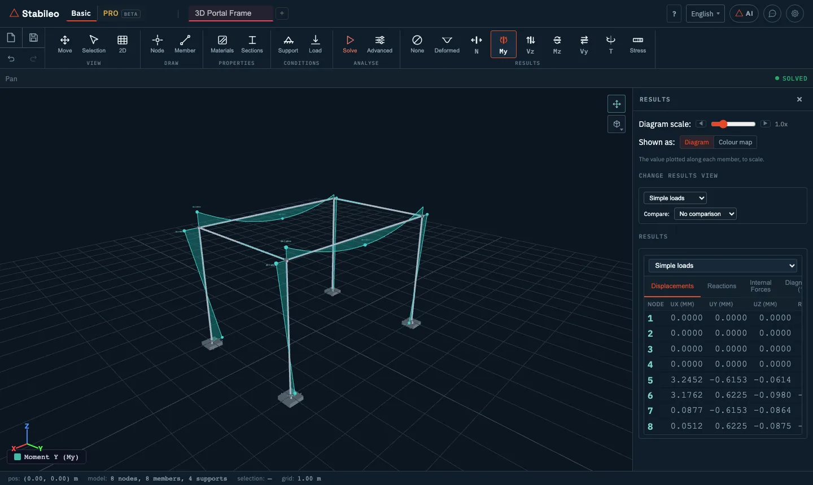

# 3. Basic mode in 3D

The **3D** button in the **View** group takes the model into space. It is still Basic mode, with
the same tools and the same member logic, but each node goes from three degrees of freedom to
**six**: three displacements (**ux**, **uy**, **uz**) and three rotations (**θx**, **θy**, **θz**).

## The axes

The **Z axis is vertical, pointing up**; **X** and **Y** are horizontal. Gravity points to −Z. A
2D model, which lives in the XZ plane, stands upright in that same plane when moved to 3D.

Besides the global axes, **each member has its own local axes**:

- **local x** runs along the member, from node I to node J.
- **local z** is the global vertical projected perpendicular to the member. In a horizontal beam
  it points up.
- **local y** completes the triad (y = z × x).
- In vertical members, where the vertical cannot serve as a reference, global X is used instead.

Member forces are expressed in those local axes. That is why, in a horizontal beam loaded by
gravity, the main moment is **My** (bending about the local y axis) and the shear that goes with
it is **Vz**.

> **Settings** lets you choose a right- or left-handed local triad. It changes the sign of some
> member forces and which side the diagrams are drawn on, not their magnitude.

## What changes from 2D

| | 2D | 3D |
|---|---|---|
| Degrees of freedom per node | 3 | 6 |
| Member forces | N, Vz, My | N, Vy, Vz, T, My, Mz |
| Matrix of one member | 6 × 6 | 12 × 12 |
| Stresses in the section | bending in one plane | biaxial bending and torsion |

The **Results** buttons add **Mz**, **Vy** and **T** (torsion).

### Nodes

Nodes are drawn on a **working plane** (XY, XZ or YZ) at a given **level**: for instance the XY
plane at first-floor height.

### Supports

In 3D a support is defined by ticking what it restrains: three displacements (Fx, Fy, Fz) and
three rotations (Mx, My, Mz). The shortcuts **Fixed** (all six) and **Pin.** (the three
displacements) cover the usual cases. Every unrestrained degree of freedom can be given a spring
stiffness. Inclined rollers and prescribed displacements are options of 2D mode.

### Loads

- **Nodal:** Fx, Fy, Fz, Mx, My, Mz.
- **Distributed:** in the member's **local y and z** directions, with a value at each end.
- **Self-weight:** as in 2D.

> **Watch the default direction.** In 3D the point load starts on **Fy** and the distributed load
> on **local y**, which are horizontal on a horizontal beam. For gravity loads use **Fz** on nodes
> and **qZ** (local z) on members, and set **qYI** and **qYJ** to 0; otherwise the member also gets
> the horizontal load that comes by default.

Thermal loads and point loads within a member's span are entered in 2D; when the model moves to
3D they are kept and solved.

### Joints

In 3D a joint releases any combination of the six relative movements between the member end and
the node. It is set with the **Joints** mode of the **Node** tool: tick the movements to release
(dx, dy, dz, θx, θy, θz) and click the member near the end. Sliding joints belong to the 2D model.

> In a model with 3D geometry, the **Hng I** and **Hng J** columns of the members table release
> **only the Mz moment**. In a horizontal beam the gravity moment is **My**, so to hinge it for
> gravity loads release θy with the **Joints** mode. In a model that is still flat, such as one
> brought over from 2D, those columns release the in-plane moment, as in 2D.

### Torsion

A 3D member can work in torsion, and for that it needs the torsion constant **J** of its section.
Catalogue sections and sections built from a shape have it computed. If you define an amorphous
section, enter J by hand, so that torsion is computed with the value that belongs to the section.

## Going back to 2D

The same button, which now reads **2D**, takes the model back to the plane. If the model really is
flat, the switch is immediate. If not, the program asks what to do:

1. **The plane:** XZ, YZ or XY.
2. **What to take:**
   - **One frame, cut at a distance.** Takes only what lies in that plane, at the chosen distance:
     "give me the frame on grid line 3". The program lists the possible cuts with their members,
     supports and loads, and warns if one would be left without supports or without loads.
   - **The whole structure, flattened.** Projects everything onto the plane. It is useful to see
     the structure from the side, but it stacks frames on top of each other.
3. With the plane and the option chosen, **Take it to 2D** makes the switch. There are also **Stay
   in 3D**, to leave things as they were, and **Erase model and switch to 2D**, to start from
   scratch in the plane.

The original 3D model is kept: pressing **3D** again brings it back exactly as it was. Changes you
made to the 2D cut are not carried back into the 3D model.

---

[← Basic mode in 2D](02-basic-2d.md) · [Contents](README.md) · [Next: Advanced tools →](04-advanced-tools.md)
