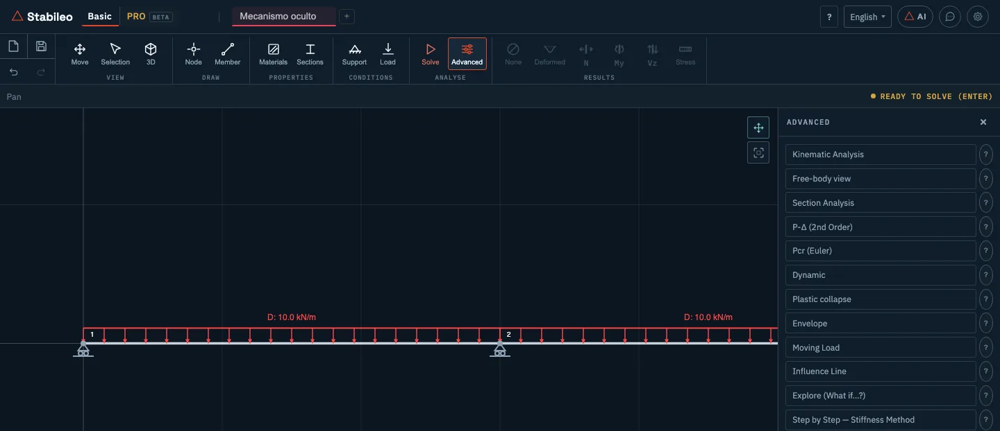
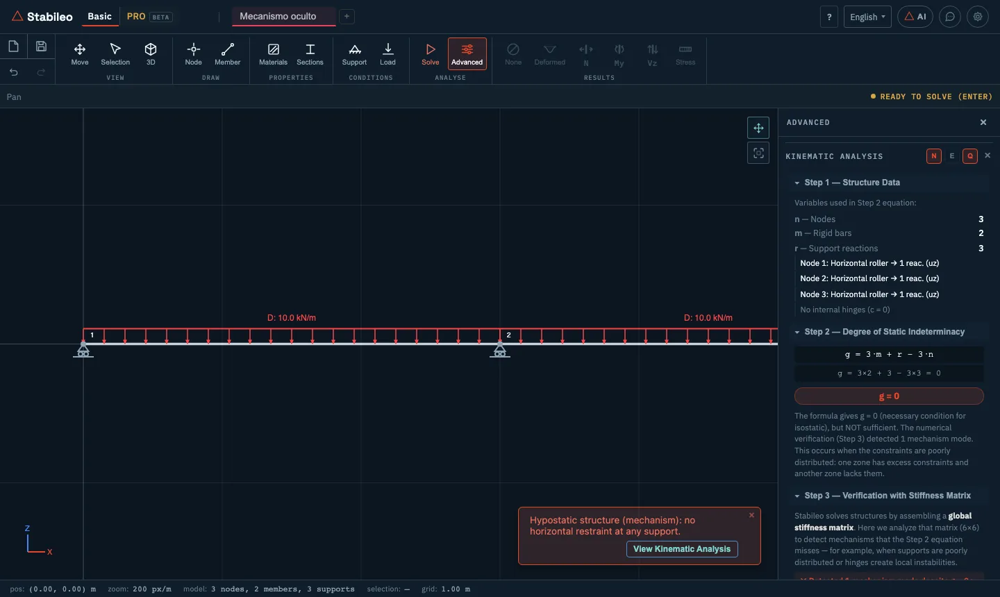
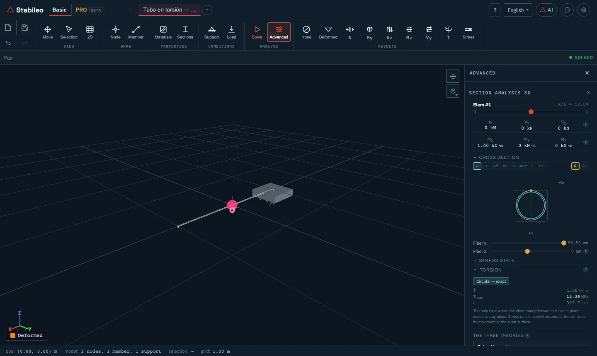
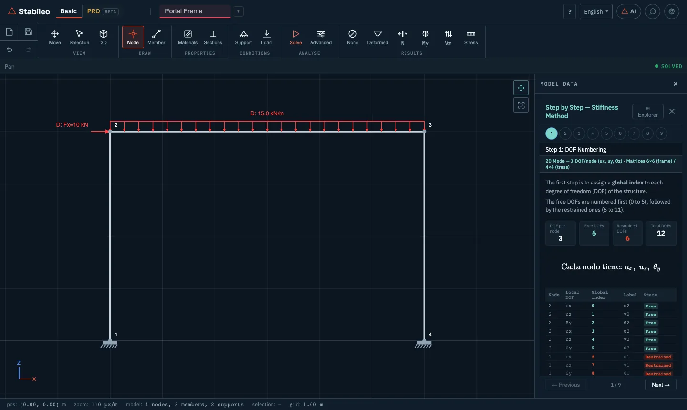

# 4. Advanced tools in Basic mode

The **Advanced** button in the **Analyse** group opens a menu. Choosing an entry replaces the menu
with that tool's controls, with a ✕ to go back. The **?** button of each entry briefly explains
what it does.



One idea runs through all of these tools: **give the working, not just the number**. Which formula
was used, with what data and, where it matters, why another formula does not apply.

| Tool | 2D | 3D | Needs a solve first |
|---|:-:|:-:|:-:|
| [Kinematic Analysis](#kinematic-analysis) | ✓ | — | no |
| [Free-body view](#free-body-view) | ✓ | ✓ | yes |
| [Section Analysis](#section-analysis) | ✓ | ✓ | yes |
| [P-Δ (2nd Order)](#p-δ-second-order) | ✓ | ✓ | no |
| [Pcr (Euler)](#pcr-buckling) | ✓ | ✓ | no |
| [Dynamic](#dynamic-modal-analysis) | ✓ | ✓ | no |
| [Plastic collapse](#plastic-collapse) | ✓ | — | no |
| [Envelope](#envelope) | ✓ | ✓ | no |
| [Moving Load](#moving-load) | ✓ | — | no |
| [Influence Line](#influence-line) | ✓ | — | yes |
| [Explore (What if…?)](#explore-what-if) | ✓ | ✓ | yes |
| [Step by Step — Stiffness Method](#step-by-step-the-stiffness-method) | ✓ | ✓ | no |

---

## Kinematic analysis

**What it answers:** whether the structure is stable and, if so, how many unknowns are left over.
It is the first step of any hand calculation, and the program shows it worked out.



1. **Data:** nodes (n), rigid and truss members (m), support reactions (r) and internal
   conditions (c), each with where it comes from (for example, "Node 1: Horizontal roller → 1 reac.
   (uz)").
2. **Degree of indeterminacy**, with the formula that fits the type of structure and the numbers
   substituted:
   - frames: g = 3·m + r − 3·n − c
   - trusses: g = m + r − 2·n
   - mixed: g = 3·$m_p$ + $m_r$ + r − 3·n − c ($m_p$ frame members, $m_r$ truss members)
3. **Check with the stiffness matrix.** The degree formula is a **necessary but not sufficient**
   condition. A structure can have g = 0 and still be a mechanism if its restraints are badly
   distributed: too many in one place, too few in another. So the program checks the rank of the
   stiffness matrix numerically and, if there is a mechanism, says **at which node and in which
   direction** it moves.
4. **Suggestions** to make it stable.

It needs no solve: it is worked out when the panel opens. If you then change the model, a button
(**Structure modified — click here to update**) recomputes it; with **Live calculation** on, it
updates on its own.

> There is a blog post built on exactly this case, a beam where the formula gives zero and the
> structure moves: [what free software computes, and what it never
> explains](https://stabileo.com/en/blog/conceptual-side-advanced-tools/).

## Free-body view

**What it shows:** every member detached from its nodes, with the forces it receives at each end
(N, V, M) and the support reactions. It is the free-body diagram of the whole structure at once,
with the action-reaction pairs in view. It is how you check the equilibrium of every member and
every node.

Options: vectors on members, on nodes or both; in local or global axes; loads shown in full, as a
resultant or off; combined vectors; and **Vector size** and **Value size**. Clicking a node or a member
lists the actions that reach it.

## Section analysis

**What it shows:** the stress state at any section of a member. Turn it on, click a member and move a
cursor along it.



- **Normal stress** by Navier: σ = N/A + M·z/I (biaxial bending in 3D). A cursor runs across the
  fibres of the section.
- **Shear stress** by Jourawski: τ = V·Q / (I·b), with the shear flow drawn over the section.
- **Torsion:** the program decides which theory applies from the shape of the section (Cauchy for
  circular sections, Bredt for closed thin walls, and Saint-Venant, the general theory, for the
  rest) and says so. **The three theories** compares them, and marks the ones that do not apply
  with the reason. Where it matters, it also estimates the share of the torque taken by
  **warping** (non-uniform torsion). These results appear in 3D, when the member carries torque.
- **Stress state, tensors and Mohr's circle**, with the principal stresses.
- **Failure criteria:** Von Mises, Tresca and Rankine, each as a percentage of fy.
- **Centroid and shear centre**, with the working.
- **Central core**, with its equations, and **eccentric load**: whether the resultant falls
  inside or outside the core.
- **Critical sections:** the member ends, the maximum moment (where V = 0), the load points and
  midspan.

It needs a section defined by its shape: an amorphous section has no geometry to compute stresses
on.

> The comparison between Bredt and the exact solution on a tube has a post of its own: [Bredt or
> Saint-Venant](https://stabileo.com/en/blog/torsion-bredt-saint-venant/).

## P-Δ (second order)

**What it computes:** the effect of the loads acting on the **deformed** structure. In a linear
analysis equilibrium is written on the initial geometry. In a second-order one, a compressed
column that sways generates an extra moment P·Δ, which increases the sway, which increases the
moment.

The program solves it by iterating until the result stops changing (up to 20 iterations). It
reports the **amplification factor B₂** (the largest ratio between second-order and linear
displacements), the number of iterations and whether the structure is stable. A B₂ above 1.4 points to
a structure sensitive to second-order effects.

## Pcr (buckling)

**What it computes:** the elastic critical buckling load. It solves the eigenvalue problem

```math
\left( [K] + \lambda\,[K_G] \right) \{\phi\} = 0
```

where [K] is the elastic stiffness and $[K_G]$ the **geometric stiffness**, which depends on the
axial forces. Each eigenvalue **λ** is the factor by which the current loads must be multiplied for
the structure to buckle, and each eigenvector **φ** is the shape it buckles in.

It shows the first four modes, with their λ, their drawn shape and the effective length factor
(**K**: the buckling length is K·L) of the compressed members.

## Dynamic (modal analysis)

**What it computes:** the natural frequencies and mode shapes. It solves

```math
\left( [K] - \omega^2 [M] \right) \{\phi\} = 0
```

with a **mass matrix** built from the unit weight ρ of each material.

It shows the first six modes: frequency (Hz), period (s), effective mass of each mode and the
running total, with the mode shape animated. In 2D, the message shown when it finishes also gives
the Rayleigh damping coefficients: the factors a₀ and a₁ that build the damping as
a₀·[M] + a₁·[K].

> Seismic response-spectrum analysis is not in Basic mode: it is in PRO.

## Plastic collapse

**What it computes:** the load factor that brings the structure to collapse, through the
successive formation of **plastic hinges**. For each section the program uses a plastic moment
Mp = Zp·fy, where fy is the material's yield stress (250 MPa if none is set) and Zp is taken as
b·h²/4 from the section's width b and depth h, the plastic modulus of a solid rectangle of those
dimensions; for a section without b and h it is taken as 1.15 times the elastic modulus. Each time
the moment at a member end reaches Mp, a hinge that rotates without taking more moment is placed
there, and the structure keeps being loaded with one more hinge until a mechanism forms.

Hinges form at member ends: if one is expected inside a span (under a point load, for instance),
split the member at that point.

It shows each step with its factor λ, where the hinge formed and whether a mechanism was reached.

## Envelope

**What it shows:** for every point of every member, the maximum and minimum moment, shear and axial
force across all combinations. It is what members are sized for: no single combination governs
the whole structure. It needs combinations defined in the **Combinations** section; if they have
not been solved yet, it solves them when you turn it on.

## Moving load

**What it computes:** the effect of a load that moves, like a vehicle on a bridge. The load train
travels, in 25 cm steps, along the path of members that starts at the leftmost node and continues
to the right through connected members, and the model is solved at each position. Trains that are
not symmetric, such as the HL-93, are also run in the opposite direction. There are predefined
trains: a 100 kN point load, the HL-93 truck (axles of 35, 145 and 145 kN, 4.3 m apart) and a
tandem of two 110 kN axles 1.2 m apart. You can step through the positions and see the envelope.

The train's loads are **added to the loads already in the model**: to see the effect of the train
alone, delete the other loads first.

## Influence line

**What it shows:** how a reaction or a member force changes as a **unit load** travels across the
structure. Choose the quantity and click: a node for a reaction (Rz, Rx or My), or a member for the
moment or shear at its midpoint. The program draws the line, and the load can be animated across
the structure.

An influence line answers the inverse question of a force diagram: not "what moment is there at
each point for this load", but "what moment is there at this point depending on where the load
is".

## Explore (what if…?)

**What it does:** a slider for each load (0 to 3 times its value) and global factors for the
modulus E, the area and the inertia (0.1 to 5 times, applied to every member at once; in 3D the
inertia factor also scales the torsion constant J), with the
model re-solving live. It builds intuition: how much the deflection changes if the inertia
doubles, what happens to the forces if a load doubles. Closing it restores the original values.

## Step by step: the stiffness method

**What it shows:** the full solution of the model by the stiffness method, in nine steps, with the
actual matrices and vectors of your structure.



1. **Degree-of-freedom numbering:** free ones first, restrained ones after.
2. **Local matrices [k]** of each member: 6 × 6 for 2D frames, 2 × 2 for 2D trusses (the formula is
   shown as 4 × 4), 12 × 12 for 3D frames and 6 × 6 for 3D trusses.
3. **Transformation** to global axes: [K]ₑ = [T]ᵀ [k] [T].
4. **Assembly** of the global stiffness matrix [K].
5. **Load vector {F}**, including the equivalent nodal loads of the loads on members.
6. **Boundary conditions:** the partition into free and restrained degrees of freedom, with any
   prescribed displacements.
7. **Solution** for the displacements {u}.
8. **Reactions {R}.**
9. **Internal forces:** each member's displacements taken to local axes, the resulting force, and
   the correction for the loads along the span.

The **Matrix Explorer** lets you walk through any of them entry by entry. The theory behind each
step is in [chapter 6](06-theory.md#the-stiffness-method).

---

## Which models they accept

- Sliding joints (in 2D) and internal joints from the **Joints** mode (in 3D) are used in the linear
  analysis and in the free-body view. P-Δ, buckling, dynamic, plastic collapse, moving load,
  influence line, explore and step by step work with hinges at member ends (the **Hng I** and
  **Hng J** columns); if the model has sliding joints or internal joints, the program asks for them
  to be removed before starting.
- Kinematic analysis, plastic collapse, moving load and influence line are used on 2D models.

---

[← Basic mode in 3D](03-basic-3d.md) · [Contents](README.md) · [Next: PRO mode →](05-pro.md)
