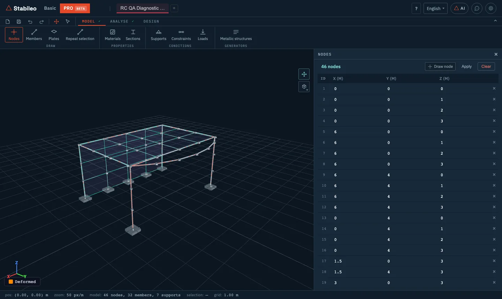
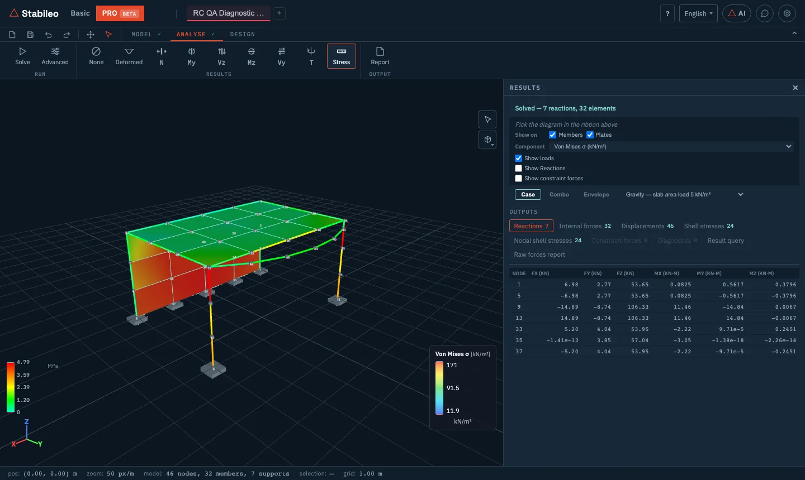

# 5. PRO mode

PRO is the mode for **finite elements and complex models**. Besides members in space, it models
**plates and shells** (slabs, walls, rafts), constraints between nodes, loads generated to code,
and it runs dynamic and non-linear analyses.

This chapter covers modelling and analysis: the **Model** and **Analyse** tabs, importing models
and the report.

## Getting in and starting a model

Enter with the **PRO** button in the header. PRO keeps **its own model**, separate from Basic's:
when you switch modes, each one keeps its own.

To start:

- **An empty model:** the **+** on the tabs.
- **An example:** **Project → New model → Examples**. There are sixteen, grouped into buildings,
  industrial, energy and offshore, foundations, long-span structures, and large showcase models.
- **Import** (see [below](#importing-models)): an Excel spreadsheet or an AutoCAD drawing (DXF).

As in Basic, **Project** also has **Save**, **Open**, **Share link** and **Export** (results to
Excel or CSV, the report, and the view to DXF or SVG). See
[chapter 1](01-getting-started.md#saving-opening-and-sharing).

## The Model tab

In PRO each ribbon button opens a **panel with a table**. To draw in the viewer, each panel has
its own **Draw** button (node, member, plate…); pressing it again goes back to selecting. The
**selection** tool is in the top bar, next to undo and redo.

### Draw

**Nodes.** An editable table of X, Y, Z coordinates in metres. You can **paste from Excel**
(X, Y and optionally Z columns).

**Members.** A table with start and end node, material and section, and the **Hinge i** and
**Hinge j** columns, with a button that toggles **Pin** and **Fix** at each end. Those columns
release only the **Mz** moment; to release any other degree of freedom, edit the member (see
below). Also:

- **Curved:** an arc through three nodes, built as a chain of straight members. The panel reports
  the chord error.
- **Member offset (eccentricity):** shifts the member's axis away from its nodes, for instance so a
  beam hangs below the slab.
- Right-clicking a member: **edit** it (material, section and per-degree-of-freedom releases at
  each end) or **subdivide** it into N parts (2 to 20). With nodes selected, right-clicking empty
  space mirrors them in X or Y or rotates them by 90°.

Members you draw are frame members. Truss members come in from the generators or from an Excel
spreadsheet, which also lets you set the roll of each member's local axes.

**Plates.** A plate is defined by its nodes: **three nodes make a triangle and four a
quadrilateral**. It is given a material and a thickness.

- **Mesh generator:** from four corners (counter-clockwise), it generates a mesh of quadrilaterals
  by target size or by number of divisions. It can split the boundary beams so they share the edge
  nodes.
- **Curved shell (cáscara):** for quadrilaterals whose four nodes do not lie in one plane. The panel
  measures how far the fourth node is out of plane and suggests when to use it.
- **Stair:** an inclined slab with the steps applied as load.
- **Shell offset (eccentric):** shifts the plate's mid-plane, for instance to line up the top face
  of the slab with the floor level.

> **How plates connect to members:** only through **shared nodes**. A beam running under a slab
> without sharing nodes with it is not connected. The panel warns when a plate has a loose corner.

**Repeat selection.** Copies the selected nodes and members N times with a given offset. It can
join the copies with members (the columns between floors, for instance) and copy the supports too.
It copies nodes, members and supports, not plates or loads, and it does not merge nodes: a copy
landing on an existing node leaves two in the same place.

### Properties

**Materials** and **Sections** work as in Basic: a library (steels, concretes, timbers, aluminium;
rolled and cold-formed profiles) or custom definitions. For sections, **Build section** makes
parametric shapes, and catalogue profiles can be rotated and combined into built-up sections.

### Conditions

**Supports.** **Fixed 3D**, **Pinned 3D**, rollers in each plane (**Roller XZ**, **XY** and **YZ**),
**Spring 3D** (with a stiffness for each degree of freedom) and **Custom**, where you tick one by
one which displacements and rotations are restrained. A roller moves freely within its plane:
**Roller XZ**, for instance, is restrained only along Y.

**Constraints.** Relations between nodes:

- **Rigid link:** a slave node follows a master node as if they were joined by an infinitely
  rigid member.
- **Diaphragm:** the nodes of a plane move together in that plane. It is the usual assumption of
  a slab that is rigid in its own plane. **Auto-detect diaphragms** groups the nodes by level
  (within 5 cm) and takes the node nearest the centre as the master.
- **Equal DOF:** two nodes share one or more degrees of freedom (DOF).
- **Eccentric connection**, **linear MPC** (multi-point constraint: a linear relation between
  degrees of freedom of several nodes) and **connectors** with their own stiffness between two
  nodes.

**Loads.** The panel has three parts:

- **Load cases:** each case with its type (D dead, L live, Lr roof live, W wind, E earthquake,
  S snow) and a button to show or hide it in the viewer. **Self-weight** is **on by default** in PRO
  and is computed for members and plates.
- **Combinations:** manual, or generated automatically (strength and service combinations).
- **Add load:** nodal (in global axes), distributed and point loads on members (in the member's
  local axes), and **surface** loads on quadrilateral plates: in kN/m², vertical (a positive value
  acts downward) and shared among the plate's four nodes.

**Auto-generate from code.** Builds the building's load plan from Argentine codes:

- **Dead loads** from the layers of the construction (CIRSOC 101, Table 3.1).
- **Live loads** from the occupancy of each space, with the reduction for tributary area.
- **Wind** to CIRSOC 102.
- **Earthquake** to INPRES-CIRSOC 103 (static method). This part is enabled when the project has a
  seismic regulation assigned; if it has none, the dialog says so.

Area loads become line loads on the horizontal members, multiplied by the tributary width entered
in the dialog, the same for all of them; wind is applied as forces per level. It first shows the
load plan for review, and applies it when you confirm. Load cases of type D, L, W and E also have a
**§** button that opens the dialog for that case directly.

### Generators

**Metallic structures** generates the **geometry** of typical steel structures:

- **Truss:** trapezoidal, parallel-chord, Pratt, arched, or a rolled portal, with several web
  patterns, half trusses and subdivided diagonals.
- **Lattice column.**
- **Shed:** span, frame spacing, number of frames, lattice or solid-web columns, purlins, and roof,
  truss and wall bracing.

Besides the geometry, it assigns a profile to each kind of member and a steel grade. The generator
**replaces the current model** (a single undo brings it back).

## Importing models

From **Project**:

- **Excel spreadsheet.** The same spreadsheet as in Basic: **Template ↓** downloads the sheets,
  their columns and examples. PRO also uses the sheets for triangular plates (**Plates**),
  quadrilateral plates (**Quads**) and constraints (**Constraints**). It is the most convenient way
  to load a large model prepared in another tool.
- **DXF plan (AutoCAD).** A four-step wizard:
  1. the file and its units;
  2. what each drawing layer represents: grid, columns, beams, walls, slabs, openings, text;
  3. the assumptions: number of floors and storey heights, column, beam, slab and wall sizes,
     base support type, loads and slab meshing;
  4. a preview before applying.

  The result is a **draft** of the structure, flagged as unreviewed, with the list of assumptions
  that were used. Slabs and walls are generated as plates.

## Before solving: diagnostics

PRO checks the model as you build it. When there are errors a warning appears that opens the
**Diagnostics** panel, and the panel opens on its own if you press **Solve** with errors. It
separates:

- **Errors**, which prevent solving: fewer than two nodes, no members and no plates, no supports,
  members without a section or material, sections with zero area or inertia, loads pointing to
  elements that do not exist.
- **Warnings:** coincident or loose nodes, very short or duplicate members, members hinged at both
  ends, transverse loads on truss members.
- **Information:** empty load cases, a model without loads.

After solving, the engine also reports the **mesh quality** of the plates (aspect ratio, warping,
very small angles).

## The Analyse tab

### Solve

**Solve** solves the model with the 3D engine. If there are combinations, it solves every case and
combination and builds the envelope. For large models it uses a sparse solver (Cholesky
factorisation with reordering), which is what makes thousands of degrees of freedom solvable in
the browser.

### Results

The diagrams are the same as in Basic 3D: **Deformed**, **N**, **My**, **Vz**, **Mz**, **Vy**,
**T** and **Stress**, which in PRO colours both members and plates.

In the **Results** panel:

- **Shown as:** diagram, member colour or colour map. For **Stress**, **Show on** members, plates
  or both.
- **Colour map** of moment, shear, axial force, **Strength (σ/fy)**, Von Mises or **Shell
  contour**.
- For plates, the component to show: Von Mises, principal stresses σ1 and σ2, σxx, σyy, τxy
  (kN/m²) and moments per unit width mx, my, mxy (kN·m/m).
- View by **Case**, **Combo** or **Envelope**, and checkboxes to show loads, reactions and
  constraint forces.
- The **outputs** as tables: reactions, internal forces, displacements, shell stresses (per
  element and per node), constraint forces and diagnostics.
- **Result query:** finds the governing value of a force over the whole model, the selection or a
  list of elements, with filters, and exports it to CSV.
- **Raw forces report:** reactions, displacements and forces per member and per station, as Excel,
  PDF or HTML.

### Advanced

PRO's advanced analyses:

- **P-Delta**, **modal**, **spectral** and **buckling**. Spectral uses a simplified
  INPRES-CIRSOC 103 spectrum by seismic zone and soil type, combines the modes by CQC (complete
  quadratic combination) or SRSS (square root of the sum of squares), and needs a modal run first.
- **Time history** (Newmark or HHT-α, with a sinusoidal ground acceleration generated by the program
  or your own accelerogram pasted as a list of values) and **harmonic response**.
- **Non-linear:** **pushover** (successive formation of plastic hinges under the model's loads, with
  the same Mp as Basic mode's [plastic collapse](04-advanced-tools.md#plastic-collapse)),
  corotational (large displacements) and fibre.
- **Geometric imperfections**, **foundation on Winkler springs**, **soil-structure interaction**
  with p-y curves, and **contact or gap**.
- **Staged construction** and **creep and shrinkage**.
- **3D influence lines**, **multi-case solver**, **section analyser** and **constrained analysis**.
- The **Rigid diaphragm** option for the whole model.

These analyses use the members' axis, without their offsets, and the hinges of the **Hinge i** and
**Hinge j** columns. Sliding joints and per-degree-of-freedom releases set when editing a member are
taken into account by **Solve**; before an advanced analysis, the program asks for them to be
removed. **Modal** and **spectral** work with the model's members: stiffness and mass come from
the members (and from the rigid members that the **Rigid diaphragm** option adds, when it is on).

### Report

**Report** builds a printable **calculation report**: model data, load details, results, the
advanced analyses you ran, material quantities and diagnostics, with an optional letterhead (logo,
company, engineer, revision). It also exports to Excel.

## The theory behind it

- **Members:** the same 3D Euler-Bernoulli members as Basic mode, with six degrees of freedom per
  node.
- **Quadrilateral plates:** the **MITC4** element, with its shear strains interpolated so that the
  element does not "lock" when the plate is thin (*shear locking*), and an enhanced membrane (EAS)
  that improves in-plane bending.
- **Triangular plates:** the **DKT** element for bending (a thin Kirchhoff plate, with no shear
  deformation), combined with a constant-strain triangle for the membrane. For walls, which work in
  in-plane bending, quadrilaterals are the better choice.
- **Curved shells:** a four-node element that represents curvature, for non-planar quadrilaterals.

Why a slab needs a mesh and a beam does not, what shear locking is, and when a member model stops
being enough: [chapter 6](06-theory.md#finite-elements-plates-and-shells) and the post [bars or
finite elements?](https://stabileo.com/en/blog/bars-or-finite-elements/).

---

[← Advanced tools](04-advanced-tools.md) · [Contents](README.md) · [Next: Theory →](06-theory.md)
