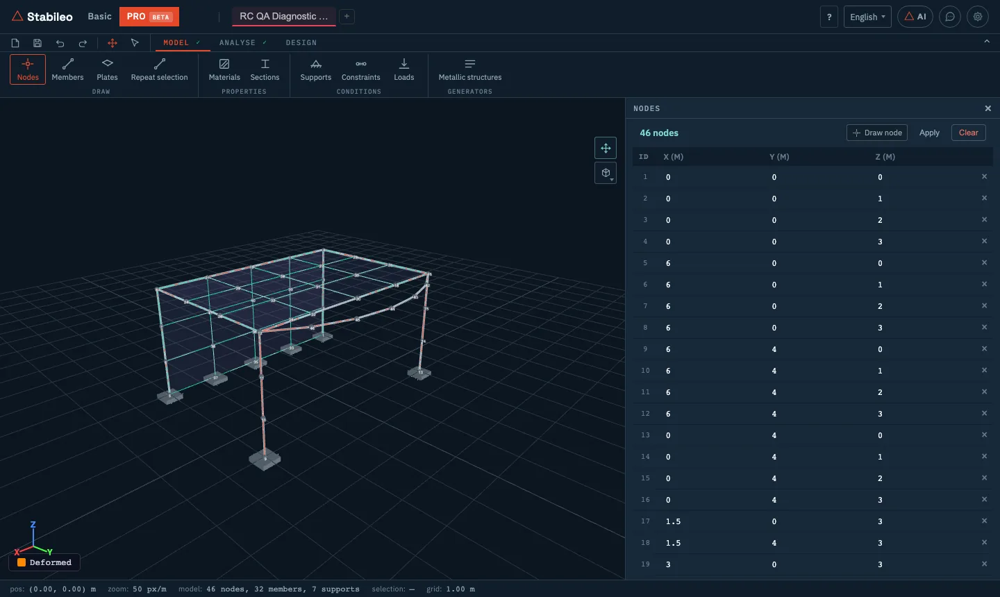
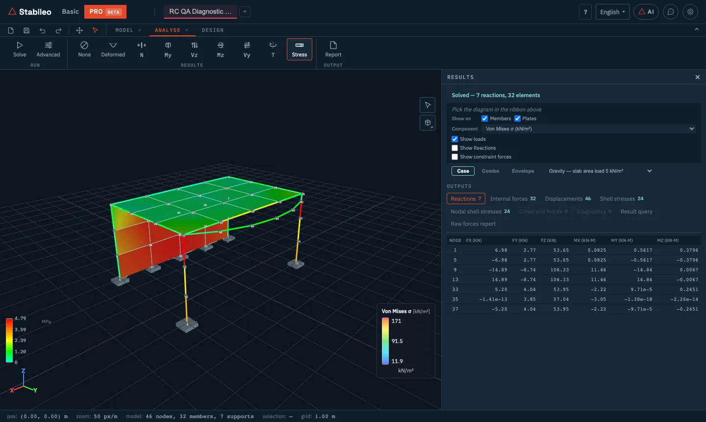

# 5. PRO mode

PRO is the mode for **finite elements and complex models**. Besides members in space, it models
**plates and shells** (slabs, walls, rafts), constraints between nodes, loads generated to code,
and it runs dynamic and non-linear analyses.

This chapter covers modelling and analysis: the **Model** and **Analyse** tabs, importing models
and the report.

## Getting in and starting a model

Enter with the **PRO** button in the header. PRO keeps **its own model**, separate from Basic's:
when you switch modes, each one keeps its own.

To start:

- **An empty model:** the **+** on the tabs.
- **An example:** **Project → New model → Examples**. There are twenty-four, in eight groups that
  run from a first frame to the models that test the viewer: first steps, buildings, from CAD,
  sheds and industrial buildings, towers, bridges and long spans, foundations, and a scale
  showcase. Within a group they go from the smallest to the largest. Each card says what the
  model is for, what to look at once it is solved, and its size, and it warns on the heavy ones.
  With a model open, the card asks before replacing it. The gallery opens over the model, its
  cards side by side.
- **Import** (see [below](#importing-models)): an Excel spreadsheet, an AutoCAD drawing (DXF) or
  an IFC model.

As in Basic, **Project** also has **Save**, **Open**, **Share link** and **Export** (results to
Excel or CSV, the report, and the view to DXF or SVG). See
[chapter 1](01-getting-started.md#saving-opening-and-sharing).

**Project workbook.** **Export → Project workbook** writes one Excel file with a cover (the project
data, the date, the build and the units), the conventions, the model and every case and combination:
reactions, displacements, member end forces, forces, deflections and stresses at the **stations**
you choose (5, 13 or the critical ones: quarters, load positions and zero shear), the maxima with
where they occur, the envelope of each node and member end with the combination that governs it, the
plates at their centres, nodes and corners, the statics and the second-order status. Numbers keep
every digit and the solver's sign, the one the diagrams show. The model sheets use the names and
columns of the Excel import, so they can be read back. When the workbook is larger than an Excel
file handles well (a sheet past its rows, or more than four million cells), it comes as a zip with
one CSV per sheet. The report dialog's Excel is the same workbook, with the sections you tick.

**Project data.** Client, job, job number, site, the revisions with their date and description,
and who designed, checked and approved it, with dates. Saved with the project and printed on the
report's cover.

**Office templates.** A project's materials, sections, cases, combinations, combination rules,
regulations and deflection limits are saved as a template, in the browser or as a file to share.
Applying a template adds what the project lacks, by name, and never overwrites what it has.

**Commands by name.** **Ctrl+K** (⌘K on Mac) lists every ribbon command: type part of its name and
**Enter** runs it.

## The Model tab

In PRO each ribbon button opens a **panel with a table**. To draw in the viewer, each panel has
its own **Draw** button (node, member, plate…); pressing it again goes back to selecting. The
**selection** tool is in the top bar, next to undo and redo.

### Draw

**Nodes.** An editable table of X, Y, Z coordinates in metres. You can **paste from Excel**
(X, Y and optionally Z columns).

**Members.** A table with start and end node, material and section, and the **Hinge i** and
**Hinge j** columns. For a member being added they toggle **Pin** (both bending moments released)
and **Fix**. For an existing one they show what its end is (fixed, pinned, semi-rigid or partly
released) and open its end conditions in **Specifications › Members**, the one place they are
edited. Also:

- **Curved:** an arc through three nodes, built as a chain of straight members. The panel reports
  the chord error.
- **Member offset (eccentricity):** shifts the member's axis away from its nodes, for instance so a
  beam hangs below the slab. It is set in **Specifications › Members**.
- Right-clicking a member: **edit** its material and section, open its **Specifications…**, or
  **subdivide** it into N parts (2 to 20). Right-clicking a supported node opens the support's
  specifications. With nodes selected, right-clicking empty space mirrors them in X or Y or rotates
  them by 90°.

Members you draw are frame members; **Specifications › Members** makes them trusses, one-way
members or cables, and sets the roll of their local axes.

**Plates.** A plate is defined by its nodes: **three nodes make a triangle and four a
quadrilateral**. It is given a material and a thickness.

- **Mesh generator:** the outline is a polygon of existing nodes or a circle (centre and radius),
  with polygonal or circular holes. Each side takes its own number of divisions and a bias that
  gathers the elements towards one end; the rest is meshed by target size. It makes quadrilaterals
  or triangles, keeps the nodes already on the boundary (so a wall and a slab meet node to node)
  and can split the boundary beams. A circular plate is meshed with an O-grid, with no degenerate
  triangles at the centre. A preview shows the mesh before it is created.
- **Surfaces:** cylinder, cone, spherical cap and zone, hyperboloid (tower) and hyperbolic
  paraboloid, as curved shells. They are placed with the ghost, like a generator, or along an axis
  marked with two points.
- **Curved shell (cáscara):** for quadrilaterals whose four nodes do not lie in one plane. The panel
  measures how far the fourth node is out of plane and suggests when to use it; it is switched on
  in **Specifications › Surfaces**.
- **Stair:** an inclined slab with the steps applied as load.
- **Shell offset (eccentric):** shifts the plate's mid-plane, for instance to line up the top face
  of the slab with the floor level. It is set in **Specifications › Surfaces**.

> **How plates connect to members:** only through **shared nodes**. A beam running under a slab
> without sharing nodes with it is not connected. The panel warns when a plate has a loose corner.

**Grid and levels.** The building's axes are typed as bays from an origin ("6; 7.5; 6" or "3x6"),
named A, B, C… one way and 1, 2, 3… the other, and the levels as storey heights from a base
elevation. They are saved with the project and travel in the model code. The **active level** is
the plane new nodes land on and where the axes are drawn with their names; the pointer snaps to
the intersections and to the axes. The grid can also be **read off the model** (a level at every
elevation with nodes and an axis at every coordinate with columns), and **columns and beams
between axes** are created over a range of axes and levels in one undo step.

**Floor grid.** It is drawn at the spacing nodes snap to (**Grid** in the settings), with a heavier line
every ten. Zooming out, the finer lines fade and go once they would crowd the screen, and the
heavier ones carry on; a line that is drawn stays on the same coordinate at every zoom.

**Transform.** Repeat, polar repeat, mirror, rotate and move the selection, as copies or in place.
Copies that land on an existing node are welded to it, which is what connects repeated bays, and
they carry loads, supports and groups when asked. While the numbers change, the result shows in
the model before it is applied. The point, the mirror plane and the rotation can be picked with
clicks: one point, two points of the mirror plane, or centre, from and to for the rotation.
**Move by two points** takes a base point and the destination; Ctrl (⌘ on a Mac) on the second
click copies instead of moving.

**Placing.** Everything that goes into the model (a paste, a generated structure, a template, a
copy of a group, an IFC or a DXF) follows the pointer as a **ghost** before it goes in:

- the pointer snaps to a node, or to the active level's plane with the grid;
- **Tab** changes the insertion point, **R** turns 90° (Shift+R back) and **F** mirrors;
- the placement bar takes typed coordinates and **Enter** places there; **Esc** cancels;
- **Shift+click** places and keeps placing copies;
- the bar says how many nodes will weld onto the model; those nodes keep the model's support.

While placing, the model is view-only. Each placement is one undo step, what was placed is
selected, and undo brings back the previous selection.

**Copy and paste.** Ctrl+C, Ctrl+X and Ctrl+V (⌘ on a Mac) copy, cut and paste the selection with
its supports, loads and groups, and its sections and materials by definition. Ctrl+V pastes with
the ghost; Ctrl+Shift+V pastes in place. What is copied goes to the clipboard as model code, so it
can be pasted into another project or another tab. In text fields the keys do what they always do.

**Edit.** When splitting members into N parts, the cut points show on the selected members before
they are split.

- **Renumber** nodes, members and shells by position, the whole model or only the selection, and
  from a number. If that number belongs to something not selected, nothing is renumbered and the
  panel says which.
- **Clean-up:** coincident nodes (within the **weld tolerance**, which can be changed and which
  every weld in the model reads), repeated or zero-length members, orphan nodes, and also **loose
  parts** reached by no support, **free shell edges** on no member, **members crossing without a
  node**, and **repeated properties** (materials or sections equal under another number), which
  are unified.
- **Reverse members:** I becomes J. The section keeps its orientation, and the member's releases,
  semi-rigid ends, offsets and loads follow it, so the result is the same. A member with
  reinforcement is not reversed.
- **Tapered member:** a welded I whose depth changes from one end to the other, with constant
  flanges and web. Each selected member is cut into prismatic segments (12 by default) at the depth
  of each segment's mid-length; with 12 segments a cantilever's deflection is within 0.5 % of the
  exact one.

**Select.** Beyond Basic's options: dragging can draw a **lasso** instead of a rectangle; members
**parallel to a global axis or plane** are selected, and what is **loaded in a case**, and the
**previous selection** comes back. **Walk through, zoomed** steps through the selected members or
nodes one at a time, framing each.

**View.** Saved views keep the projection, the orthographic zoom, what is hidden, the labels and
the colours. Also:

- **Zoom window:** drag a rectangle and what falls inside is framed.
- **Labels only on the selection**, and a **quick card** on a click on a node or member, with its
  data and results.
- **Member colour** by section, material or group, with its legend.
- **Draw** constraints and diaphragms as lines between their nodes, and the I and J ends.
- **Notes** of text at a point of the model, saved with the project.
- **Units:** SI (kN, m), technical metric (tf, tf·m, kgf/cm², cm) or imperial, and the **decimals**
  of each quantity. The model is always stored in kN and m.

### Properties

**Materials** and **Sections** work as in Basic: a library (steels, concretes, timbers, aluminium;
rolled and cold-formed profiles) or custom definitions. For sections, **Build section** makes
parametric shapes, and catalogue profiles can be rotated and combined into built-up sections.

**Catalogue.** Beyond the usual families there are **HE M** sections and **unequal-leg angles**
(EN 10365 and EN 10056-1, with the producer's values). The list can be viewed as a **table** with
every property of each profile (h, b, thicknesses, radius, A, mass, second moments, moduli, radii of
gyration and J), sorted by any column and exported to CSV. The **dimensioned drawing** shows the
profile with its dimensions. **Import CSV** brings in a company's own list of sections (name, shape
and dimensions in mm, with optional A and second moments to compare against): every row needs the
dimensions of its outline, and a row whose outline does not match its declared area is reported by
line.

**Drawing a section.** In **Build section**, **Draw** assembles a section from parts: rectangles,
hollow rectangles, circles, tubes, polygons, bent plates (a centreline with a thickness), catalogue
profiles (cut too, like a tee from an I) and holes. It starts from a common shape (welded I, box or
tee, cover-plated profile, cut tee, double angle, double channel, cold-formed C, filled tube) or
from nothing; a DXF outline can be imported, and sections of the project brought in. Parts are moved
by dragging and snap to the edges of the others, or are **attached** on top, below or at a side,
aligned. Each part can have its own **material**; the properties are then those of the transformed
section, with n = Eᵢ/E_ref, and the drawing hatches each material with a legend. While drawing it
shows A, the second moments and principal axes, the centroid and shear centre, the elastic moduli
at top, bottom and sides, Z, J, Cw, the shear areas, the self-weight and mass per metre, the
dimensions, and a table per part. It warns of overlapping parts, loose parts and holes outside the
section. A drawn section reopens for editing from the list, is saved with the project and travels in
the model code.

**Shear deformation.** Each section can include it, with shear areas computed from its geometry or
typed in. One button gives geometric shear areas to every section whose shape has them, and the
other removes those (typed areas are kept). Without it, members are solved with Euler-Bernoulli
theory. The switch in **Specifications › Analysis** leaves it out of the whole model, deleting
nothing, and Sections says so while it is off.

### Specifications

What a member, support or plate is told beyond its geometry, material and section is in
**Specifications**, in six sections. Members, Supports and Surfaces edit what is selected: several
members take the same value at once, in one undo step, and a property whose value differs across
the selection reads **mixed** until it is set. Opening a section points the pointer at what it
edits (members, supports, nodes or plates), and moving between sections keeps the members picked.
The sections are tabs a keyboard walks with the arrow keys.

**Members.**

- **Axial behaviour:** frame, truss (axial force only), **tension only**, **compression only**,
  **cable**, or **inactive** (out of every analysis, without deleting it).
- **End conditions**, together: the **releases** of My, Mz and T at each end in the member's local
  axes, **joints** that release any of the six degrees of freedom at each end in global axes, and
  **semi-rigid** ends, with a rotational stiffness in kN·m/rad. A semi-rigid end acts in global
  axes, so on a member whose bending axes are not global ones it is solved rigid, and the model
  check says so before a solve.
- **Local axes:** β turns the member's y and z axes about its x axis, on top of the section's own
  rotation.
- **Stiffness modifiers** for cracked inertia, with the values of CIRSOC 201-2025 (Table
  6.6.3.1.1(a): columns 0.70 Ig, uncracked walls 0.70 and cracked walls 0.35, beams 0.35, slabs
  0.25) or your own; changing one factor over a selection keeps each member's others.
- **Offsets** (eccentricity) and **design lengths** (unbraced length and effective length factors
  for steel design).

Inactive members and stiffness modifiers apply to every analysis. Tension or compression only is
resolved by **Solve**: a member working the wrong way leaves the model and the model is solved
again, until no member changes state. While it works, a one-way member carries axial force only,
and any load along it goes to its nodes as the reactions of a simply supported span. A member that
has left the model reports zero forces. The results state how many iterations it took, which
members were left out, and whether any keeps switching between the two states.

A **cable** works in tension only, and its own weight gives it sag and softens it: each solve takes
Ernst's equivalent modulus from the cable's tension, span and weight, and repeats until the tension
settles. The results list each cable's tension, horizontal thrust, sag and modulus. A cable has no
pretension (its unstretched length is its chord). The weight that softens it comes from its
material; the weight that loads it is the project's self-weight, as for any member.

Design follows the behaviour, on every design path (concrete, steel, other codes and the
optimiser): a tension-only member or a cable is checked in tension only, a compression-only member
in compression only, and an inactive member is not designed.

**Supports.** The type of every selected support at once, and whether they **lift off** (take
compression only). The Supports table shows each support's type with what it adds, and its ✎
opens this section on it. A support that lifts off is resolved by **Solve**: if it pulls, it is released
and the model is solved again. With one support selected, its own editor: which degrees of freedom
are fixed, a spring on each one (linear or **multilinear**, with a displacement–force curve typed as
"mm kN;" pairs) and an **inclined frame**, set by two points or by pointing at a node. A standard type
shows what it restrains and takes no spring there; the Custom type chooses one by one.

**Node links.** Relations between nodes, with the shared table of links under them:

- **Rigid link:** a slave node follows a master node as if they were joined by an infinitely
  rigid member.
- **Diaphragm:** the nodes of a plane move together in that plane and turn together about its
  normal. It is the usual assumption of a slab that is rigid in its own plane. **Auto-detect diaphragms** groups the nodes by level
  (within 5 cm) and takes the node nearest the centre as the master.
- **Equal DOF:** two nodes share one or more degrees of freedom (DOF).
- **Eccentric connection**, **linear MPC** (multi-point constraint: a linear relation between
  degrees of freedom of several nodes) and **connectors** with their own stiffness between two
  nodes.

**Surfaces.** On the selected plates, the **curved shell** (for quadrilaterals whose four nodes do
not lie in one plane) and the **offset** of the mid-plane, each in one undo step. The offset fields
show what the plates carry, or that it differs; the top and bottom face presets use each plate's
own thickness.

**Foundation springs.** On the selected shells of a slab or raft, this creates vertical springs
k = ks·A at each node, with each node's tributary area (a quarter of every quadrilateral and a third
of every triangle around it). ks is typed in or taken from the project's geotechnical profile. The
springs can act one way, so the raft can lift, and they replace any support the node had.

**Analysis.** How combinations are formed: with one-way members, cables or supports that lift off,
each combination is
solved on its own factored loads (the sound choice, since a member can work in one combination
and not in another), or the cases are superposed, each solved with its own set of active members;
then the members whose state in the sum contradicts the cases' are listed. Without such members
both methods give the same. Each combination can also be solved **linear** or with **P-Delta**.
A P-Delta combination whose load the structure cannot carry to second order (it buckles below
it) publishes no forces, and a notice names it; the design panels name it too and call the design
incomplete, since they read the combinations that have forces. With one-way members, cables or
supports that lift off, combinations are solved linear. Large models go through the same sparse solver as
the linear analysis: the fourteen combinations of a building of a thousand nodes and two and a
half thousand members take a few seconds.

P-Delta repeats until the displacements stop changing. Some programs instead stop after a fixed
number of iterations, whether or not the result has settled; a model solved
that way can differ from Stabileo's by a few percent in the members that sway most, and it
still gives forces for a combination in which Stabileo finds no second-order equilibrium.
Stabileo keeps the converged result.

**Shear deformation** is on by default, and each section then decides with its shear areas. Off,
every member deforms in bending only, whatever its section says.

**List.** The specifications of the members, supports and plates, one row per value (support
curves and plate offsets with their values), with the entities that hold it. Clicking a row selects them and opens the section that edits them. The list is
read from the entities themselves, so it shows what they hold. The project workbook carries it as
its **Specifications** sheet, and the cables' results as **Cables**.

### Conditions

**Supports.** **Fixed 3D**, **Pinned 3D**, rollers in each plane (**Roller XZ**, **XY** and **YZ**),
**Spring 3D** (with a stiffness for each degree of freedom) and **Custom**, where you tick one by
one which displacements and rotations are restrained. A roller moves freely within its plane:
**Roller XZ**, for instance, is restrained only along Y. When a panel acts on selected nodes or
members and its pointer picks something else, a button switches the pointer to what it needs.
Springs, lift-off and an inclined frame
are set in **Specifications › Supports**.

**Loads.** The panel has three tabs (load cases, with the self-weight rule inside; combinations;
floor loads), the card to write a load, and the load tables:

- **Load cases:** each case with its type (D dead, L live, Lr roof live, W wind, Wa service wind, E earthquake,
  S snow, R rain, T temperature, F fluids, H soil; and, to add when needed, N notional and
  imperfection, Cr crane, Tr traffic, M mass, A accidental, I ice) and a button to show or hide it
  in the viewer. Crane and traffic cases combine as imposed loads in the automatic combinations;
  notional cases enter them on request, and mass, accidental and ice cases through the project's
  rules. The **⚙** of a row opens the case's composition:
  - **takes in other cases**, each times a factor, besides its own loads: a composite case, solved
    as one case, so a second-order solve sees the whole sum;
  - **reference**: a case only to be taken in by others, not solved nor listed on its own; and
    **solve**: a case unticked is solved only if a combination needs it, and is not listed;
  - an **alternatives group** (the combinations take one case of the group at a time) and
    **pattern** (it varies only where its action is the principal one), marked in the table;
  - for an N case, its **notional loads**: a fraction (0.002 by default) of the vertical load a
    source case puts at each node, horizontal along ±X or ±Y;
  - for an imposed load typed by hand, its **reduction** by tributary area, member kind and storeys,
    with the bound code's formula: the case's loads are multiplied by the factor shown.

  **Notional cases** below the table creates one N case per source case and direction.
- **Self-weight:** a load of a case. Each row says which case it goes into, along which global
  direction, with which factor (−1 along Z is gravity) and on what: the whole model, a list of
  members or a group. On members it is ρ·A along the member, so a beam takes its own wL²/8; on
  a column or an inclined member the part along the member stays in it, so its axial force grows
  towards the lower end. On plates it is ρ·t over the area. It goes in once, in that case, and each combination takes it with
  that case's factor. A project saved before this rule opens with self-weight in its first D case,
  and a notice says so; if it had several D cases, the notice recalls that the weight used to be
  counted in each of them.
- **Combinations:** manual, or generated automatically. The strength ones are CIRSOC 101-2025's
  (§2.3.2), with wind at 1.0 W or 0.5 W. The service ones are an alternative generated separately:
  gravity at factor 1.0 and, with wind, CIRSOC 102-2025 B.4.2's (0.6 D + 0.6 W and
  D + 0.75 L + 0.45 W + 0.75 (Lr or S or R)). When
  generating them, wind and earthquake can be taken in both senses: each case also enters with the
  opposite sign. They can be created **as composite cases** (each solved as one case), and **with
  notional loads**: each combination without wind or earthquake gets one variant per direction,
  with each notional case at its source's factor. Each combination adds its cases **linearly**, by
  **SRSS** or by **ABS**: the last two combine every quantity on its own, along the members too,
  and are magnitudes without a sign, listed with their results and left out of the linear
  envelope. **Project rules** are your own combinations written in actions (for example
  1.2 D + 1.0 E + 0.5 L), for strength or service; they are saved with the project, can start from
  CIRSOC 101's, and can be saved as a template for another project.
  PRO examples load with CIRSOC 101-2025's strength combinations built from the cases that carry
  a load, with wind and earthquake in both senses unless the cases already have their sign. A few
  keep their own: the offshore platform, whose waves are not a CIRSOC 103 earthquake, the hangar,
  whose three crane positions are alternatives, and the two drafts from CAD, which keep the
  combinations they were drafted with.
- **Floor:** an area load on a level, a floor group, the members or slabs picked, a box of
  coordinates or a **zone** is carried to the beams by tributary area, or onto the slabs as a
  surface load. Panels are the closed regions the beams bound in their plane; two way, each side
  takes the region its front sweeps moving inward (on a convex panel the nearest-side 45° pattern;
  beside a re-entrant corner the corner's bisector), and one way, the strips load the two beams they
  reach. A ring of beams inside a panel is an opening of it: its beams take their share, and its own
  panel is loaded once. Each beam gets partial linear loads that add up to the load times the area;
  beside a re-entrant corner, the part of a region past its beam's end goes to that node. A floor on
  an inclined plane takes the load vertically, per true area or per plan area; a negative load lifts.
  A plan shows the panels before adding. The floor load is **kept as its definition**: its loads are
  marked ⟲ in the tables and rewritten before solving when the model has changed under it; the list
  below shows each one with its total, to remove it. **Zones** are drawn by picking an outline's
  nodes in order; the members picked with them stay out, and other zones can be their openings.
- **Write a load:** pick its kind, its values and what it goes on. Numbers take a decimal comma or
  point; an empty J field takes the I value, and a zero typed in J is a zero.
  - On **nodes**: a six-component force in global axes, or a force pointing at another node or a
    point (kept as its components); and an **imposed displacement** of the case, in mm or rad, on
    nodes whose support restrains that direction. Unlike a support's settlement, which enters once,
    it is multiplied by the case's factor in every combination.
  - On **members**: a **distributed** load in local, global or projected axes, over the whole member
    or over a stretch a–b measured from node I; also a **triangle with a peak** (two trapezoids
    meeting at the peak) and a **hydrostatic** load (w₁ at the lowest coordinate of the members
    picked and w₂ at the highest, along a global axis). A **concentrated** load with axial and
    transverse forces and moments, in local or global axes: a moment or an axial force inside the
    member is solved exactly, because the solve cuts the member at that point and reports it as
    one. A **temperature** with a uniform change and two gradients (ΔTgz through the depth, the −z
    face minus the +z face; ΔTgy side to side, the −y face minus the +y face), which bend the
    member by its real depth and width. An **initial strain** in ‰ or in mm of elongation, solved as
    the temperature that gives it. A **prestress**: the tendon's tension and its eccentricity at the
    ends and the middle (positive toward local −z), solved by its equivalent loads on the connected
    structure.
  - On **slabs** (quadrilaterals and triangles): an area load downward, along the slab's local z, or
    along a global axis per true or projected area; uniform, with a value per corner, or varying
    along an axis between two values (nothing outside them); on the whole slab or only inside a
    rectangle. A **fluid** to a level, pushing every slab under it away from the fluid. A
    **concentrated** force at a point of a slab, split to its nodes by its shape functions. The
    slab temperature.

  **Apply to** is the same choice for every kind: the selection, a list of numbers (`1, 4, 7-12`),
  a group, a range of coordinates in X, Y or Z, a section or a kind of member (beams, columns,
  inclined, truss members). Member loads also take a **physical member**: the members picked taken
  as one straight member, with distances measured along the whole of it. The panel says how many
  elements the load goes on before adding, and all of it is one undo step.
- **Load tables:** one table per kind, for the active case or every case, with the stretches a–b,
  temperatures and strains, tendons and imposed displacements; every cell is edited in place. Below
  them, **each case's totals** about the origin (ΣF and ΣM, with the self-weight where it applies),
  before solving. Loads picked in the table or the view are **copied** or **moved** to another case,
  with a factor, **scaled** or deleted. A case can be **duplicated** with its loads, and deleting one
  says how many loads it takes and how many combinations it leaves.
- **In the view:** a partial load is drawn on its stretch; with one distributed load picked, two
  handles at the ends of its stretch are dragged along the member. Concentrated loads show their
  axial part and moments; temperatures, strains, tendons and imposed displacements are drawn with
  their values. Labels use the project's units and decimals, and **Arrows** changes the length of
  every load arrow.

**Auto-generate from code.** Builds the building's load plan from Argentine codes:

- **Dead loads** from the layers of the construction (CIRSOC 101, Table 3.1).
- **Live loads** from the occupancy of each space, with the reduction for tributary area.
- **Wind** to CIRSOC 102-2025, with the four load cases of Fig. 2.4-8: case 1 in each direction,
  case 2 with the torsional moment of the ±0.15 B eccentricity, and cases 3 and 4 in both
  directions at once. You can ask for case 1 only, or cases 1 and 3 for exempt buildings (§2.4.7).
  Wind from −X and −Y is generated as cases of its own. Roof pressure is applied on the roof
  members, normal to each. The enclosure can be classified from the openings, and the dialog shows
  q_z against height.
  The dialog names both CIRSOC 102 editions: 2025 is applied; 2005 is shown but cannot be chosen
  until its text is supplied, and is not replaced by 2025's. For the service combinations you can
  add B.4.2's **service wind Wa**: the 50-year speed from the map of Figure C AB.4.2-1 and a
  recurrence (5 to 500 years), converted by that figure's factor.
  The **gust effect factor** follows §1.9. Each direction's fundamental frequency comes from the
  model's own modal analysis (with the plan's masses), from numbers you type, from the
  approximate formulas of §1.9.3, or from declaring the structure rigid. Above 1 Hz the building
  is rigid and takes G = 0.85 or Eq. (1.9-6); below, it is flexible and takes G_f with the damping
  you give, and its torsional cases use Eq. (2.4-5). After the preview the dialog shows, per
  direction, n₁, the classification, the factor and its steps. A low-rise building is rigid
  without a frequency.
- **Snow** to CIRSOC 104-2005: pg for the locality (Tables 1.1 to 1.15) or the site, pf with its
  minimum on low-slope roofs, Cs from the slope and the thermal condition, rain on snow, and the
  unbalanced load on gable roofs, one case per wind direction. Drifts, partial loads and ice are
  not generated.
- **Earthquake** to INPRES-CIRSOC 103 (static method). This part is enabled when the project has a
  seismic regulation assigned; if it has none, the dialog says so.

Area loads become line loads on the horizontal members, multiplied by the tributary width entered
in the dialog, the same for all of them; wind is applied as forces per level, and torsion as forces spread over the level's nodes that add
up to that moment. It first shows the
load plan for review, and applies it when you confirm. Load cases of type D, L, Lr, W, Wa, S, E, T, H and F also
have a **§** button that opens the dialog on that case's section.

Each load role of the project (combinations, imposed loads, wind, snow, earthquake and thermal
action) is bound to a code in **Project regulations**, and the generator works with the code bound
to each role. The selector offers the codes that can generate loads; an action code of another
family than the combinations is reported as an error. The dialog opens on the parameters the
project saved for each code, or on that code's starting values when it has none. Area loads and
speeds are typed in the project's display units.

**Replace generated loads** acts per action: it removes the loads the generator wrote for the
actions it regenerates and the combinations a code wrote. Loads and combinations typed by hand stay,
and so do the cases of actions the plan does not touch. Every generated combination records the
code, edition and rule it comes from; the design uses the strength ones. A load or combination you
edit or copy becomes yours, and replace leaves it. In a project saved before loads were marked,
the preview says how many unmarked loads and combinations sit in the cases the plan writes into,
and offers to remove them as well; otherwise they stay and the plan is added beside them.

### Generators

**Metallic structures** generates the **geometry** of typical structures:

- **Truss:** trapezoidal, parallel-chord, Pratt, arched, or a rolled portal, with several web
  patterns, half trusses and subdivided diagonals.
- **Lattice column.**
- **Shed:** span, frame spacing, number of frames, lattice or solid-web columns, purlins, and roof,
  truss and wall bracing. Solid-web columns can be **tapered**, with one depth at the base and
  another at the head.
- **Structures:** space frame by bays (X, Y and storeys), plane frame, floor grid, continuous
  beam, space truss, lattice girder with X or K bracing, Howe roof truss, sawtooth roof, barrel
  vault, circular beam and dome. Bays are typed as "6; 7.5; 6".

It assigns a profile to each kind of member, a steel grade and the supports (the generator's,
none, pinned or fixed). The structure can go:

- as a **new model**, replacing the current one (a single undo brings it back);
- **at a point:** coordinates, rotation, the XZ or YZ plane, or along a grid axis, and the
  insertion point picked on a schema; the ghost shows in the model while the data change;
- **at a node**, with the mouse.

Inserted into a model, it stays a **generated group**: **Edit parameters** changes its data and
**Regenerate in place** rebuilds it in one step. Members that still exist keep their number, their
loads and any section changed on them by hand.

**Templates:** a piece of the model is saved by name and placed again with the ghost; it is shared
by copying its code.

## Importing models

From **Project**:

- **Excel spreadsheet.** The same spreadsheet as in Basic: **Template ↓** downloads the sheets,
  their columns and examples. PRO also uses the sheets for triangular plates (**Plates**),
  quadrilateral plates (**Quads**) and constraints (**Constraints**). It is the most convenient way
  to load a large model prepared in another tool.
- **DXF plan (AutoCAD).** A four-step wizard:
  1. the file and its units;
  2. what each drawing layer represents: grid, columns, beams, walls, slabs, openings, text;
  3. the assumptions: number of floors and storey heights, column, beam, slab and wall sizes,
     base support type, loads and slab meshing;
  4. a preview before applying.

  The result is a **draft** of the structure, flagged as unreviewed, with the list of assumptions
  that were used. Slabs and walls are generated as plates. When a model is open, the draft can be
  **inserted** into it with the ghost instead of replacing it.
- **IFC.** Members of a BIM model with their sections and materials. With a model open it can be
  **inserted** with the ghost or **replace** the model; either is undone in one step.

## Before solving: diagnostics

PRO checks the model as you build it. When there are errors a warning appears that opens the
**Diagnostics** panel, and the panel opens on its own if you press **Solve** with errors. It
separates:

- **Errors**, which prevent solving: fewer than two nodes, no members and no plates, no supports,
  members without a section or material, sections with zero area or inertia, loads pointing to
  elements that do not exist.
- **Warnings:** coincident or loose nodes, very short or duplicate members, members hinged at both
  ends, transverse loads on truss members.
- **Information:** empty load cases, a model without loads.

After solving, the engine also reports the **mesh quality** of the plates (aspect ratio, warping,
very small angles). A coarse or distorted mesh makes slabs and walls stiffer than they are: refine
it until the result you are after stops changing. On the validation models, the deflection of a
slab moved by about 20 % between the original mesh and the same mesh subdivided twice.

## The Analyse tab

### Solve

**Solve** solves the model with the 3D engine. If there are combinations, it solves every case and
combination and builds the envelope. For large models it uses a sparse solver (Cholesky
factorisation with reordering), which is what makes thousands of degrees of freedom solvable in
the browser.

### Results

The diagrams are the same as in Basic 3D: **Deformed**, **N**, **My**, **Vz**, **Mz**, **Vy**,
**T** and **Stress**, which in PRO colours both members and plates.

In the **Results** panel:

- **Shown as:** diagram, member colour or colour map. For **Stress**, **Show on** members, plates
  or both.
- **Colour map** of moment, shear, axial force, **Strength (σ/fy)**, Von Mises or **Shell
  contour**.
- For plates, the component to show: Von Mises, principal stresses σ1 and σ2, σxx, σyy, τxy
  (kN/m²) and moments per unit width mx, my, mxy (kN·m/m).
- View by **Case**, **Combo** or **Envelope**, and checkboxes to show loads, reactions and
  constraint forces.
- The **outputs** as tables: reactions, internal forces, displacements, shell stresses (per
  element and per node), constraint forces and diagnostics.
- For plates, a table of **faces and criteria**: Von Mises and Tresca on the top and bottom faces
  (membrane ± 6M/t², the top at z = +t/2 along the element's local z) and, for quadrilaterals, the
  transverse shears qx and qy. Its CSV and Excel carry every column, including the stresses,
  moments and shears turned to global axes. A combination's plate values mean what a case's do:
  Von Mises on the worse face for a triangle, of the membrane for a quadrilateral.
- **Result query:** finds the governing value of a force over the whole model, the selection or a
  list of elements, with filters, and exports it to CSV.
- **Raw forces report:** reactions, displacements and forces per member and per station, as Excel,
  PDF or HTML.
- Every table can also be read over **all**, a **summary** or the **envelope** of the active
  combinations, the load cases, or both. It can be narrowed to the selection or to a group, add the
  **resultant**, ask for **stations** along each member and group by member; the max-by-type view
  keeps My apart from Mz and Vy from Vz. All of it exports to CSV and Excel, in the units chosen.
- **Named envelopes** can take load cases on their own, unfactored (D and L for a service
  envelope, say).
- **Statics:** the applied loads against the reactions, all six components, per case and per
  combination.
- **Deflections:** each member is checked against the **rule** that applies to it, by kind, group
  or chosen members, with L/n and the direction (resultant or one local plane). With no rule,
  beams are checked at L/360. A **cantilever** is measured from the tangent at its root and its
  limit is taken over 2L. Deflections are read from the **service envelopes** when the project
  defines any; otherwise from the unfactored sum of the loaded gravity cases (D, L, Lr, S) and from
  each case on its own. The panel says which of the two it reads.
- **Member stresses:** the largest tension and the largest compression on the section at each
  station, over its geometry.
- **Shell contours:** at the nodes or at each element's centre, over the range of the results or a
  typed one, smooth or in bands, and on the deformed shape. **Results along a line** plots the value
  between two points typed or picked.
- **Image and video:** the PNG carries the caption and the colour scale of what it shows; the
  deformed shape and the modes animate and record to video.
- **Story drift:** for each seismic case, each story's drift with the elastic displacements
  multiplied by Cd/γr (INPRES-CIRSOC 103, 6.4), against the Table 6.4 limit for the destination
  group and whether non-structural elements can be damaged. Cd and the group come from the
  project's seismic settings.

### Advanced

PRO's advanced analyses:

- **P-Delta**, **modal**, **spectral** and **buckling**, on the project's rules as **Solve** reads
  them (self-weight as stated, the shear-deformation switch). This P-Delta takes every load of the
  model together, unfactored; each combination with its factors is asked for in
  **Specifications › Analysis**. Modal can ask for modes **up to 90 % of the mass**: it adds modes
  until the cumulative participating mass reaches 90 % in X and in Y, or says so when the model has
  no more. The masses come from the **mass source** (self-weight only, or chosen cases with their
  factors). With node links the engine's mass ratios are not reliable: modal then gives
  frequencies and shapes but uses the number of modes asked for and says so, and spectral is not
  offered. Spectral builds the INPRES-CIRSOC 103 spectrum from the zone, the site class and its
  parameters (ca, cv, T1 to T3, γr, R and ξ), combines the modes by CQC (complete quadratic
  combination, with the ξ you set) or SRSS (square root of the sum of squares), and needs a modal
  run first.
- **Time history**, with Newmark or HHT-α. The settings are saved with the project and travel in
  the model code. Each direction (X, Y and Z, at once) has its own ground acceleration, with a
  scale factor: sinusoidal, a record read from a file (PEER .AT2, a time–acceleration table or a
  single column) or **spectrum-compatible** with the project's INPRES-CIRSOC 103 spectrum, an
  artificial accelerogram generated from a seed and a duration. Each record can be plotted, with
  its peak acceleration, and it warns when its peak reads as a unit mistake, when the run's dt
  loses its peak, and when the run is shorter than the record; one button fits the steps to the
  records. **Nodal forces in time**, sinusoidal or step, can be added too, with or
  without ground motion. Damping is Rayleigh, with a single ξ fitted to the first two modes.
- **Harmonic response**.
- **Non-linear:** **pushover** (successive formation of plastic hinges under the model's loads, with
  the same Mp as Basic mode's [plastic collapse](04-advanced-tools.md#plastic-collapse)) and
  corotational (large displacements). Pushover is for steel: a model with members of another
  material is refused, and the panel names them. Pushover shows the **capacity curve**: base shear
  against the displacement of a control node, with one point per hinge formed. A slider walks the
  steps; each one lists its new hinges with their moments, and the model shows the deformed shape
  and every hinge formed up to that step. When the run stops because every member end at a joint
  yielded at once, the panel says so: the structure may carry more, and the collapse factor is
  read as a lower bound.
- **Geometric imperfections:** notional loads equal to the chosen out-of-plumbness times each
  node's total vertical load (nodal loads, member loads and self-weight). As **experimental**
  analyses whose data stays in the panel, **foundation on Winkler springs**, with ky and kz along
  the member's local axes, and **soil-structure interaction** with p-y curves. The springs
  and curves the model keeps are set on its supports, in **Specifications › Supports**.
- **Staged construction:** each stage adds or removes members and shells and picks the load cases
  it applies; the first starts with the whole model and every case, and the model's supports come
  in with it. The final state is shown in the view. A member added in a later stage takes its force
  from the cumulative displacement, and the panel says so; curved shells and connectors are not
  accepted.
- **Creep and shrinkage** by the effective-modulus method (EN 1992-1-1, Annex B): the loads are
  solved with E/(1 + φ) and shrinkage as a shortening on E/(1 + χ·φ). Only concrete creeps, each
  material with its own f'c (fcm = f'c + 8); humidity, notional size, age at loading and cement come
  from the panel.
- **3D influence lines** and the **section analyzer**; its J comes from the Saint-Venant solution on
  the section's mesh.
- **Moving loads:** a train of axles (predefined or your own) travels along the selected members,
  in order, and each member keeps its largest and smallest forces with the train's position. The
  lane load is created as an ordinary load case on the same members. The envelope does not enter
  the combinations or the design.

Unless the analysis says otherwise, these analyses load the unfactored sum of every case. They use
the members' axis, without their offsets, and the hinges of the **Hinge i** and
**Hinge j** columns. Sliding joints and per-degree-of-freedom releases set when editing a member are
taken into account by **Solve**; before an advanced analysis, the program asks for them to be
removed. **Modal** works with the model's members and shells; its diaphragms are set in
**Specifications › Node links** (the panel says how many there are), and with them it gives
frequencies and shapes but not reliable mass ratios.

### Report

**Report** builds a printable **calculation report**: model data with every property, load
details, results, the summary of extremes (along the members) and the envelope over the
combinations, the statics, the deflections, the **design check** as the Design panel ran it (each
member with its own reinforcement, the governing check, demand, capacity and utilization; the
report does not size members on its own), the **story drift** with the panel's computation on
condition D, the advanced analyses you ran (each one can be left out), the **figures** you add from the view (each with its caption and scale), material quantities
and diagnostics. The tables are complete whatever the size of the model. The cover prints the
project's data, which the dialog links to; the office letterhead (logo and company) stays in the
dialog. It also exports to Excel. Figures and the report's choices belong to the session: opening
another project or example starts them afresh.

The **quantities** (in Documents too) take the concrete and structural steel from the geometry and
the reinforcement from the **detailing**, by diameter; the steel ratio is taken over the detailed
members.

## The Design tab

The Design stage opens on steel design when most members are steel, and on the concrete workflow
otherwise. Every design panel names the combinations that have no forces (no second-order
equilibrium) and calls the design incomplete while there are any.

### Reinforced concrete

Beam design also checks the **spacing of the bars next to the tension face** for crack control
(CIRSOC 201-2025, 24.3.2), with fs = 2/3 fy as 24.3.2.1 permits; when it fails, the automatic design
moves to an arrangement with more bars. The detailing's drawing set adds, to each assembly's
elevations and sections, whole **frames** in their plane, **column stacks** over every storey and a
**detail of each joint**, all from the detailing's own bars.

### Other codes

In the **Design** tab, **Other codes** checks the members to **AISC 360**, **EN 1993-1-1**,
**AISI S100** (lipped C sections), **ACI 318** and **EN 1992-1-1**, under the active combinations.
Choosing a code shows one notice of what it covers. Members the code cannot describe are left out
with the reason, and a check that is missing part of what the code requires reads as incomplete,
never as a pass. Concrete is checked with the reinforcement stated on each member.

With **AISC 360** the forces can come from the **direct analysis** (Chapter C): second order in each
combination, on reduced stiffness (0.8 throughout and τb on the flexure of steel members, iterated
or with τb = 1 and the added notional load), with notional loads of 0.002 of each node's gravity
load. Gravity-only combinations try the four directions and keep the largest sway; in those with
lateral load the notional loads are added when the amplification exceeds 1.7. With those forces
every member is checked at K = 1. A combination with no second-order equilibrium is reported and
not checked.

A **drawn section** is checked when it is exactly one of the shapes the checks cover: a welded I of
three plates, or a single profile. Otherwise (cover plates, a cut tee, several profiles, a filled
tube, a free outline) the member is left out with that reason.

**Lightest profile.** In **Metallic › Profile design**, the search for the lightest profile that passes can go through
other I families besides the current profile's, keep within a minimum and maximum depth and a
maximum width, aim at a target ratio (80 %, say), work by **named group** (one profile for all its
members) and also require each member's **deflection**, estimated from the current one and the
ratio of inertias. As before, what is applied is re-verified after solving again.

## The theory behind it

- **Members:** the same 3D Euler-Bernoulli members as Basic mode, with six degrees of freedom per
  node. In P-Delta and buckling, a member released at an end takes the geometric stiffness of a
  member pinned there: a column pinned at both ends takes P/L from the lateral stiffness, as a
  leaning column does.
- **Quadrilateral plates:** the **MITC4** element, with its shear strains interpolated so that the
  element does not "lock" when the plate is thin (*shear locking*), and an enhanced membrane (EAS)
  that improves in-plane bending.
- **Triangular plates:** the **DKT** element for bending (a thin Kirchhoff plate, with no shear
  deformation), combined with a constant-strain triangle for the membrane. Refined, triangles and
  quadrilaterals converge to the same plate, with moments of the same sign. For walls, which work
  in in-plane bending, quadrilaterals are the better choice.
- **Curved shells:** a four-node element that represents curvature, for non-planar quadrilaterals.

Why a slab needs a mesh and a beam does not, what shear locking is, and when a member model stops
being enough: [chapter 6](06-theory.md#finite-elements-plates-and-shells) and the post [frame members or
finite elements?](https://stabileo.com/en/blog/bars-or-finite-elements/).

---

[← Advanced tools](04-advanced-tools.md) · [Contents](README.md) · [Next: Theory →](06-theory.md)
