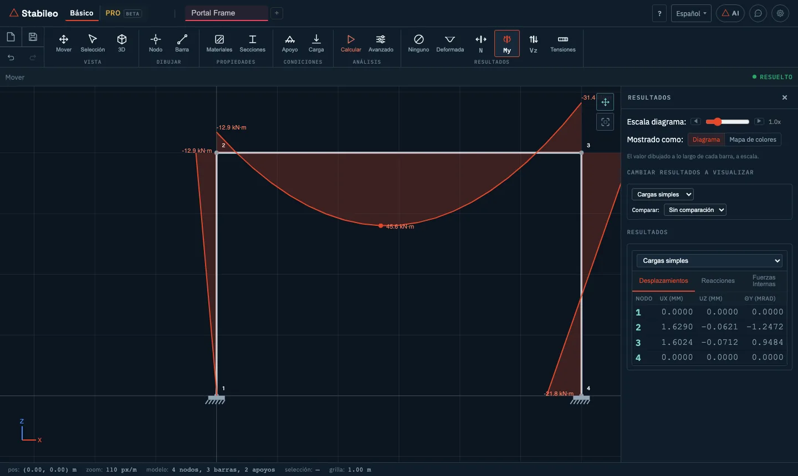

# 1. Primeros pasos

## Abrir el programa

Entrá a [stabileo.com](https://stabileo.com) y tocá **Abrir el editor**. Funciona en cualquier
navegador actual (Chrome, Edge, Firefox, Safari), en Windows, macOS o Linux. No hace falta
instalar nada ni registrarse.

El programa descarga una sola vez el motor de cálculo —un programa escrito en Rust y compilado
a WebAssembly— y a partir de ahí **resuelve en tu computadora**. Nada de lo que modelás se manda
a un servidor.

## La pantalla

- **Arriba a la izquierda**, los dos modos: **Básico** y **PRO**. Al lado, las pestañas: podés
  tener varios modelos abiertos a la vez, y el **+** abre uno nuevo.
- **Arriba a la derecha**: **?** (atajos de teclado), el idioma (español, inglés o portugués),
  el asistente de IA, el botón de contacto y **Ajustes** (el engranaje).
- **La cinta de comandos**, organizada en grupos de izquierda a derecha en el orden en que se
  arma un modelo: **Vista**, **Dibujar**, **Propiedades**, **Condiciones**, **Análisis** y
  **Resultados**. En el extremo izquierdo hay un bloque de cuatro íconos: **Proyecto** (archivos,
  ejemplos, importar y exportar), guardar, deshacer (`Ctrl/⌘ + Z`) y rehacer (`Ctrl/⌘ + Y`).
- **Debajo de la cinta**, una franja con las opciones de la herramienta activa. A la derecha de
  esa franja, el estado del modelo: te dice qué falta ("Empezá creando nodos", "Conectá los nodos
  con barras", "Agregá apoyos", "Aplicá cargas") hasta que queda **Listo para calcular** y, después,
  **Resuelto**.
- **A la derecha**, el panel que abre cada comando.
- **Abajo**, la barra de estado: coordenadas del cursor, zoom, tamaño del modelo y selección.

## Básico o PRO

| | Básico | PRO |
|---|---|---|
| **Qué modela** | Barras (vigas, columnas, reticulados), en 2D y en 3D | Barras y además placas y cáscaras (losas, tabiques, muros) |
| **Teoría** | Método de las rigideces con barras de Euler-Bernoulli | Elementos finitos: barras 3D más elementos de placa y cáscara |
| **Para qué** | Aprender, verificar a mano, resolver estructuras de barras | Modelos de edificios y estructuras reales |
| **Explica el desarrollo** | Sí: cinemática, sección, rigideces paso a paso | Se concentra en el modelo y los resultados |
| **Estado** | Terminado | En desarrollo, con acceso libre |

> **Importante:** cada modo guarda su propio modelo. Si pasás de Básico a PRO, el modelo de
> Básico no se traslada: PRO abre el suyo (o uno vacío). Al volver a Básico, tu modelo sigue ahí.

La diferencia entre los dos no es sólo de interfaz. En el [capítulo 6](06-fundamentos-teoricos.md)
se explica por qué **una barra y una cáscara son dos modelos distintos de la misma pieza**, y
cuándo dan resultados diferentes.

## Tu primer modelo: una viga simplemente apoyada

Es la forma más rápida de ver todo el recorrido. Si preferís una guía interactiva, en
**Proyecto → Tutoriales** hay recorridos cortos ("Primeros pasos", "Dibujar una viga", "Leer
los resultados", entre otros).

1. **Nodos.** Elegí **Nodo** (tecla `N`) y hacé clic en dos puntos de la grilla, por ejemplo en
   (0, 0) y (6, 0). La grilla ayuda a caer en coordenadas redondas.
2. **Barra.** Elegí **Barra** (tecla `E`) y hacé clic primero en el nodo de la izquierda y después
   en el de la derecha. Cada barra nueva recibe un material y una sección por defecto (acero A36 e
   IPN 300), que se cambian desde la tabla de barras.
3. **Apoyos.** Elegí **Apoyo** (tecla `S`). En la franja de opciones marcá **Artic.** y hacé clic
   en el nodo de la izquierda; después marcá **Móvil** y hacé clic en el de la derecha.
4. **Carga.** Elegí **Carga** (tecla `L`), marcá **Distribuida** y dejá `-10` kN/m en los dos
   extremos (qI y qJ; vienen así por defecto). Hacé clic sobre la barra. Por defecto la carga es
   perpendicular a la barra y su sentido sigue el orden en que dibujaste los nodos: con la barra
   dibujada de izquierda a derecha, el signo negativo apunta hacia abajo. Para no depender de eso,
   elegí la dirección **Z** (global).
5. **Calcular.** Tocá **Calcular** (o `Enter`). El programa resuelve y abre el panel de
   resultados.
6. **Leer.** Con los botones del grupo **Resultados** elegí qué ver: **N** (esfuerzo axial),
   **Vz** (corte), **My** (momento flector), **Deformada** o **Tensiones**. Pasá el cursor sobre
   la barra para leer el valor en cada punto.

Deberías ver un momento máximo de 45 kN·m en el centro (q·L²/8 = 10 · 6² / 8) y reacciones de
30 kN en cada apoyo.

> **Cálculo en tiempo real.** En **Ajustes** se puede activar que el programa recalcule con
> cada cambio: movés un nodo o cambiás una carga y los diagramas se actualizan solos.

## Ejemplos

En **Proyecto** hay dos menús de ejemplos listos para abrir y explorar:

- **Ejemplos 2D:** vigas (biarticulada, ménsula, Gerber, continua), apoyo elástico,
  asentamiento de apoyo, carga térmica, reticulados Pratt, Warren y Howe, arco triarticulado,
  pórticos de uno y dos pisos, un puente con tren de carga y pórticos con combinaciones de
  cargas permanentes, sobrecarga, viento y sismo.
- **Ejemplos 3D:** ménsula con flexión biaxial, viga con torsión, arco, pórticos espaciales,
  emparrillado, reticulado espacial, torres y una nave industrial.

## Guardar, abrir y compartir

Todo está en **Proyecto**:

- **Guardar** (`Ctrl/⌘ + S`) descarga un archivo `.ded` con el modelo y sus resultados. Podés
  guardar sólo la pestaña actual o toda la sesión (`Ctrl/⌘ + Shift + S`).
- **Abrir** (`Ctrl/⌘ + O`) carga un `.ded` (o un `.json`).
- **Compartir link** arma un enlace que contiene el modelo entero, comprimido. Quien lo abre ve
  exactamente tu modelo. El modelo viaja dentro del enlace y no se guarda en ningún servidor; con
  modelos muy grandes, el programa avisa que el enlace puede quedar demasiado largo.
- **Importar planilla de Excel** carga un modelo desde una planilla. El botón **Plantilla ↓**
  descarga el formato, con una hoja de instrucciones y una por cada parte del modelo: nodos,
  barras, materiales, secciones, apoyos, casos de carga, combinaciones y cargas (más placas y
  vínculos, que usa PRO). Los nombres de las hojas están en inglés.
- **Exportar**: resultados en Excel o CSV, una memoria de cálculo en PDF y el dibujo en PNG. En 2D,
  también en DXF y SVG.

Además, el programa **guarda solo** cada 30 segundos, en el almacenamiento del navegador. Si cerrás la pestaña por error, al volver te ofrece recuperar el
trabajo.

## Unidades

El programa trabaja en el sistema internacional: **metros, kN, kN·m y MPa**. Las tablas muestran
las áreas en cm², las inercias en cm⁴, los desplazamientos en mm y los giros en mrad. En
**Ajustes → Unidades** se puede pasar a unidades imperiales (kip, ft) para ver los diagramas y los
valores en pantalla; las tablas siguen en el sistema internacional.

---

[← Índice](README.md) · [Siguiente: Modo Básico en 2D →](02-basico-2d.md)
