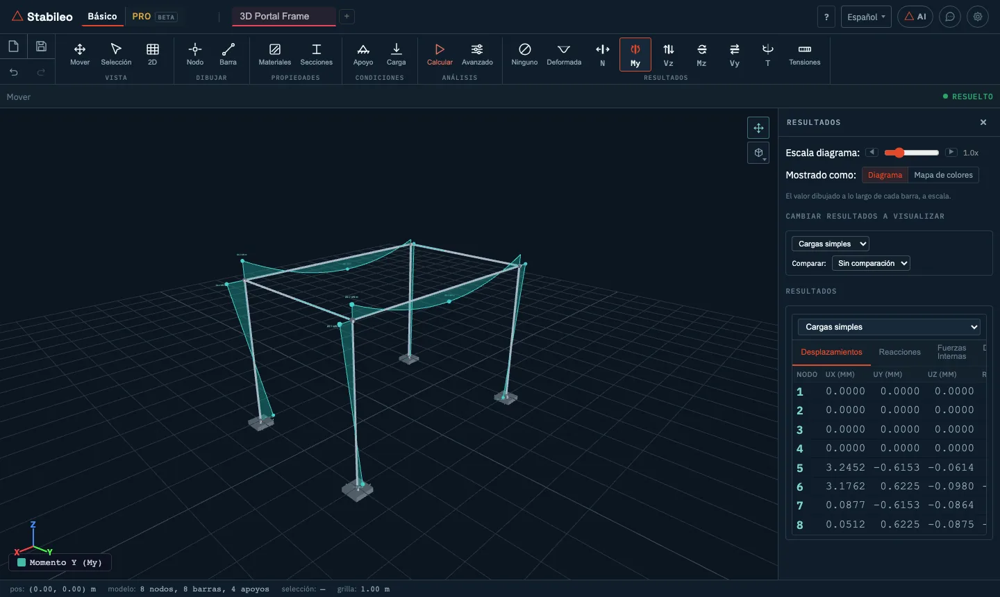

# 3. Modo Básico en 3D

El botón **3D** del grupo **Vista** lleva el modelo al espacio. Sigue siendo el modo Básico —las
mismas herramientas, la misma lógica de barras—, pero cada nodo pasa de tener tres grados de
libertad a tener **seis**: tres desplazamientos (**ux**, **uy**, **uz**) y tres giros (**θx**,
**θy**, **θz**).

## Los ejes

El eje **Z es vertical, hacia arriba**; **X** e **Y** son horizontales. La gravedad apunta hacia
−Z. Un modelo 2D, que vive en el plano XZ, aparece parado en ese mismo plano al pasar a 3D.

Además de los ejes globales, **cada barra tiene sus ejes locales**:

- **x local** va a lo largo de la barra, del nodo I al nodo J.
- **z local** es la vertical global proyectada perpendicular a la barra. En una viga horizontal
  apunta hacia arriba.
- **y local** completa la terna (y = z × x).
- En las barras verticales, donde la vertical no sirve de referencia, se usa el eje X global.

Los esfuerzos se expresan en esos ejes locales. Por eso, en una viga horizontal cargada por
gravedad, el momento principal es **My** (flexión alrededor del eje y local) y el corte que lo
acompaña es **Vz**.

> En **Ajustes** se elige si la terna local es derecha o izquierda. Eso cambia de qué lado se
> dibujan los diagramas, no los valores.

## Qué cambia respecto de 2D

| | 2D | 3D |
|---|---|---|
| Grados de libertad por nodo | 3 | 6 |
| Esfuerzos | N, Vz, My | N, Vy, Vz, T, My, Mz |
| Matriz de una barra | 6 × 6 | 12 × 12 |
| Tensiones en la sección | flexión en un plano | flexión biaxial y torsión |

Los botones de **Resultados** suman **Mz**, **Vy** y **T** (torsión).

### Nodos

Los nodos se dibujan sobre un **plano de trabajo** (XY, XZ o YZ) a un **nivel** dado: por
ejemplo, el plano XY a la altura del primer piso.

### Apoyos

En 3D, un apoyo se define marcando qué restringe: tres desplazamientos (Fx, Fy, Fz) y tres giros
(Mx, My, Mz). Los atajos **Empot.** (los seis) y **Artic.** (los tres desplazamientos) resuelven
los casos habituales. A cada grado de libertad no restringido se le puede dar una rigidez de
resorte.

### Cargas

- **Nodales:** Fx, Fy, Fz, Mx, My, Mz.
- **Distribuidas:** en las direcciones **y** y **z locales** de la barra, con un valor en cada
  extremo.
- **Peso propio:** igual que en 2D.

### Articulaciones

En 3D, una articulación libera cualquier combinación de los seis movimientos relativos entre el
extremo de la barra y el nodo. La columna **Art.** de la tabla de barras libera sólo el momento
Mz.

### Torsión

Una barra 3D puede trabajar a torsión, y para eso necesita la constante **J** de su sección. Las
secciones de catálogo y las construidas por forma la traen calculada. Si definís una sección
amorfa, cargá J a mano: si falta, el programa usa un valor de reemplazo mínimo y los resultados
de torsión no significan nada.

## Volver a 2D

El mismo botón, que ahora dice **2D**, lleva el modelo al plano. Si el modelo es plano de verdad,
el cambio es directo. Si no, el programa pregunta qué hacer:

1. **El plano:** XZ, YZ o XY.
2. **Qué tomar:**
   - **Un pórtico, cortado a una distancia.** Toma sólo lo que está en ese plano, a la distancia
     elegida: "dame el pórtico del eje 3". El programa lista los cortes posibles con sus barras,
     apoyos y cargas, y avisa si alguno quedaría sin apoyos o sin cargas.
   - **Toda la estructura, aplastada.** Proyecta todo sobre el plano. Sirve para ver la
     estructura de costado, pero superpone pórticos.
3. **Seguir en 3D**, si el cambio fue un error.

El modelo 3D original se guarda: al volver a tocar **3D**, se recupera tal como estaba.

## Limitaciones actuales del 3D en Básico

- Las cargas térmicas y las cargas puntuales en el tramo de una barra están disponibles sólo en 2D.
- Los apoyos móviles inclinados y los desplazamientos impuestos, sólo en 2D.
- La exportación a DXF y SVG está disponible sólo en 2D.

---

[← Modo Básico en 2D](02-basico-2d.md) · [Índice](README.md) · [Siguiente: Funciones avanzadas →](04-funciones-avanzadas.md)
