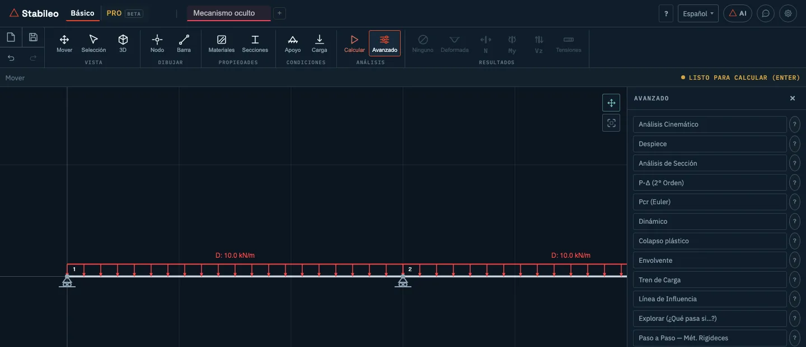
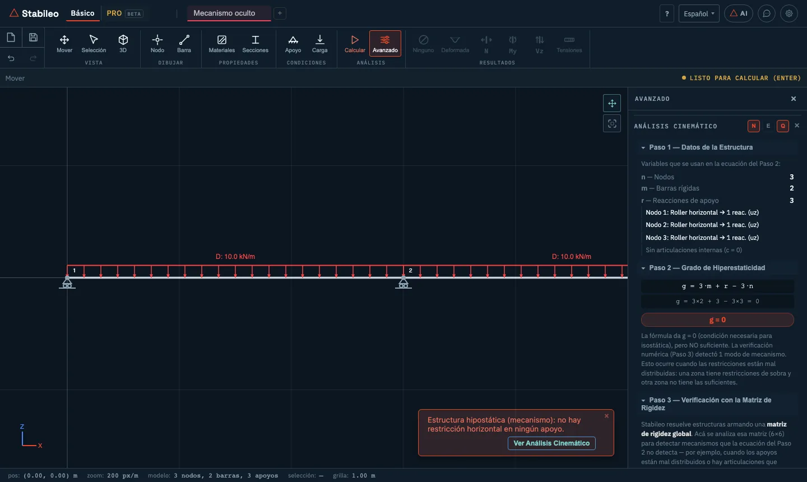
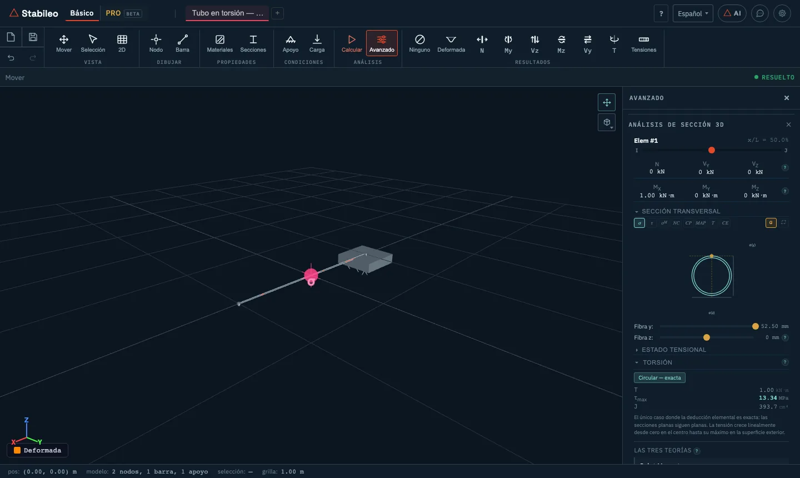
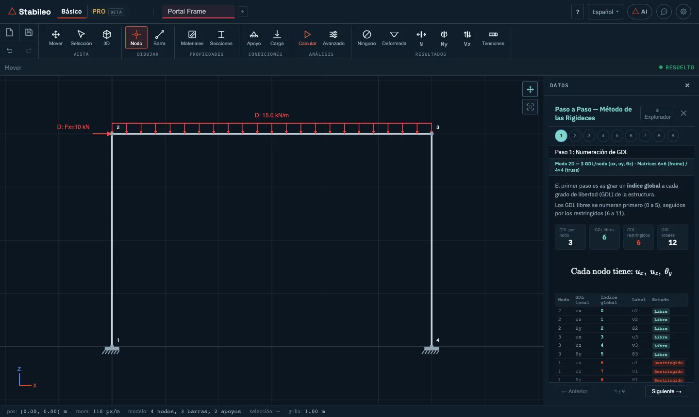

# 4. Funciones avanzadas del modo Básico

El botón **Avanzado** del grupo **Análisis** abre un menú. Al elegir una entrada, el menú se
reemplaza por los controles de esa función, con una ✕ para volver. El botón **?** de cada entrada
explica brevemente qué hace.



La idea que atraviesa todas estas funciones es la misma: **no dar sólo el número, sino el
desarrollo**. Qué fórmula se usó, con qué datos y, cuando corresponde, por qué otra fórmula no
aplica.

| Función | 2D | 3D | Necesita calcular antes |
|---|:-:|:-:|:-:|
| [Análisis Cinemático](#análisis-cinemático) | ✓ | — | no |
| [Despiece](#despiece) | ✓ | ✓ | sí |
| [Análisis de Sección](#análisis-de-sección) | ✓ | ✓ | sí |
| [P-Δ (2° Orden)](#p-δ-segundo-orden) | ✓ | ✓ | no |
| [Pcr (Euler)](#pcr-pandeo) | ✓ | ✓ | no |
| [Dinámico](#dinámico-análisis-modal) | ✓ | ✓ | no |
| [Colapso plástico](#colapso-plástico) | ✓ | — | no |
| [Envolvente](#envolvente) | ✓ | ✓ | no |
| [Tren de Carga](#tren-de-carga) | ✓ | — | no |
| [Línea de Influencia](#línea-de-influencia) | ✓ | — | sí |
| [Explorar (¿Qué pasa si…?)](#explorar-qué-pasa-si) | ✓ | ✓ | sí |
| [Paso a Paso — Mét. Rigideces](#paso-a-paso-método-de-las-rigideces) | ✓ | ✓ | no |

---

## Análisis cinemático

**Qué responde:** si la estructura es estable, y si lo es, cuántas incógnitas sobran. Es el
primer paso de cualquier cálculo a mano, y el programa lo muestra desarrollado.



1. **Datos:** nodos (n), barras rígidas y articuladas (m), reacciones de apoyo (r) y
   condiciones internas (c), cada una con su origen (por ejemplo, «Nodo 1: Roller horizontal → 1
   reac. (uz)»).
2. **Grado de hiperestaticidad**, con la fórmula que corresponde al tipo de estructura y los
   números sustituidos:
   - pórticos: g = 3·m + r − 3·n − c
   - reticulados: g = m + r − 2·n
   - mixtas: g = 3·$m_p$ + $m_r$ + r − 3·n − c ($m_p$ barras de pórtico, $m_r$ barras de reticulado)
3. **Verificación con la matriz de rigidez.** La fórmula del grado es una condición
   **necesaria pero no suficiente**. Una estructura puede tener g = 0 y ser un mecanismo, si
   los vínculos están mal distribuidos: sobran en un lugar y faltan en otro. Por eso el programa
   verifica numéricamente el rango de la matriz de rigidez y, si hay un mecanismo, dice **en qué
   nodo y en qué dirección** se mueve.
4. **Sugerencias** para estabilizarla.

No hace falta calcular: se arma al abrir el panel. Si después modificás el modelo, un botón
(**Estructura modificada — clickeá aquí para actualizar**) lo recalcula; con **Cálculo en tiempo
real** activado, se actualiza solo.

> Hay una nota en el blog construida sobre exactamente este caso, una viga donde la fórmula da
> cero y la estructura se mueve: [lo que el software gratuito calcula, y lo que no te
> explica](https://stabileo.com/es/blog/conceptual-side-advanced-tools/).

## Despiece

**Qué muestra:** cada barra separada de sus nodos, con los esfuerzos que recibe en cada extremo
(N, V, M) y las reacciones de apoyo. Es el diagrama de cuerpo libre de toda la estructura a la
vez, con los pares de acción y reacción a la vista. Sirve para verificar el equilibrio de cada
barra y de cada nodo.

Opciones: ver los vectores en barras, en nodos o en ambos; en ejes locales o globales; mostrar
las cargas completas, como resultante o apagarlas; combinar vectores; y ajustar **Tamaño vector**
y **Tamaño valor**. Un clic en un nodo o en una barra lista las acciones que llegan a él.

## Análisis de sección

**Qué muestra:** el estado tensional de una sección cualquiera de una barra. Se activa, se hace
clic en una barra y se mueve un cursor a lo largo de ella.



- **Tensión normal** por Navier: σ = N/A + M·z/I (en 3D, flexión biaxial). Un cursor recorre las
  fibras de la sección.
- **Tensión tangencial** por Jourawski: τ = V·Q / (I·b), con el flujo de corte dibujado sobre la
  sección.
- **Torsión:** el programa decide qué teoría corresponde según la forma de la sección (Cauchy
  para la sección circular, Bredt para la pared delgada cerrada y Saint-Venant, que es la teoría
  general, para el resto) y lo dice. En **Las tres teorías** las compara, y marca las que no
  aplican con el motivo. Cuando corresponde, también estima la parte del torsor que toma el
  **alabeo** (torsión no uniforme). Estos resultados aparecen en 3D, cuando la barra tiene torsor.
- **Estado tensional, tensores y círculo de Mohr**, con las tensiones principales.
- **Criterios de falla:** Von Mises, Tresca y Rankine, cada uno como porcentaje de fy.
- **Baricentro y centro de corte**, con el cálculo.
- **Núcleo central**, con sus ecuaciones, y **carga excéntrica**: si la resultante cae adentro o
  afuera del núcleo.
- **Secciones críticas:** los extremos de la barra, el momento máximo (donde V = 0), los puntos de
  carga y el centro del tramo.

Necesita una sección definida por su forma: con una sección amorfa no hay geometría sobre la que
calcular tensiones.

> La comparación entre Bredt y la solución exacta en un tubo tiene su propia nota: [Bredt o
> Saint-Venant](https://stabileo.com/es/blog/torsion-bredt-saint-venant/).

## P-Δ (segundo orden)

**Qué calcula:** el efecto de las cargas actuando sobre la estructura **deformada**. En un
análisis lineal, el equilibrio se plantea en la geometría inicial. En uno de segundo orden, una
columna comprimida que se desplaza lateralmente genera un momento adicional P·Δ, que aumenta el
desplazamiento, que aumenta el momento.

El programa lo resuelve iterando hasta que el resultado deja de cambiar (hasta 20 iteraciones).
Informa el **factor de amplificación B₂** (el mayor cociente entre los desplazamientos de segundo
orden y los del análisis lineal), la cantidad de iteraciones y si la estructura es estable. Un B₂
mayor que 1,4 indica una estructura sensible a los efectos de segundo orden.

## Pcr (pandeo)

**Qué calcula:** la carga crítica de pandeo elástico. Plantea el problema de autovalores

```math
\left( [K] + \lambda\,[K_G] \right) \{\phi\} = 0
```

donde [K] es la rigidez elástica y $[K_G]$ la **rigidez geométrica**, que depende de los esfuerzos
axiales. Cada autovalor **λ** es el factor por el que hay que multiplicar las cargas actuales para
que la estructura pandee, y cada autovector **φ** es la forma en que lo hace.

Muestra los cuatro primeros modos, con su λ, su forma dibujada y el factor de longitud efectiva
(**K**: la longitud de pandeo es K·L) de las barras comprimidas.

## Dinámico (análisis modal)

**Qué calcula:** las frecuencias y formas propias de vibración. Plantea

```math
\left( [K] - \omega^2 [M] \right) \{\phi\} = 0
```

con una **matriz de masa** armada a partir del peso específico ρ de cada material.

Muestra los seis primeros modos: frecuencia (Hz), período (s), masa efectiva de cada modo y la
suma acumulada, con la forma modal animada. En 2D, el aviso al terminar informa además los
coeficientes de amortiguamiento de Rayleigh: los factores a₀ y a₁ que arman el amortiguamiento
como a₀·[M] + a₁·[K].

> El análisis espectral sísmico no está en el modo Básico: está en PRO.

## Colapso plástico

**Qué calcula:** el factor de carga que lleva la estructura al colapso, por formación sucesiva de
**rótulas plásticas**. Para cada sección el programa usa un momento plástico Mp = Zp·fy, donde fy
es la tensión de fluencia del material (250 MPa si no está cargada) y Zp se toma como b·h²/4 con
el ancho b y la altura h de la sección, el módulo plástico de un rectángulo macizo de esas
medidas; si la sección no tiene b y h, se toma 1,15 veces su módulo elástico. Cada vez que el
momento en un extremo de barra llega a Mp, ahí se coloca una rótula que gira sin tomar más
momento, y la estructura sigue cargándose con una rótula más, hasta que se forma un mecanismo.

Las rótulas se forman en los extremos de las barras: si se espera una dentro de un tramo (por
ejemplo, bajo una carga puntual), conviene dividir la barra en ese punto.

Muestra cada paso con su factor λ, dónde se formó la rótula y si se llegó al mecanismo.

## Envolvente

**Qué muestra:** para cada punto de cada barra, el máximo y el mínimo de momento, corte y esfuerzo
axil entre todas las combinaciones. Es lo que se usa para dimensionar: ninguna combinación sola
gobierna en toda la estructura. Necesita combinaciones definidas en la sección **Combinaciones**; si
todavía no se calcularon, las calcula al activarla.

## Tren de carga

**Qué calcula:** el efecto de una carga que se mueve, como un vehículo sobre un puente. El tren
recorre, de a 25 cm, el camino de barras que arranca en el nodo de más a la izquierda y sigue hacia
la derecha por las barras conectadas, y en cada posición se resuelve el modelo. Los trenes que no
son simétricos, como el HL-93, se pasan también en sentido contrario. Hay trenes predefinidos: una
carga puntual de 100 kN, el camión HL-93 (ejes de 35, 145 y 145 kN separados 4,3 m) y un tándem
de dos ejes de 110 kN separados 1,2 m. Se puede recorrer posición por posición y ver la
envolvente.

Las cargas del tren **se suman a las que ya tiene el modelo**: para ver el efecto del tren solo,
borrá antes las otras cargas.

## Línea de influencia

**Qué muestra:** cómo varía una reacción o un esfuerzo cuando una **carga unitaria** recorre la
estructura. Se elige la magnitud y se hace clic: en un nodo para una reacción (Rz, Rx o My), o en
una barra para el momento o el corte en su punto medio. El programa dibuja la línea, y se puede
animar la carga recorriendo la estructura.

La línea de influencia responde a la pregunta inversa del diagrama de esfuerzos: no "qué momento
hay en cada punto para esta carga", sino "qué momento hay en este punto según dónde esté la
carga".

## Explorar (¿qué pasa si…?)

**Qué hace:** controles deslizantes para cambiar cada carga (de 0 a 3 veces su valor) y factores
globales para el módulo E, el área y la inercia (de 0,1 a 5 veces, aplicados a todas las barras a la
vez; en 3D, el de inercia también afecta la constante de torsión J), con el modelo recalculándose en
vivo. Sirve para desarrollar intuición: cuánto cambia la flecha si se duplica la inercia, qué pasa
con los esfuerzos si una carga se duplica. Al cerrar se restauran los valores originales.

## Paso a paso: método de las rigideces

**Qué muestra:** el cálculo completo del modelo por el método de las rigideces, en nueve pasos,
con las matrices y los vectores reales de tu estructura.



1. **Numeración de grados de libertad:** primero los libres, después los restringidos.
2. **Matrices locales [k]** de cada barra: 6 × 6 para pórticos en 2D, 2 × 2 para reticulados en
   2D (la fórmula se muestra en 4 × 4), 12 × 12 para pórticos en 3D y 6 × 6 para reticulados en 3D.
3. **Transformación** a ejes globales: [K]ₑ = [T]ᵀ [k] [T].
4. **Ensamblaje** de la matriz de rigidez global [K].
5. **Vector de cargas {F}**, incluidas las cargas nodales equivalentes de las cargas en las barras.
6. **Condiciones de borde:** la partición en grados de libertad libres y restringidos, con los
   desplazamientos impuestos si los hay.
7. **Solución** de los desplazamientos {u}.
8. **Reacciones {R}.**
9. **Fuerzas internas:** los desplazamientos de cada barra llevados a ejes locales, la fuerza que
   resulta y la corrección por las cargas del tramo.

El **Explorador de Matrices** permite recorrer cualquiera de ellas elemento por elemento. La
teoría de cada paso está en el [capítulo 6](06-fundamentos-teoricos.md#el-método-de-las-rigideces).

---

## Qué modelos admiten

- Las deslizaderas (en 2D) y las articulaciones internas del modo **Articulaciones** (en 3D) se
  usan en el cálculo lineal y en el despiece. P-Δ, pandeo, dinámico, colapso plástico, tren de
  carga, línea de influencia, explorar y el paso a paso trabajan con las articulaciones de extremo
  de barra (columnas **Art. I** y **Art. J**); si el modelo tiene deslizaderas o articulaciones
  internas, el programa pide quitarlas antes de empezar.
- El análisis cinemático, el colapso plástico, el tren de carga y la línea de influencia se usan
  en modelos 2D.

---

[← Modo Básico en 3D](03-basico-3d.md) · [Índice](README.md) · [Siguiente: Modo PRO →](05-pro.md)
