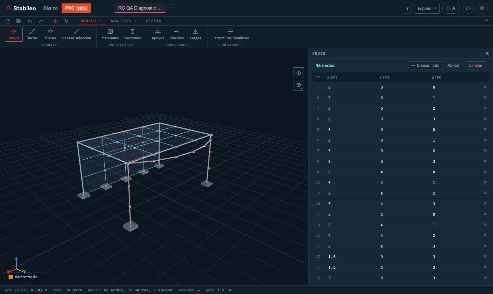
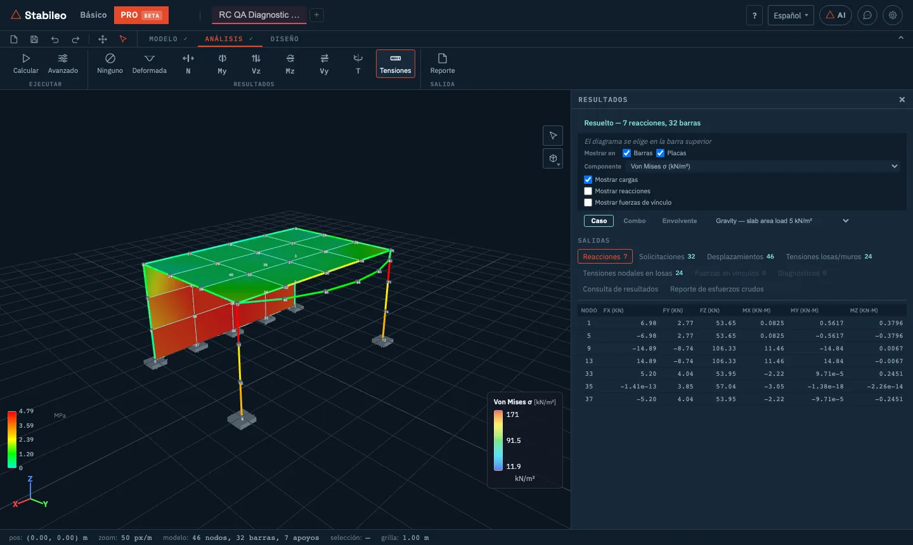

# 5. Modo PRO

El modo PRO es el de **elementos finitos y modelos complejos**. Además de barras en el espacio,
modela **placas y cáscaras** (losas, tabiques, muros, plateas), vínculos entre nodos, cargas
generadas según norma, y corre análisis dinámicos y no lineales.

Este capítulo cubre el modelado y el análisis: las pestañas **Modelo** y **Análisis**, la
importación de modelos y el reporte.

## Cómo entrar y cómo empezar un modelo

Se entra con el botón **PRO** del encabezado. PRO guarda **su propio modelo**, separado del de
Básico: al cambiar de modo, cada uno conserva el suyo.

Para empezar:

- **Un modelo vacío:** el **+** de las pestañas.
- **Un ejemplo:** **Proyecto → Modelo nuevo → Ejemplos**. Hay dieciséis, agrupados en edificios,
  industriales, energía y offshore, fundaciones, estructuras de gran luz y modelos grandes de
  demostración.
- **Importar** (ver [más abajo](#importar-modelos)): una planilla de Excel o un plano de AutoCAD
  (DXF).

**Proyecto** tiene también, como en Básico, **Guardar**, **Abrir**, **Compartir link** y
**Exportar** (los resultados en Excel o CSV, el reporte, y la vista en DXF o SVG). Ver el
[capítulo 1](01-primeros-pasos.md#guardar-abrir-y-compartir).

## La pestaña Modelo

En PRO, cada botón de la cinta abre un **panel con una tabla**. Para dibujar en el visor, cada
panel tiene su botón **Dibujar** (nodo, barra, placa…); al tocarlo de nuevo se vuelve a
seleccionar. La herramienta de **selección** está en la barra superior, junto a deshacer y
rehacer.

### Dibujar

**Nodos.** Una tabla editable de coordenadas X, Y, Z en metros. Se puede **pegar desde Excel**
(columnas X, Y y opcionalmente Z).

**Barras.** Una tabla con nodo inicial y final, material y sección, y las columnas **Vinc. i** y
**Vinc. j** con un botón que alterna entre **Art** (articulado) y **Emp** (empotrado) en cada
extremo. Esas columnas liberan sólo el momento **Mz**; para liberar cualquier otro grado de
libertad se edita la barra (ver abajo). Además:

- **Curva:** un arco que pasa por tres nodos, materializado como una cadena de barras rectas. El
  panel informa el error de cuerda.
- **Excentricidad de barra (offset):** desplaza el eje de la barra respecto de sus nodos, por
  ejemplo para que una viga cuelgue de la losa.
- Con clic derecho sobre una barra: **editarla** (material, sección y articulaciones por grado de
  libertad en cada extremo) o **dividirla** en N partes (de 2 a 20). Con nodos seleccionados, clic
  derecho en un espacio vacío los refleja en X o en Y o los gira 90°.

Las barras que se dibujan son de pórtico. Las de reticulado se incorporan desde los generadores o
desde una planilla de Excel, que también permite fijar el giro de los ejes locales de cada barra.

**Placas.** Una placa se define por sus nodos: **tres nodos forman un triángulo y cuatro un
cuadrilátero**. Se le asigna material y espesor.

- **Generador de malla:** a partir de cuatro esquinas (en sentido antihorario), genera una malla
  de cuadriláteros por tamaño objetivo o por cantidad de divisiones. Puede partir las vigas del
  contorno para que compartan los nodos del borde.
- **Cáscara (con curvatura):** para cuadriláteros cuyos cuatro nodos no están en un mismo plano.
  El panel mide cuánto se aparta el cuarto nodo y sugiere cuándo usarla.
- **Escalera:** una losa inclinada con los escalones aplicados como carga.
- **Offset de losa/muro (excéntrico):** desplaza el plano medio de la placa, por ejemplo para
  alinear la cara superior de la losa con el nivel de piso.

> **Cómo se conectan las placas con las barras:** sólo a través de **nodos compartidos**. Una
> viga que pasa por debajo de una losa sin compartir nodos con ella no está conectada. El panel
> avisa cuando una placa tiene una esquina suelta.

**Repetir selección.** Copia los nodos y barras seleccionados N veces con un desplazamiento dado.
Puede unir las copias con barras (por ejemplo, las columnas entre pisos) y copiar también los
apoyos. Copia nodos, barras y apoyos, no placas ni cargas, y no fusiona nodos: si una copia cae
sobre un nodo existente, quedan dos superpuestos.

### Propiedades

**Materiales** y **Secciones** funcionan como en Básico: una biblioteca (aceros, hormigones,
maderas, aluminio; perfiles laminados y conformados) o definiciones a medida. En secciones,
**Construir sección** arma formas paramétricas, y en los perfiles de catálogo se puede elegir la
rotación y componer secciones.

### Condiciones

**Apoyos.** **Empotrado 3D**, **Articulado 3D**, móviles en cada plano (**Roller XZ**, **XY** y
**YZ**), **Resorte 3D** (con rigidez en cada grado de libertad) y **Personalizado**, donde se marca
uno por uno qué desplazamientos y giros se restringen. Un móvil se desplaza libremente dentro de
su plano: **Roller XZ**, por ejemplo, sólo está restringido en la dirección Y.

**Vínculos.** Relaciones entre nodos:

- **Vínculo rígido:** un nodo esclavo sigue a un nodo maestro como si estuvieran unidos por una
  barra infinitamente rígida.
- **Diafragma:** los nodos de un plano se mueven juntos en ese plano. Es la hipótesis habitual
  de losa rígida en su plano. **Auto-detectar diafragmas** agrupa los nodos por nivel (con una
  tolerancia de 5 cm) y toma como maestro el nodo más cercano al centro.
- **DOF iguales:** dos nodos comparten uno o más grados de libertad (DOF).
- **Conexión excéntrica**, **MPC lineal** (restricción multipunto: una relación lineal entre
  grados de libertad de varios nodos) y **conectores** con rigidez propia entre dos nodos.

**Cargas.** El panel tiene tres partes:

- **Casos de carga:** cada caso con su tipo (D permanente, L sobrecarga de uso, Lr sobrecarga de
  cubierta, W viento, E sismo, S nieve) y un botón para mostrarlo u ocultarlo en el visor. El
  **peso propio** está **activado por defecto** en PRO y se calcula para barras y placas.
- **Combinaciones:** manuales, o generadas automáticamente (combinaciones de resistencia y de
  servicio).
- **Agregar carga:** nodal (en ejes globales), distribuida y puntual sobre barras (en ejes
  locales de la barra), y **de superficie** sobre placas cuadriláteras: en kN/m², vertical (un
  valor positivo actúa hacia abajo) y repartida entre los cuatro nodos de la placa.

**Auto-generar desde norma.** Arma el plan de cargas del edificio a partir de la normativa
argentina:

- **Cargas permanentes** a partir de las capas de la construcción (CIRSOC 101, Tabla 3.1).
- **Sobrecarga de uso** según el destino de cada local, con la reducción por área tributaria.
- **Viento** según CIRSOC 102.
- **Sismo** según INPRES-CIRSOC 103 (método estático). Esta parte se habilita cuando el proyecto
  tiene asignado un reglamento sísmico; si no lo tiene, el diálogo lo indica.

Las cargas de superficie se transforman en cargas lineales sobre las barras horizontales,
multiplicándolas por el ancho tributario que se indica en el diálogo, el mismo para todas; el
viento se aplica como fuerzas por nivel. Primero muestra el plan de cargas para revisarlo, y lo
aplica cuando lo confirmás. Los casos de tipo D, L, W y E tienen además un botón **§** que abre el
diálogo directamente para ese caso.

### Generadores

**Estructuras metálicas** genera la **geometría** de estructuras típicas de acero:

- **Cercha:** trapezoidal, de cordones paralelos, Pratt, en arco o pórtico de alma llena, con
  distintos patrones de diagonales, media cercha y diagonales subdivididas.
- **Columna reticulada.**
- **Nave:** luz, separación entre pórticos, cantidad de pórticos, columnas reticuladas o de alma
  llena, correas y arriostramientos de cubierta, de cercha y de muro.

Además de la geometría, asigna un perfil a cada tipo de barra y un acero. El generador
**reemplaza el modelo actual** (se deshace con un solo paso).

## Importar modelos

Desde **Proyecto**:

- **Planilla de Excel.** La misma planilla que en Básico: **Plantilla ↓** descarga las hojas, sus
  columnas y ejemplos. En PRO se usan además las hojas de placas triangulares (**Plates**),
  cuadriláteras (**Quads**) y vínculos (**Constraints**). Es la forma más cómoda de cargar un modelo
  grande armado en otra herramienta.
- **Plano DXF (AutoCAD).** Un asistente de cuatro pasos:
  1. el archivo y sus unidades;
  2. qué representa cada capa del dibujo: ejes, columnas, vigas, tabiques, losas, huecos, textos;
  3. los supuestos: cantidad de pisos y alturas, dimensiones de columnas, vigas, losas y
     tabiques, tipo de apoyo en la base, cargas y mallado de losas;
  4. una vista previa antes de aplicar.

  El resultado es un **borrador** de la estructura, marcado como no revisado, con la lista de
  supuestos que se usaron. Las losas y los tabiques se generan como placas.

## Antes de calcular: diagnósticos

PRO revisa el modelo mientras lo armás. Si hay errores, aparece un aviso que abre el panel
**Diagnósticos**, y el panel se abre solo si tocás **Calcular** con errores. Separa:

- **Errores**, que impiden calcular: menos de dos nodos, ni barras ni placas, ningún apoyo, barras
  sin sección o sin material, secciones con área o inercia nula, cargas que apuntan a elementos
  inexistentes.
- **Advertencias:** nodos coincidentes o sueltos, barras muy cortas o duplicadas, barras
  articuladas en los dos extremos, cargas transversales sobre barras de reticulado.
- **Información:** casos de carga vacíos, modelo sin cargas.

Después de resolver, el motor informa además la **calidad de la malla** de placas (relación de
aspecto, alabeo, ángulos muy chicos).

## La pestaña Análisis

### Calcular

**Calcular** resuelve el modelo con el motor 3D. Si hay combinaciones, resuelve todos los casos y
combinaciones y arma la envolvente. Para modelos grandes usa un solver disperso (factorización
de Cholesky con reordenamiento), que es lo que permite resolver miles de grados de libertad en el
navegador.

### Resultados

Los diagramas son los mismos que en Básico 3D: **Deformada**, **N**, **My**, **Vz**, **Mz**,
**Vy**, **T** y **Tensiones**, que en PRO pinta tanto las barras como las placas.

En el panel de **Resultados**:

- **Mostrado como:** diagrama, color de barras o mapa de colores. Para **Tensiones**, **Mostrar
  en** barras, placas o ambas.
- **Mapa de colores** de momento, corte, esfuerzo axil, **Resistencia (σ/fy)**, Von Mises o
  **Contorno losas/muros**.
- Para las placas, la componente a ver: Von Mises, tensiones principales σ1 y σ2, σxx, σyy, τxy
  (kN/m²) y momentos por unidad de ancho mx, my, mxy (kN·m/m).
- Vista por **Caso**, **Combo** o **Envolvente**, y casillas para mostrar las cargas, las
  reacciones y las fuerzas en vínculos.
- Las **salidas** en tablas: reacciones, solicitaciones, desplazamientos, tensiones en losas y
  muros (por elemento y por nodo), fuerzas en vínculos y diagnósticos.
- **Consulta de resultados:** busca el valor gobernante de un esfuerzo en todo el modelo, en la
  selección o en una lista de elementos, con filtros, y lo exporta a CSV.
- **Reporte de esfuerzos crudos:** reacciones, desplazamientos y esfuerzos por barra y por
  estación, en Excel, PDF o HTML.

### Avanzado

Los análisis avanzados de PRO:

- **P-Delta**, **modal**, **espectral** y **pandeo**. El espectral usa un espectro simplificado de
  INPRES-CIRSOC 103 por zona sísmica y tipo de suelo, combina los modos por CQC (combinación
  cuadrática completa) o SRSS (raíz cuadrada de la suma de los cuadrados) y requiere haber corrido
  antes el modal.
- **Historia en el tiempo** (métodos de Newmark o HHT-α, con una aceleración de base senoidal que
  genera el programa o un acelerograma propio pegado como lista de valores) y **respuesta
  armónica**.
- **No lineal:** **pushover** (formación sucesiva de rótulas plásticas bajo las cargas del modelo,
  con el mismo cálculo de Mp que el [colapso plástico](04-funciones-avanzadas.md#colapso-plástico)
  del modo Básico), corrotacional (grandes desplazamientos) y de fibras.
- **Imperfecciones geométricas**, **fundación sobre resortes de Winkler**, **interacción
  suelo-estructura** con curvas p-y y **contacto o gap**.
- **Construcción por etapas** y **fluencia y retracción**.
- **Líneas de influencia 3D**, **solver multi-caso**, **analizador de sección** y **análisis con
  restricciones**.
- La opción **Diafragma rígido** para todo el modelo.

Estos análisis usan el eje de las barras, sin su excentricidad, y las articulaciones de las
columnas **Vinc. i** y **Vinc. j**. Las deslizaderas y las liberaciones por grado de libertad que se
definen al editar una barra se consideran en **Calcular**; antes de un análisis avanzado, el
programa pide quitarlas. El **modal** y el **espectral** trabajan con las barras del modelo: la
rigidez y la masa salen de las barras (y de las barras rígidas que agrega la opción **Diafragma
rígido**, si está activada).

### Reporte

**Reporte** arma una **memoria de cálculo** imprimible: datos del modelo, detalle de cargas,
resultados, los análisis avanzados que hayas corrido, cómputo de materiales y diagnósticos, con
un encabezado opcional (logo, empresa, profesional, revisión). También se exporta a Excel.

## La teoría detrás

- **Barras:** las mismas barras 3D de Euler-Bernoulli del modo Básico, con seis grados de
  libertad por nodo.
- **Placas cuadriláteras:** elemento **MITC4**, con deformaciones de corte interpoladas de forma
  que el elemento no se "trabe" cuando la placa es delgada (*shear locking*) y un refuerzo de la
  membrana (EAS) que mejora la flexión en su plano.
- **Placas triangulares:** elemento **DKT** para la flexión (placa delgada de Kirchhoff, sin
  deformación por corte), combinado con un triángulo de deformación constante para la membrana.
  Para tabiques, que trabajan a flexión en su plano, conviene usar cuadriláteros.
- **Cáscaras curvas:** un elemento de cuatro nodos que representa la curvatura, para
  cuadriláteros no planos.

Por qué una losa necesita malla y una viga no, qué es el *shear locking* y cuándo un modelo de
barras deja de alcanzar: [capítulo 6](06-fundamentos-teoricos.md#elementos-finitos-placas-y-cáscaras)
y la nota [¿barras o elementos finitos?](https://stabileo.com/es/blog/bars-or-finite-elements/).

---

[← Funciones avanzadas](04-funciones-avanzadas.md) · [Índice](README.md) · [Siguiente: Fundamentos teóricos →](06-fundamentos-teoricos.md)
