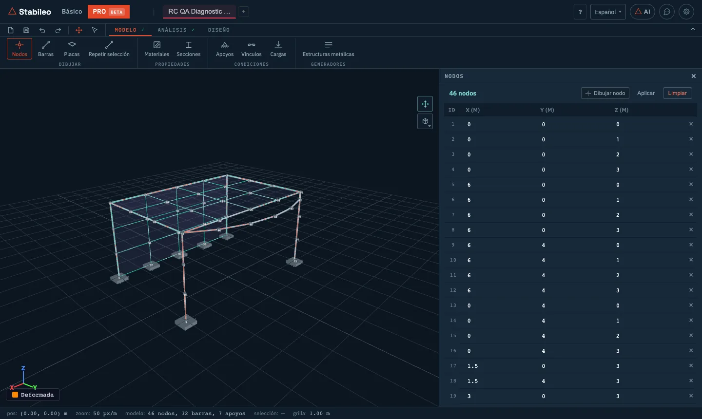
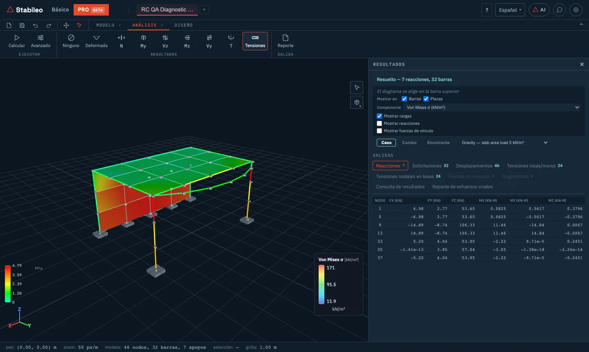

# 5. Modo PRO

El modo PRO es el de **elementos finitos y modelos complejos**. Además de barras en el espacio,
modela **placas y cáscaras** (losas, tabiques, muros, plateas), vínculos entre nodos, cargas
generadas según norma, y corre análisis dinámicos y no lineales.

Este capítulo cubre el modelado y el análisis: las pestañas **Modelo** y **Análisis**, la
importación de modelos y el reporte.

## Cómo entrar y cómo empezar un modelo

Se entra con el botón **PRO** del encabezado. PRO guarda **su propio modelo**, separado del de
Básico: al cambiar de modo, cada uno conserva el suyo.

Para empezar:

- **Un modelo vacío:** el **+** de las pestañas.
- **Un ejemplo:** **Proyecto → Modelo nuevo → Ejemplos**. Hay veinticuatro, en ocho grupos que van
  de un primer pórtico a los modelos que ponen a prueba el visor: primeros pasos, edificios, desde
  CAD, naves y galpones, torres, puentes y gran luz, fundaciones y una vitrina de escala. Dentro de
  cada grupo van del más chico al más grande. Cada tarjeta dice para qué sirve el modelo, qué mirar
  una vez resuelto y cuánto pesa, y avisa en los pesados. Con un modelo abierto, la tarjeta
  pregunta antes de reemplazarlo. La galería se abre sobre el modelo, con las tarjetas una al lado
  de otra.
- **Importar** (ver [más abajo](#importar-modelos)): una planilla de Excel, un plano de AutoCAD
  (DXF) o un modelo IFC.

**Proyecto** tiene también, como en Básico, **Guardar**, **Abrir**, **Compartir link** y
**Exportar** (los resultados en Excel o CSV, el reporte, y la vista en DXF o SVG). Ver el
[capítulo 1](01-primeros-pasos.md#guardar-abrir-y-compartir).

**Libro del proyecto.** **Exportar → Libro del proyecto** escribe un archivo de Excel con una
carátula (los datos del proyecto, la fecha, la versión y las unidades), las convenciones, el modelo
y todos los casos y combinaciones: reacciones, desplazamientos, esfuerzos de extremo, esfuerzos,
flechas y tensiones en las **estaciones** que elijas (5, 13 o las críticas: cuartos, posiciones de
carga y corte nulo), los máximos con el lugar donde ocurren, la envolvente de cada nodo y extremo de
barra con la combinación que la gobierna, las placas en su centro, sus nodos y sus esquinas, la
estática y el estado de segundo orden. Los números van con todos sus dígitos y con el signo del
solver, que es el que muestran los diagramas. Las hojas del modelo usan los nombres y columnas de la
importación desde Excel, así que se pueden volver a leer. Si el libro es más grande de lo que un
archivo de Excel maneja bien (una hoja con más filas de las que admite, o más de cuatro millones de
celdas), sale como un zip con un CSV por hoja. El Excel del diálogo de reporte es el mismo libro,
con las secciones que marques.

**Datos del proyecto.** Comitente, obra, número de obra, ubicación, las revisiones con su fecha
y descripción, y quién proyectó, revisó y aprobó, con fechas. Se guardan con el proyecto y los
imprime la carátula del reporte.

**Plantillas de la oficina.** Los materiales, secciones, casos, combinaciones, reglas de
combinación, reglamentos y límites de flecha de un proyecto se guardan como plantilla, en el
navegador o como archivo para compartir. Aplicar una plantilla agrega lo que al proyecto le falta,
por nombre, y no pisa lo que ya tiene.

**Comandos por nombre.** **Ctrl+K** (⌘K en Mac) abre la lista de todos los comandos de la cinta:
se escribe parte del nombre y **Enter** lo ejecuta.

## La pestaña Modelo

En PRO, cada botón de la cinta abre un **panel con una tabla**. Para dibujar en el visor, cada
panel tiene su botón **Dibujar** (nodo, barra, placa…); al tocarlo de nuevo se vuelve a
seleccionar. La herramienta de **selección** está en la barra superior, junto a deshacer y
rehacer.

### Dibujar

**Nodos.** Una tabla editable de coordenadas X, Y, Z en las unidades elegidas, y un **nombre**
opcional (por ejemplo A1) junto al número. Se puede **pegar desde Excel** (columnas X, Y y
opcionalmente Z). Un doble clic en una fila encuadra ese nodo en el modelo.

Las barras también llevan un **nombre** opcional en su tabla, y un doble clic en la fila las
encuadra. Los nombres se guardan en el archivo, van y vienen en el Excel del modelo, aparecen en
las tablas del reporte y en las etiquetas cuando **Vista › Las etiquetas muestran** dice
**nombre**. Cambiar un nombre se deshace en un paso y no borra los resultados.

**Barras.** Una tabla con nodo inicial y final, material y sección, y las columnas **Vinc. i** y
**Vinc. j**. En una barra que se está agregando alternan entre **Art** (los dos momentos de flexión
liberados) y **Emp**. En una que ya existe muestran cómo es su extremo (empotrado, articulado,
semirrígido o liberado en parte) y abren sus condiciones de extremo en
**Especificaciones › Barras**, el único lugar donde se editan. Además:

- **Curva:** un arco que pasa por tres nodos, materializado como una cadena de barras rectas. El
  panel informa el error de cuerda.
- **Excentricidad de barra (offset):** desplaza el eje de la barra respecto de sus nodos, por
  ejemplo para que una viga cuelgue de la losa. Se define en **Especificaciones › Barras**.
- Con clic derecho sobre una barra: **editar** su material y su sección, abrir sus
  **Especificaciones…** o **dividirla** en N partes (de 2 a 20). Con clic derecho sobre un nodo con
  apoyo se abren las especificaciones del apoyo; **Agregar apoyo** y **Agregar carga** abren la
  tarjeta de su panel sobre ese nodo. Con nodos seleccionados, clic derecho en un
  espacio vacío los refleja en X o en Y o los gira 90°.

Las barras que se dibujan son de pórtico; en **Especificaciones › Barras** se hacen de reticulado,
de un solo sentido o cables, y se fija el giro de sus ejes locales.

**Placas.** Una placa se define por sus nodos: **tres nodos forman un triángulo y cuatro un
cuadrilátero**. Se le asigna material y espesor.

- **Generador de malla:** el contorno es un polígono de nodos existentes o un círculo (centro y
  radio), con agujeros poligonales o circulares. Cada lado admite su propia cantidad de divisiones
  y un sesgo que concentra los elementos hacia un extremo; el resto se malla por tamaño objetivo.
  Genera cuadriláteros o triángulos, respeta los nodos que ya hay sobre el borde (para que muro y
  losa empalmen) y puede partir las vigas del contorno. Una placa circular se malla con una grilla
  en O, sin triángulos degenerados en el centro. Una vista previa muestra la malla antes de crearla.
- **Superficies:** cilindro, cono, casquete y zona esférica, hiperboloide (torre) y paraboloide
  hiperbólico, como cáscaras curvas. Se colocan con el fantasma, igual que un generador, o a lo
  largo de un eje que se marca con dos puntos.
- **Cáscara (con curvatura):** para cuadriláteros cuyos cuatro nodos no están en un mismo plano.
  El panel mide cuánto se aparta el cuarto nodo y sugiere cuándo usarla; se activa en
  **Especificaciones › Superficies**.
- **Escalera:** una losa inclinada con los escalones aplicados como carga.
- **Offset de losa/muro (excéntrico):** desplaza el plano medio de la placa, por ejemplo para
  alinear la cara superior de la losa con el nivel de piso. Se define en
  **Especificaciones › Superficies**.

> **Cómo se conectan las placas con las barras:** sólo a través de **nodos compartidos**. Una
> viga que pasa por debajo de una losa sin compartir nodos con ella no está conectada. El panel
> avisa cuando una placa tiene una esquina suelta.

**Grilla y niveles.** Los ejes del edificio se cargan como vanos a partir de un origen ("6; 7,5; 6"
o "3x6"), con nombres A, B, C… en un sentido y 1, 2, 3… en el otro, y los niveles como alturas de
piso desde una cota base. Se guardan con el proyecto y viajan en el código de modelo. El **nivel
activo** es el plano donde caen los nodos nuevos y donde se dibujan los ejes con sus nombres; el
cursor se engancha a las intersecciones y a los ejes. También se puede **leer la grilla del
modelo** (un nivel en cada cota con nodos y un eje en cada coordenada con columnas) y crear
**columnas y vigas entre ejes** en un rango de ejes y niveles, en un solo paso de deshacer.

**Grilla de piso.** Se dibuja al paso al que se enganchan los nodos (**Grilla** en la
configuración), con una línea más marcada cada diez. Al alejarse, las líneas finas se desvanecen y
desaparecen cuando llenarían la pantalla, y siguen las marcadas; una línea dibujada queda en la
misma coordenada con cualquier zoom.

**Transformar.** Repetir, repetir en polar, espejar, girar y mover la selección, como copias o en
el lugar. Las copias que caen sobre un nodo existente se sueldan a él, que es lo que conecta los
vanos repetidos, y copian cargas, apoyos y grupos si se pide. Mientras se cambian los números, el
resultado se ve en el modelo antes de aplicarlo. El punto, el plano de espejo y el giro se pueden
tomar con clics: un punto, dos puntos del plano de espejo, o centro, desde y hasta para el giro.
**Mover por dos puntos** toma un punto base y el destino; con Ctrl (⌘ en Mac) en el segundo clic
copia en vez de mover.

**Colocar.** Todo lo que se inserta en el modelo (pegar, una estructura generada, una plantilla,
una copia de un grupo, un IFC o un DXF) sigue al cursor como un **fantasma** antes de entrar:

- el cursor se engancha a un nodo, o al plano del nivel activo con la grilla;
- **Tab** cambia el punto de inserción, **R** gira 90° (Shift+R al revés) y **F** espeja;
- en la barra de colocación se escriben las coordenadas y **Enter** coloca ahí; **Esc** cancela;
- **Shift+clic** coloca y deja seguir colocando copias;
- la barra dice cuántos nodos se van a soldar al modelo; en esos nodos queda el apoyo del modelo.

Mientras se coloca, el modelo sólo se mira. Cada colocación es un paso de deshacer, lo colocado
queda seleccionado y deshacer devuelve la selección anterior.

**Copiar y pegar.** Ctrl+C, Ctrl+X y Ctrl+V (⌘ en Mac) copian, cortan y pegan la selección con
sus apoyos, cargas y grupos, y con sus secciones y materiales por definición. Ctrl+V pega con el
fantasma; Ctrl+Shift+V pega en el mismo lugar. Lo copiado va al portapapeles como código de
modelo, así que se puede pegar en otro proyecto o en otra pestaña. En campos de texto las teclas
hacen lo de siempre.

**Editar.** Al dividir barras en N partes, los puntos de corte se ven en las barras
seleccionadas antes de dividir.

- **Renumerar** nodos, barras y placas por posición, todo el modelo o sólo la selección, y desde un
  número. Si ese número ya lo usa algo que no está seleccionado, no se renumera y se dice cuál.
- **Limpieza:** nodos coincidentes (con la **tolerancia de soldado**, que se puede cambiar y usan
  todas las soldaduras del modelo), barras repetidas (los mismos dos nodos, que se eliminan) o de
  largo nulo, nodos sueltos, **barras colineales superpuestas** con nodos distintos en los extremos
  (se listan por par con el tramo que comparten y se seleccionan, para elegir cuál queda), y además
  **partes sueltas** sin ningún apoyo, **bordes libres** de placas que no están sobre una barra,
  **barras que se cruzan sin nodo** y **propiedades repetidas** (materiales o secciones iguales con
  otro número), que se unifican.
- **Invertir barras:** I pasa a ser J. La sección conserva su orientación, y las articulaciones,
  los extremos semirrígidos, los desplazamientos y las cargas de la barra la acompañan, así que el
  resultado es el mismo. Una barra con armadura no se invierte.
- **Barra acartelada:** una I soldada cuya altura cambia de un extremo al otro, con alas y alma
  constantes. Cada barra seleccionada se corta en tramos prismáticos (12 por defecto) con la altura
  de la mitad de cada tramo; con 12 tramos la flecha de un voladizo queda a menos de 0,5 % de la
  exacta.

**Seleccionar.** Además de las opciones de Básico: arrastrar puede dibujar un **lazo** en lugar de
un rectángulo; se seleccionan las barras **paralelas a un eje o a un plano global**, lo que está
**cargado en un caso**, y se vuelve a la **selección anterior**. **Recorrer con zoom** pasa por las
barras o nodos seleccionados de a uno, encuadrando cada uno.

**Vista.** Las vistas guardadas conservan la proyección, el zoom ortográfico, lo oculto, las
etiquetas y los colores. Además:

- **Lupa por ventana:** se arrastra un rectángulo y se encuadra lo que queda adentro.
- **Etiquetas sólo en lo seleccionado**, y una **ficha rápida** al hacer clic sobre un nodo o una
  barra, con sus datos y resultados.
- **Color de las barras** por sección, material o grupo, con su leyenda.
- **Dibujar** los vínculos y diafragmas como líneas entre sus nodos, y los extremos I y J.
- **Notas** de texto en un punto del modelo, que se guardan con el proyecto.
- **Unidades:** SI (kN, m), **SI con milímetros** (kN, mm: coordenadas, desplazamientos y
  propiedades de sección en mm), técnico (tf, tf·m, kgf/cm², cm) o imperial, y los **decimales** de
  cada magnitud. Todo campo con una magnitud se escribe en las unidades elegidas y muestra la
  unidad al lado; el modelo se guarda siempre en kN y m. Las propiedades de una sección se leen en
  cm², cm⁴ y cm³ en SI.

### Propiedades

**Materiales** y **Secciones** funcionan como en Básico: una biblioteca (aceros, hormigones,
maderas, aluminio; perfiles laminados y conformados) o definiciones a medida. En secciones,
**Construir sección** arma formas paramétricas, y en los perfiles de catálogo se puede elegir la
rotación y componer secciones.

**Catálogo.** Además de las familias de siempre están los **HE M** y los **ángulos de alas
desiguales** (EN 10365 y EN 10056-1, con los valores del productor). La lista se puede ver como
**tabla**, con todas las propiedades de cada perfil (h, b, espesores, radio, A, masa, inercias,
módulos, radios de giro y J), ordenable por cualquier columna y exportable a CSV. El **dibujo
acotado** muestra el perfil con sus medidas. **Importar CSV** trae la lista de secciones propias
de una empresa (nombre, forma y medidas en mm, con A e inercias opcionales para comparar): cada fila
tiene que tener las medidas de su contorno, y una fila cuyo contorno no coincide con el área
declarada se informa con su línea.

**Dibujar la sección.** En **Construir sección**, **Dibujar** arma una sección con piezas:
rectángulos, rectángulos huecos, círculos, tubos, polígonos, chapas plegadas (un eje con espesor),
perfiles del catálogo (también cortados, como una T sacada de un I) y huecos. Se arranca de una
forma habitual (I, cajón o T soldadas, perfil con platabandas, T cortada, doble ángulo, doble canal,
C conformado, tubo relleno) o de cero, se importa un contorno DXF o se traen secciones del
proyecto. Las piezas se mueven arrastrando y se enganchan a los bordes de las otras, o se **apoyan**
arriba, abajo o a un costado, alineadas. Cada pieza puede tener su **material**; las propiedades son
entonces las de la sección transformada, con n = Eᵢ/E_ref, y el dibujo muestra un tramado por
material con su leyenda. Mientras se dibuja se ven A, las inercias y los ejes principales, el
baricentro y el centro de corte, los módulos resistentes arriba, abajo y a los costados, Z, J, Cw,
las áreas de corte, el peso y la masa por metro, las cotas, y una tabla por pieza. Se avisa si hay
piezas superpuestas, piezas sueltas o huecos fuera de la sección. La sección dibujada se vuelve a
abrir para editarla desde la lista, se guarda con el proyecto y viaja en el código de modelo.

**Deformación por corte.** Cada sección puede incluirla, con las áreas de corte calculadas a partir
de su geometría o escritas a mano. Un botón les da áreas de corte geométricas a todas las secciones
cuya forma las tiene, y el otro quita esas (las escritas a mano quedan). Sin ella, las barras se
calculan con la teoría de Euler-Bernoulli. El interruptor de **Especificaciones › Análisis** la
deja afuera de todo el modelo sin borrar nada, y Secciones lo avisa mientras está apagado.

### Especificaciones

Lo que se le indica a una barra, un apoyo o una placa además de su geometría, su material y su
sección está en **Especificaciones**, en seis secciones. Barras, Apoyos y Superficies editan lo
seleccionado: varias barras toman el mismo valor a la vez, en un solo paso de deshacer, y una
propiedad que difiere dentro de la selección se lee **(distintos)** hasta que se define. Al abrir
una sección, el puntero pasa a seleccionar lo que ella edita (barras, apoyos, nodos o placas), y al
pasar de una sección a otra las barras elegidas se conservan. Las secciones son pestañas que se
recorren con las flechas del teclado.

**Barras.**

- **Comportamiento axial:** normal (pórtico), reticulado (sólo axil), **sólo tracción**, **sólo
  compresión**, **cable** o **inactiva** (fuera de todos los cálculos, sin borrarla).
- **Condiciones de extremo**, juntas: las **liberaciones** de My, Mz y T en cada extremo en los ejes
  locales de la barra, las **uniones** que liberan cualquiera de los seis grados de libertad en cada
  extremo en ejes globales, y los extremos **semirrígidos**, con una rigidez al giro en kN·m/rad. Un
  extremo semirrígido actúa en ejes globales, así que en una barra cuyos ejes de flexión no siguen
  los globales se calcula rígido, y el chequeo del modelo lo avisa antes de calcular.
- **Ejes locales:** β gira los ejes y y z de la barra alrededor de su eje x, sumado a la rotación
  propia de la sección.
- **Modificadores de rigidez** para la inercia fisurada, con los valores de CIRSOC 201-2025 (Tabla
  6.6.3.1.1(a): columnas 0,70 Ig, muros no fisurados 0,70 y fisurados 0,35, vigas 0,35, losas 0,25)
  o valores propios; al cambiar un factor sobre una selección, cada barra conserva los otros.
- **Excentricidades** y **longitudes de diseño** (longitud no arriostrada y factores de longitud
  efectiva del diseño en acero).

Las barras inactivas y los modificadores de rigidez valen en todos los análisis. Tracción o
compresión exclusivas se resuelven en **Calcular**: una barra que trabaja al revés de lo indicado
sale del modelo y se vuelve a calcular, hasta que ninguna cambia de estado. Mientras trabaja, una
barra de un solo sentido lleva sólo esfuerzo axil, y las cargas que tenga a lo largo pasan a sus
nodos como las reacciones de una viga simplemente apoyada. Una barra que salió del modelo informa
esfuerzos nulos. Los resultados dicen cuántas iteraciones hicieron falta y qué barras quedaron
afuera, y si alguna oscila entre los dos estados.

Un **cable** trabaja sólo a tracción, y su propio peso le da flecha y lo ablanda: cada cálculo toma
el módulo equivalente de Ernst a partir de la tensión, la luz y el peso del cable, y se repite hasta
que la tensión se estabiliza. Los resultados listan la tensión, el empuje horizontal, la flecha y el
módulo de cada cable. Un cable no tiene pretensado (su largo sin estirar es la cuerda). El peso que
lo ablanda sale de su material; el que lo carga es el peso propio del proyecto, como en cualquier
barra.

El diseño sigue al comportamiento en todos sus caminos (hormigón, acero, otras normas y el
optimizador): una barra sólo a tracción o un cable se verifica sólo a tracción y una barra sólo a
compresión se verifica sólo a compresión; una barra inactiva no se diseña.

**Apoyos.** El tipo de todos los apoyos seleccionados a la vez, y si **se levantan** (sólo toman
compresión). La tabla de Apoyos muestra el tipo de cada uno con lo que agrega, y su ✎ abre esta
sección sobre él. Un apoyo que se levanta se resuelve en **Calcular**: si tracciona, se libera y se
vuelve a calcular. Con un solo apoyo seleccionado, su editor propio: qué grados de libertad se
fijan, un resorte en cada uno (lineal o **multilineal**, con una curva desplazamiento–fuerza escrita
como pares "mm kN;") y una **terna inclinada**, definida por dos puntos o apuntando a un nodo. Un
tipo estándar muestra lo que restringe y no admite resortes ahí; el tipo Personalizado elige uno
por uno.

**Uniones entre nodos.** Relaciones entre nodos, con la tabla compartida debajo:

- **Vínculo rígido:** un nodo esclavo sigue a un nodo maestro como si estuvieran unidos por una
  barra infinitamente rígida.
- **Diafragma:** los nodos de un plano se mueven juntos en ese plano y giran juntos alrededor de
  su normal. Es la hipótesis habitual de losa rígida en su plano. **Auto-detectar diafragmas** agrupa los nodos por nivel (con una
  tolerancia de 5 cm) y toma como maestro el nodo más cercano al centro.
- **DOF iguales:** dos nodos comparten uno o más grados de libertad (DOF).
- **Conexión excéntrica**, **MPC lineal** (restricción multipunto: una relación lineal entre
  grados de libertad de varios nodos) y **conectores** con rigidez propia entre dos nodos.

**Superficies.** Sobre las placas seleccionadas, la **cáscara con curvatura** (para cuadriláteros
cuyos cuatro nodos no están en un mismo plano) y el **offset** del plano medio, cada uno en un solo
paso de deshacer. Los campos del offset muestran lo que tienen las placas, o que difiere; los atajos
de cara superior e inferior usan el espesor de cada placa.

**Resortes de fundación.** Sobre las placas seleccionadas de una losa o platea, crea resortes
verticales k = ks·A en cada nodo, con el área tributaria de cada nodo (un cuarto de cada
cuadrilátero y un tercio de cada triángulo que lo tocan). El ks se escribe o se toma del perfil
geotécnico del proyecto. Los resortes pueden ser de un solo sentido, para que la platea se
levante, y reemplazan el apoyo que tuviera el nodo.

**Análisis.** Cómo se combinan: con barras de un solo sentido, cables o apoyos que se levantan, cada
combinación se resuelve con sus cargas mayoradas (lo que corresponde, porque una barra puede
trabajar en una combinación y no en otra) o se superponen los casos, cada uno resuelto con su propio
conjunto de barras activas; en ese caso se listan las barras cuyo estado en la suma contradice el de
los casos. Sin esas barras los dos métodos dan lo mismo. Cada combinación puede resolverse además
**lineal** o con **P-Delta**. Una combinación con P-Delta cuya carga la estructura no puede llevar
en segundo orden (pandea antes) no publica esfuerzos, y un aviso la nombra; los paneles de diseño
también la nombran y dan el diseño por incompleto, porque leen las combinaciones que tienen
esfuerzos. Con barras de un solo sentido, cables o apoyos que se levantan, las combinaciones se
resuelven lineales. Los modelos grandes
pasan por el mismo solver disperso que el análisis lineal: las catorce combinaciones de un edificio
de mil nodos y dos mil quinientas barras tardan unos segundos.

El P-Delta se repite hasta que los desplazamientos dejan de cambiar. Algunos programas, en cambio,
cortan después de un número fijo de iteraciones, haya convergido o no el
resultado; un modelo resuelto así puede diferir del de Stabileo en unos pocos por ciento en las
barras que más se desplazan, y da esfuerzos en una combinación en la que Stabileo no encuentra
equilibrio de segundo orden. Stabileo se queda con el resultado convergido.

La **deformación por corte** está activada de entrada, y entonces cada sección decide con sus áreas
de corte. Apagada, todas las barras se deforman sólo por flexión, diga lo que diga su sección.

**Listado.** Las especificaciones de las barras, los apoyos y las placas, una fila por valor (las
curvas de los apoyos y los offsets de las placas con sus valores), con las entidades que la tienen. Un clic en una fila las selecciona y abre la sección que las edita. El listado
se lee de las propias entidades, así que muestra lo que ellas tienen. El libro del proyecto lo lleva
como hoja **Specifications**, y los resultados de los cables como **Cables**.

### Condiciones

**Apoyos.** **Empotrado 3D**, **Articulado 3D**, móviles en cada plano (**Móvil XZ**, **XY** y
**YZ**), **Resorte 3D** (con rigidez en cada grado de libertad) y **Personalizado**, donde se marca
uno por uno qué desplazamientos y giros se restringen. Un móvil se desplaza libremente dentro de
su plano: **Móvil XZ**, por ejemplo, sólo está restringido en la dirección Y. Cuando un panel
actúa sobre nodos o barras seleccionados y su puntero elige otra cosa, un botón pasa el puntero a
lo que hace falta. Los resortes, el
levantamiento y la terna inclinada se definen en **Especificaciones › Apoyos**.

Un apoyo se agrega con **Agregar apoyo**: se marcan los grados de libertad que restringe (o se
elige uno de los tipos de arriba) y, abajo, **Aplicar a**, la misma elección que en las cargas: la
selección, una lista de números (`1, 4, 7-12`), un grupo o un rango de coordenadas, con la cuenta de
nodos a los que va. Todo entra en un solo paso de deshacer, y un nodo que ya tenía apoyo toma el
nuevo en su lugar.

**Cargas.** El panel tiene tres pestañas (casos de carga; combinaciones; cargas de piso), la
tarjeta para agregar una carga y las tablas de cargas:

- **Casos de carga:** cada caso con su tipo (D permanente, L sobrecarga de uso, Wa viento de servicio, Lr sobrecarga de
  cubierta, W viento, E sismo, S nieve, R lluvia, T temperatura, F fluidos, H empuje del suelo; y, para
  sumar cuando hagan falta, N nocional e imperfección, Cr puente grúa, Tr tránsito, M masa,
  A accidental, I hielo) y un botón para mostrarlo u ocultarlo en el visor. Puente grúa y tránsito
  se combinan como sobrecarga en las combinaciones automáticas; los nocionales entran a pedido, y
  masa, accidental y hielo por las reglas del proyecto. El **⚙** de cada fila abre la composición
  del caso:
  - **incluye otros casos**, cada uno por un factor, además de sus cargas propias: un caso
    compuesto, que se resuelve como un solo caso, así un cálculo de segundo orden ve la suma entera;
  - **de referencia**: un caso sólo para incluirlo desde otros, que no se resuelve ni se lista solo;
    y **resolver**: un caso sin tildar se resuelve sólo si una combinación lo necesita, y no se lista;
  - un **grupo de alternativas** (las combinaciones toman un caso del grupo por vez) y **patrón**
    (varía sólo donde su acción es la principal), marcados en la tabla;
  - en un caso N, sus **cargas nocionales**: una fracción (0,002 por defecto) de la carga vertical
    que un caso de origen pone en cada nodo, horizontal según ±X o ±Y;
  - en una sobrecarga escrita a mano, su **reducción** por área tributaria, tipo de elemento y
    pisos, con la fórmula de la norma asignada: las cargas del caso se multiplican por el factor.

  **Casos nocionales**, debajo de la tabla, crea un caso N por cada caso de origen y dirección.
- **Peso propio:** es una carga de un caso. Se agrega desde **Agregar carga › General › Peso
  propio**: dirección global, factor (−1 en Z es la gravedad) y, en **Aplicar a**, todo el modelo,
  un grupo o barras (por selección, números, rango, sección o tipo). Uno en el mismo caso, con la
  misma dirección y sobre lo mismo toma el factor nuevo en su lugar. Las tablas de cargas lo listan
  arriba de todo, una fila por regla, donde se cambia el caso, la dirección o el factor y se quita.
  Sobre todo el modelo o un grupo incluye sus placas; sobre barras elegidas, sólo esas barras. En las barras es ρ·A a lo largo de la barra, así que una viga toma su propio wL²/8;
  en una columna o una barra inclinada la parte a lo largo de la barra queda en ella, así que su
  axil crece hacia el extremo de abajo. En las placas es ρ·t por el área. Entra una vez, en ese caso, y cada combinación lo toma con el
  factor de ese caso. Un proyecto nuevo no tiene peso propio hasta que se agrega. Un proyecto
  guardado antes de esta regla se abre con el peso propio en su primer caso D, y un aviso lo dice; si tenía varios casos D, el aviso recuerda que antes el peso
  se contaba en cada uno.
- **Combinaciones:** manuales, o generadas automáticamente. Las de resistencia (últimas) son las de CIRSOC
  101-2025 (§2.3.2), con el viento a 1,0 W o 0,5 W. Las de servicio son una alternativa que se
  genera aparte: las gravitatorias a factor 1,0 y, con viento, las de CIRSOC 102-2025 B.4.2
  (0,6 D + 0,6 W y D + 0,75 L + 0,45 W + 0,75 (Lr ó S ó R)). Al generarlas se puede pedir el viento y el sismo en los dos sentidos: cada caso
  entra también con el signo opuesto. Se pueden crear **como casos compuestos** (cada una se resuelve como un caso) y **con cargas
  nocionales**: cada combinación sin viento ni sismo recibe una variante por dirección, con cada
  caso nocional al factor de su origen. Cada combinación suma sus casos en forma **lineal**, por
  **SRSS** o por **ABS**: las dos últimas combinan cada valor por separado, también a lo largo de
  las barras, y son magnitudes sin signo que se listan con sus resultados y quedan fuera de la
  envolvente lineal. En **Reglas del proyecto** se escriben combinaciones propias
  en acciones (por ejemplo 1,2 D + 1,0 E + 0,5 L), para resistencia o servicio; se guardan con el
  proyecto, pueden partir de las de CIRSOC 101 y se guardan como plantilla para otro proyecto.
  Los ejemplos de PRO se cargan con las combinaciones últimas de CIRSOC 101-2025 armadas desde
  los casos que tienen carga, con viento y sismo en los dos sentidos salvo que los casos ya traigan
  su signo. Algunos conservan las suyas: la plataforma offshore, cuyo oleaje no es un sismo de
  CIRSOC 103; el hangar, cuyas tres posiciones de grúa son alternativas, y los dos borradores
  desde CAD, que conservan las combinaciones con las que se armaron.
- **Piso:** una carga por unidad de superficie sobre un nivel, un grupo de planta, las barras o
  losas elegidas, una caja de coordenadas o una **zona** se reparte a las vigas por área tributaria,
  o va a las losas como carga de superficie. Los paños son las regiones cerradas que forman las
  vigas en su plano; en dos direcciones cada lado toma la región que barre su frente al avanzar
  hacia adentro (en un paño convexo, el reparto a 45° al lado más cercano; junto a una esquina
  entrante, la bisectriz de esa esquina) y en una dirección las fajas cargan las dos vigas a las que
  llegan. Un anillo de vigas dentro de un paño es una abertura: sus vigas toman su parte, y su propio
  paño se carga una vez. Cada viga recibe cargas lineales parciales cuya suma es la carga por el
  área; junto a una esquina entrante, la parte de la región que pasa del extremo de su viga va a ese
  nodo. Un piso en un plano inclinado recibe la carga vertical, por área real o por área en planta;
  una carga negativa levanta. Una planta muestra los paños antes de agregar. La carga de piso **se
  guarda como definición**: sus cargas se marcan ⟲ en las tablas y se rehacen antes de calcular si el
  modelo cambió; la lista de abajo muestra cada una con su total, para quitarla. Las **zonas** se
  dibujan eligiendo en orden los nodos del contorno; las barras elegidas con ellos quedan afuera, y
  otras zonas pueden ser sus aberturas.
- **Agregar carga:** arriba, el caso y el tipo (una lista agrupada en Nodo, Barra, Placa y
  General); debajo, con sangría, los valores del tipo, cada uno junto a su nombre y las componentes
  en columnas X, Y, Z (o I, J); al final, a qué se aplica. A la derecha de los valores, un esquema
  muestra qué representa cada uno, con sus ejes y sus cotas (a, b, la posición del pico, las
  excentricidades), y se redibuja con lo que se escribe: el signo da vuelta la flecha y un campo
  vacío muestra su símbolo. Las barras se dibujan inclinadas, así se distinguen los ejes locales,
  los globales y la proyección horizontal; las placas, de costado (dirección, área real o
  proyectada) y en planta (cómo se reparte el valor); la temperatura, como su diagrama en la sección.
  El botón de su esquina lo muestra en grande sobre el modelo (en el celular, en toda la pantalla).
  En el celular el esquema va debajo de los valores. Los números aceptan coma o
  punto decimal; un campo J vacío toma el valor de I, y un cero escrito en J es cero.
  - En **nodos**: una fuerza de seis componentes en ejes globales, o una fuerza inclinada hacia
    el nodo cargado desde un origen, un nodo o un punto: el destino es cada nodo de «Aplicar a» y no
    se escribe (se guarda por componentes); y un **desplazamiento impuesto** del caso,
    en mm o rad, sobre nodos con un apoyo que restrinja esa dirección. A diferencia del
    asentamiento de un apoyo, que entra una sola vez, éste se multiplica por el factor del caso en
    cada combinación.
  - En **barras**: una **distribuida** en ejes locales, globales o proyectados, sobre toda la barra
    o sobre un tramo a–b medido desde el nodo I; también **triangular con pico** (dos trapecios que
    se encuentran en el pico) e **hidrostática** (w₁ en la cota más baja de las barras elegidas y w₂
    en la más alta, según un eje global). Una **concentrada** con fuerza axial, transversal y
    momentos, en ejes locales o globales: un momento o una fuerza axial dentro de la barra se
    resuelven exactos, porque el cálculo corta la barra en ese punto y la informa como una sola.
    Una **temperatura** con variación uniforme y dos gradientes (ΔTgz a través de la altura, cara
    −z menos cara +z; ΔTgy de lado a lado, cara −y menos cara +y), que curvan la barra según su
    altura y su ancho reales. Una **deformación inicial** en ‰ o en mm de alargamiento, que se
    resuelve como la temperatura que la produce. Un **pretensado**: la tracción del cable y su
    excentricidad en los extremos y en el centro (positiva hacia −z local), resuelto por sus cargas
    equivalentes sobre la estructura conectada.
  - En **losas** (cuadriláteros y triángulos): una carga por superficie hacia abajo, según el eje
    local z de la losa o según un eje global por área real o proyectada; uniforme, con un valor por
    nodo o variable según un eje entre dos valores (fuera de ellos, nada); en toda la losa o sólo
    dentro de un rectángulo. Un **fluido** hasta un nivel, que empuja cada losa por debajo hacia
    afuera del fluido. Una fuerza **concentrada** en un punto de una losa, repartida a sus nodos con
    sus funciones de forma. La temperatura de losa.

  **Aplicar a** es la misma elección para todos los tipos: la selección, una lista de números
  (`1, 4, 7-12`), un grupo, un rango de coordenadas en X, Y o Z, una sección o un tipo de barra
  (vigas, columnas, inclinadas, reticuladas). Para las cargas de barra está además la **barra
  física**: las barras elegidas tomadas como una sola barra recta, con las distancias medidas sobre
  el total. Al lado del botón **Agregar carga** se lee a cuántos elementos va, y todo entra en un
  solo paso de deshacer. Con **Selección**, si el puntero está en otra herramienta aparece al lado
  **Activar selección con el mouse**: el clic en el modelo pasa a seleccionar, y nada se agrega
  hasta tocar Agregar.
- **Tablas de cargas:** una tabla por tipo, del caso activo o de todos los casos, con los tramos
  a–b, las temperaturas y deformaciones, los cables y los desplazamientos impuestos; cada celda se
  edita en el lugar. Al pie, los **totales de cada caso** respecto del origen (ΣF y ΣM, con el peso
  propio si corresponde), antes de calcular. Las cargas elegidas en la tabla o en el visor se
  **copian** o **mueven** a otro caso, con un factor, se **escalan** o se borran. Un caso se puede
  **duplicar** con sus cargas, y al borrarlo el panel dice cuántas cargas se lleva y de cuántas
  combinaciones sale.
- **En el visor:** una carga parcial se dibuja en su tramo; con una sola carga distribuida
  elegida, dos manijas en los extremos del tramo se arrastran a lo largo de la barra. Las
  concentradas muestran su parte axial y sus momentos; las temperaturas, deformaciones, cables y
  desplazamientos impuestos se dibujan con su valor. Los rótulos usan las unidades y decimales del
  proyecto, y **Flechas** cambia el largo de todas las flechas de carga.

**Auto-generar desde norma.** Arma el plan de cargas del edificio a partir de la normativa
argentina:

- **Cargas permanentes** a partir de las capas de la construcción (CIRSOC 101, Tabla 3.1).
- **Sobrecarga de uso** según el destino de cada local, con la reducción por área tributaria.
- **Viento** según CIRSOC 102-2025, con los cuatro casos de carga de la Figura 2.4-8: el caso 1
  en cada dirección, el caso 2 con el momento torsor de la excentricidad ±0,15 B, y los casos 3 y
  4 en las dos direcciones a la vez. Se puede pedir sólo el caso 1, o los casos 1 y 3 para los
  edificios exceptuados (art. 2.4.7). El viento en −X y −Y se genera como casos propios. La presión
  de cubierta se aplica sobre las barras del techo, normal a cada una. El cerramiento se puede
  clasificar a partir de las aberturas, y el diálogo muestra q_z según la altura.
  El diálogo muestra las dos ediciones de CIRSOC 102: la de 2025 se aplica; la de 2005 aparece
  pero no se puede elegir hasta que se suministre su texto, y no se reemplaza por la de 2025.
  Para las combinaciones de servicio se puede agregar el **viento de servicio Wa** de B.4.2: la
  velocidad de 50 años del mapa de la Figura C AB.4.2-1 y una recurrencia (5 a 500 años), que la
  convierte con el factor de esa figura.
  El viento puede actuar sobre una **zona, un grupo o una caja de coordenadas** en lugar de todo el
  modelo (sus nodos arman los niveles y el frente), y puede tomar un **perfil de presión** propio en
  lugar del de la norma: una presión lateral neta según la altura, dibujada al lado, que cubre el
  viento de cualquier norma leído de sus tablas (sólo el caso 1, sin presiones de cubierta ni el
  mínimo de la norma).
  El **factor de efecto de ráfaga** sigue el §1.9. La frecuencia fundamental de cada dirección
  sale del análisis modal del modelo (con las masas del plan), de valores que escribís, de las
  fórmulas aproximadas del §1.9.3, o de declarar la estructura rígida. Por encima de 1 Hz el
  edificio es rígido y toma G = 0,85 o la Ec. (1.9-6); por debajo es flexible y toma G_f con el
  amortiguamiento que indiques, y sus casos con torsión usan la Ec. (2.4-5). Después de la vista
  previa el diálogo muestra, por dirección, n₁, la clasificación, el factor y sus pasos. Un
  edificio bajo es rígido sin necesidad de frecuencia.
- **Nieve** según CIRSOC 104-2005: pg de la localidad (Tablas 1.1 a 1.15) o del lugar, pf con
  sus mínimos para cubiertas de baja pendiente, Cs según la pendiente y la condición térmica,
  lluvia sobre nieve, y la carga no balanceada en cubiertas a dos aguas, un caso por cada sentido
  del viento. Las acumulaciones por arrastre, las cargas parciales y el hielo no se generan. La
  cubierta se puede elegir (una zona, un grupo o una caja) en lugar de la que muestra la geometría.
- **Sismo** según INPRES-CIRSOC 103 (método estático). Esta parte se habilita cuando el proyecto
  tiene asignado un reglamento sísmico; si no lo tiene, el diálogo lo indica.

Las cargas de superficie se transforman en cargas lineales sobre las barras horizontales,
multiplicándolas por el ancho tributario que se indica en el diálogo, el mismo para todas; el
viento se aplica como fuerzas por nivel, y la torsión como fuerzas repartidas entre los nodos del
nivel que suman ese momento. Primero muestra el plan de cargas para revisarlo, y lo
aplica cuando lo confirmás. Los casos de tipo D, L, Lr, W, Wa, S, E, T, H y F tienen además un botón **§**
que abre el diálogo directamente en la sección de ese caso.

Cada rol de cargas del proyecto (combinaciones, sobrecargas, viento, nieve, sismo y acción
térmica) tiene asignada una norma en **Reglamentos del proyecto**, y el generador trabaja con la
norma de cada rol. El selector ofrece las normas que pueden generar cargas; una norma de acciones de
otra familia que la de combinaciones se informa como error. El diálogo se abre con los parámetros
que el proyecto guardó para cada norma, o con los valores iniciales de esa norma si no hay
guardados. Las cargas por superficie y las velocidades se escriben en las unidades de pantalla
del proyecto.

**Reemplazar cargas generadas** actúa por acción: quita las cargas que el generador escribió para
las acciones que regenera y las combinaciones que escribió una norma. Las cargas y combinaciones
escritas a mano se mantienen, igual que los casos de las acciones que el plan no toca. Cada
combinación generada registra la norma, la edición y la regla de la que sale; el diseño usa las de
resistencia.

### Generadores

**Estructuras metálicas** genera la **geometría** de estructuras típicas:

- **Cercha:** trapezoidal, de cordones paralelos, Pratt, en arco o pórtico de alma llena, con
  distintos patrones de diagonales, media cercha y diagonales subdivididas.
- **Columna reticulada.**
- **Nave:** luz, separación entre pórticos, cantidad de pórticos, columnas reticuladas o de alma
  llena, correas y arriostramientos de cubierta, de cercha y de muro. Las columnas de alma llena
  pueden ser **acarteladas**, con una altura en la base y otra en la cabeza.
- **Estructuras:** pórtico espacial por vanos (X, Y y pisos), pórtico plano, emparrillado, viga
  continua, reticulado espacial, viga reticulada en X o en K, cabriada Howe, diente de sierra,
  bóveda cilíndrica, viga circular y cúpula. Los vanos se escriben como "6; 7,5; 6".

Asigna un perfil a cada tipo de barra, un acero y los apoyos (los del generador, ninguno,
articulados o empotrados). La estructura puede ir:

- como **modelo nuevo**, que reemplaza al actual (se deshace con un solo paso);
- **en un punto:** coordenadas, giro, plano XZ o YZ, o sobre un eje de la grilla, y el punto de
  inserción elegido en un esquema; el fantasma se ve en el modelo mientras se cambian los datos;
- **en un nodo**, con el mouse.

Insertada en un modelo, queda como un **grupo generado**: con **Editar parámetros** se cambian
sus datos y **Regenerar en el lugar** la rehace en un paso. Las barras que siguen existiendo
conservan su número, sus cargas y la sección que se les haya cambiado a mano.

**Plantillas:** una parte del modelo se guarda con un nombre y se vuelve a colocar con el
fantasma; se comparte copiando su código.

## Importar modelos

Desde **Proyecto**:

- **Planilla de Excel.** La misma planilla que en Básico: **Plantilla ↓** descarga las hojas, sus
  columnas y ejemplos. En PRO se usan además las hojas de placas triangulares (**Plates**),
  cuadriláteras (**Quads**) y vínculos (**Constraints**). Es la forma más cómoda de cargar un modelo
  grande armado en otra herramienta.
- **Plano DXF (AutoCAD).** Un asistente de cuatro pasos:
  1. el archivo y sus unidades;
  2. qué representa cada capa del dibujo: ejes, columnas, vigas, tabiques, losas, huecos, textos;
  3. los supuestos: cantidad de pisos y alturas, dimensiones de columnas, vigas, losas y
     tabiques, tipo de apoyo en la base, cargas y mallado de losas;
  4. una vista previa antes de aplicar.

  El resultado es un **borrador** de la estructura, marcado como no revisado, con la lista de
  supuestos que se usaron. Las losas y los tabiques se generan como placas. Si ya hay un modelo,
  el borrador se puede **insertar** en él con el fantasma en vez de reemplazarlo.
- **IFC.** Barras de un modelo BIM con sus secciones y materiales. Con un modelo abierto se puede
  **insertar** con el fantasma o **reemplazar** el modelo; las dos cosas se deshacen en un paso.

## Antes de calcular: diagnósticos

PRO revisa el modelo mientras lo armás. Si hay errores, aparece un aviso que abre el panel
**Diagnósticos**, y el panel se abre solo si tocás **Calcular** con errores. Separa:

- **Errores**, que impiden calcular: menos de dos nodos, ni barras ni placas, ningún apoyo, barras
  sin sección o sin material, secciones con área o inercia nula, cargas que apuntan a elementos
  inexistentes.
- **Advertencias:** nodos coincidentes o sueltos, barras muy cortas o duplicadas, barras
  articuladas en los dos extremos, cargas transversales sobre barras de reticulado.
- **Información:** casos de carga vacíos, modelo sin cargas.

Después de resolver, el motor informa además la **calidad de la malla** de placas (relación de
aspecto, alabeo, ángulos muy chicos). Una malla gruesa o distorsionada deja las losas y los muros
más rígidos de lo que son: conviene refinarla hasta que el resultado que interesa deje de moverse.
En los modelos de validación, la flecha de una losa se movió cerca de un 20 % entre la malla
original y la misma malla subdividida dos veces.

## La pestaña Análisis

### Calcular

**Calcular** resuelve el modelo con el motor 3D. Si hay combinaciones, resuelve todos los casos y
combinaciones y arma la envolvente. Para modelos grandes usa un solver disperso (factorización
de Cholesky con reordenamiento), que es lo que permite resolver miles de grados de libertad en el
navegador.

### Resultados

Los diagramas son los mismos que en Básico 3D: **Deformada**, **N**, **My**, **Vz**, **Mz**,
**Vy**, **T** y **Tensiones**, que en PRO pinta tanto las barras como las placas.

En el panel de **Resultados**:

- **Mostrado como:** diagrama, color de barras o mapa de colores. Para **Tensiones**, **Mostrar
  en** barras, placas o ambas.
- **Mapa de colores** de momento, corte, esfuerzo axil, **Resistencia (σ/fy)**, Von Mises o
  **Contorno losas/muros**.
- Para las placas, la componente a ver: Von Mises, tensiones principales σ1 y σ2, σxx, σyy, τxy
  (kN/m²) y momentos por unidad de ancho mx, my, mxy (kN·m/m).
- Vista por **Caso**, **Combo** o **Envolvente**, y casillas para mostrar las cargas, las
  reacciones y las fuerzas en vínculos.
- Las **salidas** en tablas: reacciones, solicitaciones, desplazamientos, tensiones en losas y
  muros (por elemento y por nodo), fuerzas en vínculos y diagnósticos.
- Para las placas, una tabla de **caras y criterios**: Von Mises y Tresca en la cara superior y en
  la inferior (membrana ± 6M/t², la superior en z = +t/2 según el z local del elemento) y, en los
  cuadriláteros, los cortes transversales qx y qy. Su CSV y su Excel llevan todas las columnas,
  también las tensiones, momentos y cortes en ejes globales. Los valores de placa de una
  combinación significan lo mismo que los de un caso: Von Mises en la peor cara para un triángulo,
  de la membrana para un cuadrilátero.
- **Consulta de resultados:** busca el valor gobernante de un esfuerzo en todo el modelo, en la
  selección o en una lista de elementos, con filtros, y lo exporta a CSV.
- **Reporte de esfuerzos crudos:** reacciones, desplazamientos y esfuerzos por barra y por
  estación, en Excel, PDF o HTML.
- Cada tabla se lee además sobre **todas**, un **resumen** o la **envolvente** de las combinaciones
  activas, de los casos, o de los dos. Se puede limitar a la selección o a un grupo, agregar la
  **resultante**, pedir **estaciones** a lo largo de cada barra y agrupar por barra; los máximos por
  tipo separan My de Mz y Vy de Vz. Todo se exporta a CSV y a Excel, en las unidades elegidas.
- Las **envolventes con nombre** pueden incluir casos de carga solos, sin factores (por ejemplo D
  y L para una envolvente de servicio).
- **Estática:** las cargas aplicadas contra las reacciones, las seis componentes, por caso y por
  combinación.
- **Flechas:** cada barra se verifica contra la **regla** que le toca, por tipo, grupo o barras
  elegidas, con L/n y la dirección (resultante o un plano local). Sin regla, las vigas van a
  L/360. Un **voladizo** se mide desde la tangente en su empotramiento y su límite se toma sobre 2L.
  Las flechas se leen de las **envolventes de servicio** si el proyecto define alguna; si no, de la
  suma sin mayorar de los casos gravitatorios con carga (D, L, Lr, S) y de cada caso por separado.
  El panel dice cuál de las dos lee.
- **Tensiones en barras:** la mayor tracción y la mayor compresión de la sección en cada estación,
  sobre su geometría.
- **Contornos de placas:** en los nodos o en el centro de cada elemento, sobre el rango de los
  resultados o uno escrito, continuos o en bandas, y sobre la deformada. **Resultados a lo largo de
  una línea** grafica el valor entre dos puntos que se escriben o se marcan.
- **Imagen y video:** el PNG lleva el epígrafe y la escala de colores de lo que muestra; la
  deformada y los modos se animan y se graban a video.
- **Deriva de piso:** para cada caso de sismo, la distorsión de cada piso con los desplazamientos
  elásticos multiplicados por Cd/γr (INPRES-CIRSOC 103, 6.4), contra el límite de la Tabla 6.4
  según el grupo de la construcción y si los elementos no estructurales pueden dañarse. Cd y el
  grupo salen de la configuración de sismo del proyecto.

### Avanzado

Los análisis avanzados de PRO:

- **P-Delta**, **modal**, **espectral** y **pandeo**, con las reglas del proyecto tal como las lee
  **Calcular** (peso propio declarado, el interruptor de corte). Este P-Delta toma todas las cargas
  del modelo juntas, sin factores; el de cada combinación con sus factores se pide en
  **Especificaciones › Análisis**. Si con esas cargas no hay equilibrio de segundo orden, o no
  converge, el resultado no se publica como P-Delta y el panel dice por qué, con el mismo
  criterio que las combinaciones. El modal puede pedir modos **hasta el 90 % de la masa**: agrega
  modos hasta que la masa participante acumulada llega al 90 % en X y en Y, o avisa si el modelo no
  tiene más. Las masas salen de la **fuente de masas** (sólo peso propio, o casos elegidos con sus
  factores). Con uniones entre nodos, las razones de masa del motor no son confiables: el modal da
  frecuencias y formas pero usa la cantidad de modos pedida y lo avisa, y el espectral no se
  ofrece. El espectral arma el espectro de INPRES-CIRSOC 103 con la zona, la clase de sitio y sus
  parámetros (ca, cv, T1 a T3, γr, R y ξ), combina los modos por CQC (combinación cuadrática
  completa, con el ξ que se indica) o SRSS (raíz cuadrada de la suma de los cuadrados) y requiere
  haber corrido antes el modal. También puede usar uno de los **espectros del proyecto**: tablas de
  Sa (en g o m/s²) o Sd según el período, pegadas o escritas, leídas en forma lineal o en ejes
  logarítmicos, que se guardan con el proyecto. La fuente de masas puede llevar **pesos propios**,
  aparte de los casos de carga: kN/m en barras, kN/m² en losas, o kN/m² en un piso repartido a sus
  vigas, sobre una zona, un grupo o una caja de coordenadas.
- **Caso de carga espectral:** un caso E puede tomar como resultado un espectro (el de la norma o
  uno del proyecto), con los factores X/Y/Z de la excitación, la regla (SRSS, CQC o ABS), ξ y una
  escala (γr/R para el de la norma). Cada modo se resuelve con su forma impuesta y los modos se
  combinan valor por valor, cada uno con el signo del modo dominante; se calcula al resolver las
  combinaciones y entra en ellas como cualquier caso, con ± si se piden los dos sentidos del sismo.
- **Historia en el tiempo**, con los métodos de Newmark o HHT-α. La configuración se guarda con el
  proyecto y viaja en el código de modelo. Cada dirección (X, Y y Z, a la vez) tiene su propia
  aceleración de base, con un factor de escala: senoidal, un registro leído de un archivo (PEER
  .AT2, una tabla tiempo–aceleración o una columna de valores) o **compatible con el espectro**
  INPRES-CIRSOC 103 del proyecto, un acelerograma artificial generado a partir de una semilla y una
  duración. Cada registro se puede graficar con su aceleración máxima, y avisa cuando su pico
  parece un error de unidad, cuando el dt de la corrida pierde su pico y cuando la corrida es más
  corta que el registro; un botón ajusta los pasos a los registros. Se agregan también
  **fuerzas nodales en el tiempo**, senoidales o escalón, con o sin aceleración de base. El
  amortiguamiento es de Rayleigh, con un único ξ ajustado en los dos primeros modos.
- **Respuesta armónica**.
- **No lineal:** **pushover** (formación sucesiva de rótulas plásticas bajo las cargas del modelo,
  con el mismo cálculo de Mp que el [colapso plástico](04-funciones-avanzadas.md#colapso-plástico)
  del modo Básico) y corrotacional (grandes desplazamientos). El pushover es para acero: un modelo
  con barras de otro material se rechaza y el panel las nombra. El pushover muestra la
  **curva de capacidad**: el corte basal según el desplazamiento de un nodo de control, con un
  punto por cada rótula que se forma. Un deslizador recorre los pasos; en cada uno se ven las
  rótulas nuevas, con sus momentos, y en el modelo la deformada y todas las rótulas formadas hasta
  ese paso. Cuando el análisis se detiene porque plastificaron a la vez todos los extremos que
  llegan a un nodo, el panel lo avisa: la estructura puede resistir más y el factor de colapso se
  toma como un mínimo. Empuja con las cargas del modelo, las de un caso, o un patrón lateral según X
  o Y repartido por el peso permanente de cada nodo (uniforme, triangular por altura o con la forma
  del modo dominante); un patrón suma 1 kN, así el factor de carga es el corte basal, y se empuja sin
  la gravedad. Llega hasta el mecanismo o hasta un corte basal o un desplazamiento del nodo de
  control indicados.
- **Imperfecciones geométricas:** cargas nocionales iguales al desplome elegido por la carga vertical
  total de cada nodo (cargas nodales, cargas de barra y peso propio). Como análisis
  **experimentales** cuyos datos quedan en el panel, **fundación sobre resortes de Winkler**, con ky
  y kz según los ejes locales de la barra, e **interacción suelo-estructura** con curvas p-y.
  Los resortes y curvas que guarda el modelo se definen en sus apoyos, en
  **Especificaciones › Apoyos**.
- **Construcción por etapas:** cada etapa agrega o saca barras y placas y elige qué casos de carga
  aplica; la primera arranca con todo el modelo y todos los casos, y los apoyos del modelo entran con
  ella. El resultado final queda en la vista. Una barra agregada en una etapa posterior toma su
  esfuerzo del desplazamiento acumulado, y el panel lo avisa; no admite cáscaras curvas ni conectores.
- **Fluencia y retracción** por el método del módulo efectivo (EN 1992-1-1, Anexo B): las cargas se
  resuelven con E/(1 + φ) y la retracción como un acortamiento sobre E/(1 + χ·φ). Sólo el hormigón
  fluye, cada material con su f'c (fcm = f'c + 8); la humedad, el tamaño ficticio, la edad de carga
  y el cemento son del panel.
- **Líneas de influencia 3D** y el **analizador de sección**; la J del analizador sale de la
  solución de Saint-Venant sobre la malla de la sección.
- **Cargas móviles:** un tren de ejes (predefinido, propio o del catálogo AASHTO: HS20-44, HS15-44,
  H20-44, H15-44, y el camión y el tándem HL-93) recorre las barras seleccionadas, en orden, y cada barra
  guarda sus esfuerzos máximos y mínimos con la posición del tren. Un vehículo puede tener una
  separación variable entre dos ejes (se corre cada separación del rango), una trocha con una
  segunda línea de barras para la otra línea de ruedas (mitad de cada eje en cada una) y un factor
  dinámico; se guarda y se abre como archivo. La carga de carril se crea como un caso de carga común
  sobre las mismas barras. La envolvente no entra en las combinaciones ni en el diseño; para eso el
  vehículo se escribe como **casos estáticos por posición**, casos de tránsito que son alternativas
  de un grupo, así cada combinación toma una posición por vez.

Salvo que el análisis diga otra cosa, estos análisis cargan la suma de todos los casos, sin
mayorar. Usan el eje de las barras, sin su excentricidad, y las articulaciones de las
columnas **Vinc. i** y **Vinc. j**. Las deslizaderas y las liberaciones por grado de libertad que se
definen al editar una barra se consideran en **Calcular**; antes de un análisis avanzado, el
programa pide quitarlas. El **modal** trabaja con las barras y las placas del modelo; sus
diafragmas se definen en **Especificaciones › Uniones entre nodos** (el panel indica cuántos hay), y
con ellos da frecuencias y formas pero no razones de masa confiables.

### Reporte

**Reporte** arma una **memoria de cálculo** imprimible: datos del modelo con todas las propiedades
y la vista del modelo como **Figura 1**, con los números de nodos y barras (se prenden para la
captura y después vuelven a como estaban),
detalle de cargas, resultados, el resumen de extremos (a lo largo de las barras) y la envolvente
sobre las combinaciones, la estática, las flechas, la **verificación del diseño** tal como la hizo
el panel de Diseño (cada barra con su armadura, la verificación que gobierna, solicitación,
capacidad y utilización; el reporte no dimensiona por su cuenta), la **deriva de piso** con el mismo
cálculo del panel, en condición D, los análisis avanzados que hayas corrido (cada uno se puede dejar
afuera), las **figuras** que agregues desde la vista (cada una con su epígrafe y
su escala), el cómputo de materiales y los diagnósticos. Las tablas van completas cualquiera sea el
tamaño del modelo. La carátula imprime los datos del proyecto, a los que el diálogo lleva; el
membrete de la oficina (logo y empresa) queda en el diálogo. También se exporta a Excel. Las
figuras y las elecciones del reporte son de la sesión: al abrir otro proyecto o un ejemplo empiezan
de nuevo.

El **cómputo** (también en Documentos) toma el hormigón y el acero estructural de la geometría y
la armadura del **despiece**, por diámetro; la cuantía se calcula sobre las barras despiezadas.

## La pestaña Diseño

La etapa Diseño abre el diseño en acero cuando la mayoría de las barras son de acero, y el flujo de
hormigón si no. Cada panel de diseño nombra las combinaciones que no tienen esfuerzos (sin
equilibrio de segundo orden) y da el diseño por incompleto mientras haya alguna.

### Hormigón armado

El diseño de vigas verifica además la **separación de las barras junto a la cara traccionada**
para el control de fisuración (CIRSOC 201-2025, 24.3.2), con fs = 2/3 fy según 24.3.2.1; si no
cumple, el diseño automático sube a una armadura con más barras. El juego de planos del despiece
suma, a las elevaciones y cortes de cada conjunto, los **pórticos** completos en su plano, las
**columnas apiladas** en todos sus pisos y el **detalle de cada nudo**, todos con las barras del
propio despiece.

### Otras normas

En la pestaña **Diseño**, **Otras normas** verifica las barras con **AISC 360**, **EN 1993-1-1**,
**AISI S100** (perfiles C con labios), **ACI 318** y **EN 1992-1-1**, con las combinaciones activas.
Al elegir una norma, un único cartel dice hasta dónde cubre. Las barras que la norma no puede
describir quedan afuera con el motivo, y una verificación a la que le falta un chequeo figura como
incompleta, nunca como cumplida. El hormigón se verifica con la armadura cargada en cada barra.

Con **AISC 360** los esfuerzos pueden venir del **análisis directo** (capítulo C): segundo orden en
cada combinación, sobre la rigidez reducida (0,8 en todo y τb en la flexión de las barras de acero,
iterado o con τb = 1 y la carga nocional adicional), con cargas nocionales de 0,002 de la carga
gravitatoria de cada nodo. En las combinaciones sólo gravitatorias se prueban las cuatro
direcciones y queda la de mayor desplazamiento; en las que tienen carga lateral, las nocionales se
suman si la amplificación supera 1,7. Con esos esfuerzos cada barra se verifica con K = 1. Una
combinación sin equilibrio de segundo orden se informa y no se verifica.

Una **sección dibujada** entra en las verificaciones cuando es exactamente una de las formas que
cubren: una I soldada de tres chapas o un perfil solo. Si no (platabandas, una T cortada, varios
perfiles, un tubo relleno, un contorno libre), la barra queda afuera con ese motivo.

**Perfil más liviano.** En **Metálicas › Diseño de perfiles**, la búsqueda del perfil más liviano que verifica puede recorrer
otras familias I además de la del perfil actual, respetar una altura mínima y máxima y un ancho
máximo, apuntar a una razón objetivo (por ejemplo 80 %), agrupar por **grupo con nombre** (un mismo
perfil para todas sus barras) y exigir además la **flecha** de cada barra, estimada con la actual y
la razón de inercias. Como siempre, lo aplicado se re-verifica después de volver a calcular.

## La teoría detrás

- **Barras:** las mismas barras 3D de Euler-Bernoulli del modo Básico, con seis grados de
  libertad por nodo. En P-Delta y pandeo, una barra liberada en un extremo toma la rigidez
  geométrica de una barra articulada ahí: una columna articulada en los dos extremos le resta P/L
  a la rigidez lateral, como una columna pendular.
- **Placas cuadriláteras:** elemento **MITC4**, con deformaciones de corte interpoladas de forma
  que el elemento no se "trabe" cuando la placa es delgada (*shear locking*) y un refuerzo de la
  membrana (EAS) que mejora la flexión en su plano.
- **Placas triangulares:** elemento **DKT** para la flexión (placa delgada de Kirchhoff, sin
  deformación por corte), combinado con un triángulo de deformación constante para la membrana.
  Al refinar, triángulos y cuadriláteros convergen a la misma placa, con momentos del mismo signo.
  Para tabiques, que trabajan a flexión en su plano, conviene usar cuadriláteros.
- **Cáscaras curvas:** un elemento de cuatro nodos que representa la curvatura, para
  cuadriláteros no planos.

Por qué una losa necesita malla y una viga no, qué es el *shear locking* y cuándo un modelo de
barras deja de alcanzar: [capítulo 6](06-fundamentos-teoricos.md#elementos-finitos-placas-y-cáscaras)
y la nota [¿barras o elementos finitos?](https://stabileo.com/es/blog/bars-or-finite-elements/).

---

[← Funciones avanzadas](04-funciones-avanzadas.md) · [Índice](README.md) · [Siguiente: Fundamentos teóricos →](06-fundamentos-teoricos.md)
